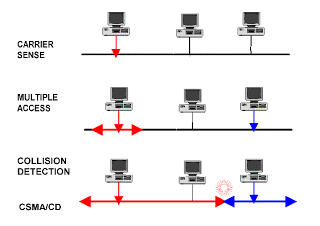

# Capa de Enlace

Esta capa encapsula los datagramas y se encarga de hacer una transferencia confiable de los mismos entre dos nodos adyacentes. Cada interface tiene su numero MAC unido, otorgado por IEEE.

Esta capa ofrece:

- **Control de Flujo**: Ajusta la velocidad del enlace al eslabón más lento.
- **Detección de Errores**
- **Corrección de Errores**
- **Half-duplex o Full-duplex**: Ambos puntos pueden emitir y recibir. Half-duplex implica que si uno esta emitiendo, el otro no puede emitir. En full-duplex esta limitación no existe.

Hay dos tipos de comunicaciones a nivel de enlace:

## Redes

### Punto a Punto

Estos protocolos son mas simples que los enlaces broadcast. Generalmente son usados para encapsular datagramas IP y no necesitan control de acceso al medio. Dentro de estos protocolos encontramos a:

- **SLIP**: Es un protocolo muy simple utilizado para encapsular datagramas IP sobre lineas seriales.
- **PPP**: Es el sucesor de SLIP. Este protocolo soporta el encapsulamiento de varios protocolos, ademas de ofreces detección de errores, autenticación, notificación de direcciones, negociación de opciones y mediación de calidad de enlace.

### Broadcast

En estas redes se utiliza un canal compartido donde existe la posibilidad de interferencia, ademas de colisiones de paquetes. Por este motivo debe haber establecido una norma para coordinar el intercambio de paquetes en el canal.

Hay 3 clases de protocolos definido para estas redes:

- **Partición de canal**: Divide al canal en partes, utilizando frecuencias o slots de tiempo, y cada cliente tiene uso exclusivo sobre esa parte.
- **Por turnos**
- **Acceso aleatorio**: Los nodos transmiten cuando quieren y si hay colisiones, mala suerte. Los protocolos deben identificar colisiones y reaccionar frente a ellas.

#### Time Division Multiple Access (TDMA)

Este protocolo es de partición del canal. Cada cliente tiene asignado un tamaño fijo de slot por turno donde puede utilizar el canal. Si el cliente no utiliza su slot, este es desperdiciado.

#### Polling

Este protocolo se basa en turnos, donde hay un cliente master que controla la conexion del canal. Este nodo master le va preguntando a cada cliente si quiere utilizar el canal y se lo va asignando.

Este protocolo no tiene colisiones, pero tiene overhead, alta latencia y un único punto de falla.

#### Token Ring

Es otro protocolo de turnos. En este caso se debe conectar a los clientes en forma de anillo y los datos circulan en un solo sentido. Cada nodo recibe un token que lo habilita a transmitir. Se dice que el anillo es compartido pero solo transmite el que recibió el token durante cierto tiempo. 

#### CSMA

En este protocolo, cada cliente sigue los mismos casos a la hora de enviar in paquete:

1. Lee el canal para ver si esta ocupado. De estar libre continua.
2. Transmite todos los paquetes.
3. Lee el canal para ver si hubo colisiones.

#### Ethernet

Es el protocolo mas utilizado en las LANs cableadas y tiene dos topologías principales:

- **Bus**: Todos los hosts están en la misma linea, conectados a un hub. Hay una gran posibilidad de colisiones. si la red crece se divide en segmentos.

  

- **Estrella**: Cada host se conecta a un switch, que luego reenvía los paquetes al destino que corresponde, evitando las colisiones. Para realizar esto se basa en la dirección MAC.

  

Las tramas de ethernet tienen la siguiente forma:

Que contiene:

- **Preambulo**: son 7 bytes con el patrón `10101010` y luego un byte con el patrón `10101011`. Este campo permite sincronizar a los hosts e indica que se esta enviando un nuevo paquete.
- **Destino**: IP de destino. Si un paquete llega a una interfaz y esta no tiene la IP indicada acá, entonces descarta el paquete.
- **Origen**: IP de origen.
- **Tipo**: Usado por el receptor para verificar integridad.
- **Datos**: Datos a enviar.

### MAC Address

Las direcciones MAC están compuestas por 48 bits divididos en 4 secciones:

- El bit 1 indica si el receiver es unicast (0) o multicast (1)
- El bit 2 indica si la dirección fue validada por el fabricante (0) o si fue creada localmente (1).
- Los bits del 3 al 24 identifican al fabricante.
- Los bits del 25 al 48 son un valor único asignado por el fabricante.

### ARP

Para poder enviar tramas de un host a otro debo conocer la dirección MAC del destino. Para conocer esto tenemos al comando ARP (Address Resolution Protocol). Este protocolo se puede iniciar de 4 formas:

- **ARP**: un host con dirección IP necesita conocer la dirección MAC de otro host del cual conoce su IP.

- **RARP**: un host sin almacenamiento conoce su dirección MAC pero se olvido de su dirección IP.

- **InARP**: un host conoce la dirección MAC de otro host pero no su IP.

- **Proxy ARP**: Un host responde a un request para otro host. Esto se usa en los routers, cuando se quiere acceder a hosts en otras redes:

  

#### ARP Spoofing

ARP no contempla autenticación, cualquiera puede responder a un ARP request para relacionar un IP con una MAC. Si bien se usa mas que nada en ataques maliciosos, existen algunos usos legítimos:

- Redireccionar a equipos no registrados a una pagina de registro.
- Acceso a internet en hoteles a dispositivos móviles.
- Implementar redundancia en servicios de red.

Para defendernos de este tipo de ataques, podemos:

- Añadir entradas estáticas a la tabla ARP.
- Usar DHCP snooping.
- Usar un programa llamado ARPwatch.
- Enviar RARP requests. si hay mas de una respuesta entonces puede ser un ataque.

