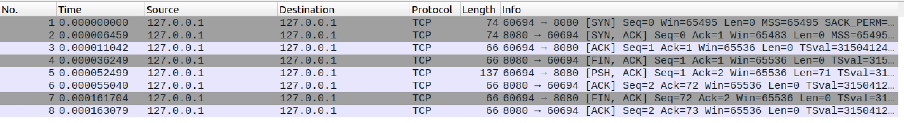
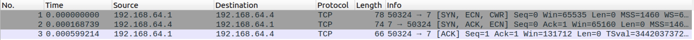
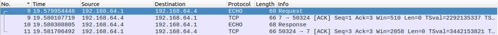
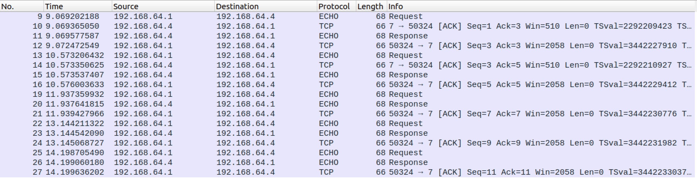
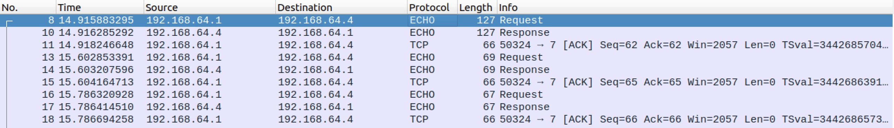
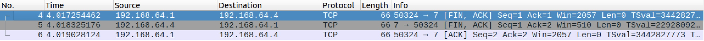
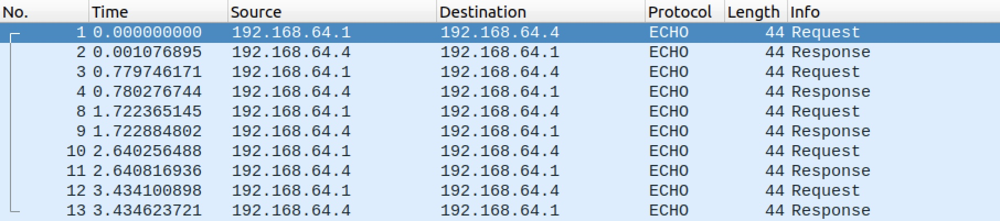
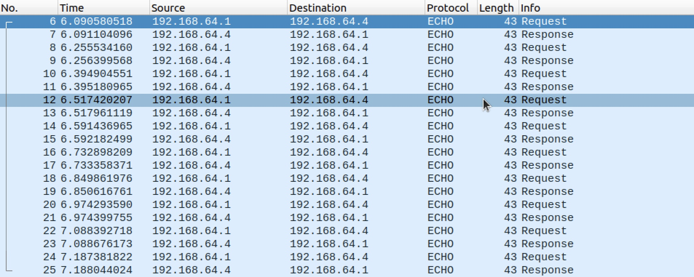

# Protocolos de Transporte

## 71

> Suponiendo que no tiene acceso a su host Linux, determinar desde otro host si están activos los siguientes servicios:

Para hacer esto tengo que usar la herramienta `nmap` y ver si los puertos están abiertos. Para ver que puerto corresponde a cada servicio puedo usar el siguiente comando:

```bash
$ cat /etc/services | grep Nombre_del_Servicio
```


> - `daytime`

```bash
$ nmap -p13 localhost
Starting Nmap 7.80 ( https://nmap.org ) at 2022-04-26 17:31 UTC
Nmap scan report for localhost (127.0.0.1)
Host is up (0.00099s latency).

PORT   STATE  SERVICE
13/tcp closed daytime

Nmap done: 1 IP address (1 host up) scanned in 0.04 seconds
```

> -  `time`

```bash
$ nmap -p37 localhost
Starting Nmap 7.80 ( https://nmap.org ) at 2022-04-26 17:34 UTC
Nmap scan report for localhost (127.0.0.1)
Host is up (0.00025s latency).

PORT   STATE  SERVICE
37/tcp closed time

Nmap done: 1 IP address (1 host up) scanned in 0.03 seconds
```

> - `smtp`

```bash
$ nmap -p465 localhost
Starting Nmap 7.80 ( https://nmap.org ) at 2022-04-26 17:34 UTC
Nmap scan report for localhost (127.0.0.1)
Host is up (0.00014s latency).

PORT    STATE  SERVICE
465/tcp closed smtps

Nmap done: 1 IP address (1 host up) scanned in 0.04 seconds
```

> - `telnet`

```bash
$ nmap -p23 localhost
Starting Nmap 7.80 ( https://nmap.org ) at 2022-04-26 17:34 UTC
Nmap scan report for localhost (127.0.0.1)
Host is up (0.00039s latency).

PORT   STATE SERVICE
23/tcp open  telnet

Nmap done: 1 IP address (1 host up) scanned in 0.04 seconds
```

## 72

> Elegir un servicio de los anteriores que se encuentre inactivo y analizar los paquetes que se generan e intercambian cuando se realiza un intento de conexión.

Vamos a investigar a `daytime`. Para hacer esto voy a tratar de conectarme con netcat al puerto 13:

```bash
$ nc localhost 13
```

En Wireshark veo:


Donde el servidor no completo my comando `SYN` y reseteo la conexión.

## 73

> Utilizando netcat transfiera un archivo entre dos hosts utilizando TCP, UDP, y SCTP. Prestar atención a las diferencias de uso (UDP) y analizar con wireshark los diferentes flujos de información.

Para enviar con TCP:

En el servidor uso el siguiente comando:

```bash
$ nc -l 8080 -q 1  > ~/file.txt < /dev/null
```

Y me va a guardar el archivo enviado en `~/file.txt`

En el cliente tengo que correr el siguiente comando:

```bash
$ cat file.txt | nc localhost 8080
```

Vemos que wireshark no usa UDP en este caso



Para enviar con UDP:

En el servidor uso el siguiente comando:

```bash
$ nc -l -u 8080 -q 1  > ~/file.txt < /dev/null
```

Y me va a guardar el archivo enviado en `~/file.txt`

En el cliente tengo que correr el siguiente comando:

```bash
$ cat file.txt | nc -u localhost 8080
```


## 74

> Exponer un servidor `echo TCP` utilizando `xinetd`. Debe asegurarse que el servidor `echo UDP` no se encuentra habilitado. De ser posible ejecutar el cliente (`netcat`) desde un host diferente (pero con conectividad). Analizar los paquetes en la interfaz del red donde el cliente deja los datagramas cuando:

Edito el archivo `/etc/xinetd.d/echo` y me aseguro que no este deshabilitado. Luego entro en el archivo `/etc/xinetd.d/echo-upd` y me aseguro que este deshabilitado.

> 1. Se realiza una conexión al servicio echo.



> 2. Se envía un único caracter.



> 3. Se envían varios caracteres dejando un pequeño intervalo entre cada uno (por ejemplo
>    1 segundo).



> 4. d. Se envían varios caracteres simultáneamente (por ejemplo escribiendo rápidamente o manteniendo presionada una tecla).



> 5.  Se desconecta el servicio (se mata el proceso servidor) También analice los cambios de estados que publica la salida de netstat en las diferentes etapas. Puede servirse de la Figura 1, “Maquina de estados de TCP” para el seguimiento.



## 75

> Exponer un servicio `echo UDP` utilizando `xinetd`. Debe asegurarse que el servidor `echo TCP` no se encuentra habilitado. De ser posible ejecutar el cliente (netcat) desde un host diferente (pero con conectividad). Analizar los paquetes en la interfaz del red donde el cliente deja los datagramas cuando:

Edito el archivo `/etc/xinetd.d/echo-udp` y me aseguro que no este deshabilitado. Luego entro en el archivo `/etc/xinetd.d/echo` y me aseguro que este deshabilitado.

> 1. Se realiza una conexión al servicio echo.

No hace nada

> 2. Se envía un único caracter.


> 3. Se envían varios caracteres dejando un pequeño intervalo entre cada uno (por ejemplo
>    1 segundo).



> 4. d. Se envían varios caracteres simultáneamente (por ejemplo escribiendo rápidamente o manteniendo presionada una tecla).



> 5.  Se desconecta el servicio (se mata el proceso servidor) También analice los cambios de estados que publica la salida de netstat en las diferentes etapas. Puede servirse de la Figura 1, “Maquina de estados de TCP” para el seguimiento.

No hace nada

## 76

> Utilizar `nmap` para determinar cuales son los servicios (`TCP` y `UDP`) para alguna de las direcciones IP que resultan de resolver el nombre `pampero.itba.edu.ar`. Analizar los paquetes generados.
>
> - ¿Cómo funciona el escaneo TCP? Verificar empíricamente de forma directa las diferencia el TCP SYN scan y el TCP connect scan. ¿En que situación es conveniente usar cada uno?

```bash
$ sudo nmap -O pampero.itba.edu.ar
Starting Nmap 7.80 ( https://nmap.org ) at 2022-04-26 18:49 UTC
Nmap scan report for pampero.itba.edu.ar (10.16.1.100)
Host is up (0.0086s latency).
Not shown: 999 closed ports
PORT   STATE SERVICE
22/tcp open  ssh
Aggressive OS guesses: Linux 2.6.32 - 3.13 (90%), Linux 2.6.22 - 2.6.36 (88%), Linux 3.10 - 4.11 (88%), Linux 3.10 (88%), Linux 2.6.32 (87%), Linux 3.2 - 4.9 (87%), Linux 2.6.32 - 3.10 (87%), Linux 2.6.18 (87%), Linux 3.16 - 4.6 (87%), Linux 2.6.39 (87%)
No exact OS matches for host (test conditions non-ideal).
Network Distance: 10 hops

OS detection performed. Please report any incorrect results at https://nmap.org/submit/ .
Nmap done: 1 IP address (1 host up) scanned in 11.82 seconds
```

SYN scan is the default and most popular scan option for good reasons.  It can be performed quickly, scanning thousands of ports per second on a fast network not hampered by restrictive firewalls. It is also relatively unobtrusive and stealthy since it never completes TCP connections.  SYN scan works against any compliant TCP stack rather than depending on idiosyncrasies of specific platforms as Nmap's FIN/NULL/Xmas, Maimon and idle scans do.  It also allows clear, reliable differentiation between the `open`, `closed`, and `filtered` states.

This  technique is often referred to as half-open scanning, because you don't open a full TCP connection. You send a SYN packet, as if you are going to open a real connection and then wait for a response. A SYN/ACK indicates the port is listening (open), while a RST (reset) is indicative of a non-listener. If no response is received after several retransmissions, the port is marked as filtered.  The port is also marked filtered if an ICMP unreachable error (type 3, code 0, 1, 2, 3, 9, 10, or 13) is received.  The port is  also considered open if a SYN packet (without the ACK flag) is received  in response.  This can be due to an extremely rare TCP feature known as a simultaneous open or split handshake connection (see [`https://nmap.org/misc/split-handshake.pdf`](https://nmap.org/misc/split-handshake.pdf)).

TCP connect scan is the default TCP scan type when SYN scan is not an option.  This is the case when a user does not have raw packet privileges.  Instead of writing raw packets as most other scan types do, Nmap asks the underlying operating system to establish a connection with the target machine and port by issuing the `connect` system call.  This is the same high-level system call that web browsers, P2P clients, and most other network-enabled applications use to establish a connection. It is part of a programming interface known as the Berkeley Sockets API.  Rather than read raw packet responses off the wire, Nmap uses this API to obtain status information on each connection attempt.

When SYN scan is available, it is usually a better choice.  Nmap has less control over the high level `connect` call than with raw packets, making it less efficient.  The system call completes connections to open target ports rather than performing the half-open reset that SYN scan does.  Not only does this take longer and require more packets to obtain the same information, but target machines are more likely to log the connection.  A decent IDS will catch either, but most machines have no such alarm system.  Many services on your average Unix system will add a note to syslog, and sometimes a cryptic error message, when Nmap connects and then closes the connection without sending data.  Truly pathetic services crash when this happens, though that is uncommon.  An administrator who sees a bunch of connection attempts in her logs from a single system should know that she has been connect scanned.

> - ¿Cómo funciona el escaneo UDP?

```bash
$ sudo nmap -O pampero.itba.edu.ar
```

UDP scan works by sending a UDP packet to every targeted port. For some common ports such as 53 and 161, a protocol-specific payload is sent to increase response rate, but for most ports the packet is empty unless the `--data`, `--data-string`, or `--data-length` options are specified. If an ICMP port unreachable error (type 3, code 3) is returned, the port is `closed`.  Other ICMP unreachable errors (type 3, codes 0, 1, 2, 9, 10, or 13) mark the port as `filtered`.  Occasionally, a service will respond with a UDP packet, proving that it is `open`.  If no response is received after retransmissions, the port is classified as `open|filtered`.  This means that the port could be open, or perhaps packet filters are blocking the communication. Version detection (`-sV`) can be used to help differentiate the truly open ports from the filtered ones.

A big challenge with UDP scanning is doing it quickly. Open and filtered ports rarely send any response, leaving Nmap to time out and then conduct retransmissions just in case the probe or response were lost.  Closed ports are often an even bigger problem. They usually send back an ICMP port unreachable error.  But unlike the RST packets sent by closed TCP ports in response to a SYN or connect scan, many hosts rate limit ICMP port unreachable messages by default. Linux and Solaris are particularly strict about this.  For example, the Linux 2.4.20 kernel limits destination unreachable messages to one per second (in `net/ipv4/icmp.c`).

Nmap detects rate limiting and slows down accordingly to avoid flooding the network with useless packets that the target machine will drop.  Unfortunately, a Linux-style limit of one packet per second makes a 65,536-port scan take more than 18 hours.  Ideas for speeding your UDP scans up include scanning more hosts in parallel, doing a quick scan of just the popular ports first, scanning from behind the firewall, and using `--host-timeout` to skip slow hosts.

## 77

> Utilizar nmap para determinar estimativamente el sistema operativo de varios hosts. De ser posible probar con impresoras de red, celulares, "access points" hogareños, etc.

Funciona para el culo, no sabe lo que es una MacBook.


