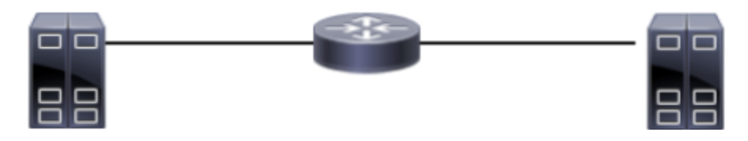

# Introduccion

## 1

> 
>
> Sean dos hosts que están en dos redes contiguas, como en la imagen superior. Se sabe que el ancho de banda entre el host de la izquierda y el router es de 10mbps (1000 bits por segundo), y entre el router y el host de la derecha es de 20mbps.
>
> Si el primer host decide enviarle al segundo un paquete que en total (datos + encabezados) es de 100 Bytes, ¿podría calcular el tiempo exacto que va a demorar desde que se envía el primer bit del primer host hasta que el último bit arriba al segundo host? En caso afirmativo, indicar cuánto sería en total ese tiempo, en caso negativo explicar por qué no se puede calcular en forma exacta.

No se puede calcular la velocidad exacta ya que tendría que conocer la latencia y el tiempo de procesamiento del router.

## 2

> Para cada afirmación decir si es verdadera o falsa
>
> 1. Si el protocolo de una capa del modelo OSI es con conexión, entonces la capa superior también ofrecerá un servicio con conexión.
> 

Falso, HTTP utiliza el servicio TCP y es un protocolo de aplicación que no requiere establecer una sesión.

> 2. Un router conecta 2 o más redes 

Verdadero.

> 3. Si el protocolo de una capa del modelo OSI es sin conexión y no confiable, entonces la capa superior no puede garantizar la recepción de los mensajes enviados.

Falso. En caso de que el servicio sea no confiable y sin conexión, la capa superior puede implementar esta complejidad en su servicio.

> 4. Un protocolo confiable es aquel que asegura que los datos lleguen correctamente a destino

Falso, solo puede confirmar si se recibió o no, pero no asegura que llegue.

> 5. Si un protocolo de aplicación utiliza un protocolo de transporte no orientado a conexión, entonces puede recibir los datos en orden distinto al que fueron enviados

Verdadero.

> 6. Si un paquete debe llegar desde el host A hasta el host Z pasando antes por los host M y N, y se sabe que el protocolo de enlace entre A y M, M y N, y entre N y Z son confiables, entonces podemos decir que el protocolo de red entre A y Z también será confiable.

Falso, los servicios de la capa de enlace solo proveen confiabilidad entre hosts adjuntos. No pueden asegurar que el camino a través de varios hosts sea confiables.

> 7. Si en una red cableada hay 4 computadoras que deben acceder a otras redes, entonces el router tendrá que tener al menos 4 interfaces.

Falso, deberá tener 5 interfaces, para poder conectarse a otras redes.

## 3

> ¿Es lo mismo un medio de transmisión broadcast que una comunicación broadcast?

No es lo mismo, el medio broadcast envía un solo mensaje por el medio a todos los nodos conectados a la red. En cambio, una comunicación broadcast puede ser enviada utilizando unicast, mandando individualmente el mismo mensaje a todos los nodos.

## 4

> Decir si las siguientes afirmaciones son verdaderas o falsas
>
> 1. Si en una red todas las PCs están interconectadas con un hub, entonces cualquiera de ellas puede ver los mensajes que envían y reciben el resto de las PCs

Verdadero. Al enviar un mensaje, este tiene un campo de IP de destino, y cada host debe verificar si el paquete es para el.

> 2. Si en una red todas las PCs están interconectadas con un switch, entonces una PC sólo podría ver los mensajes que la tienen como destino a nivel de enlace (la MAC destino del mensaje es la MAC de la PC)

Falso, ya que se pueden ver los mensajes broadband y aquellos cuya AMC de destino es desconocida para el switch.

> 3. Si en una red reemplazamos el hub por un switch es muy probable que aumente la velocidad de las comunicaciones.

Verdadero, ya que el switch reduce la probabilidad de colisión.
