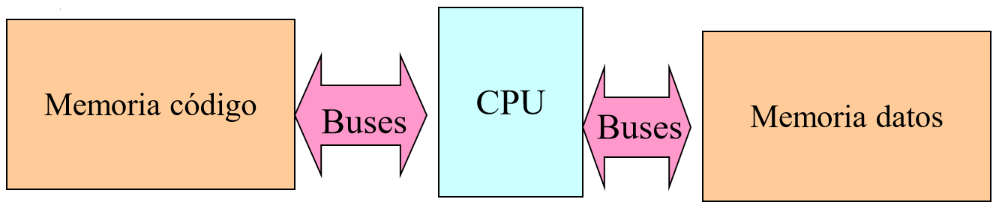

# Transmisión

Hay dos formas principales de transmitir informacion:

- **En serie**: Se utiliza solo un medio para transmitir solo un flujo de informacion.

- **Paralelo**: Se utilizan varios medios, por lo que puedo mandar mas de un flujo de informacion y transmitir mas rápido. La desventaja de este sistema es que suele ser mas caro. 

  Se suele llamar a un **bus** al conjunto de medios que conectan a un dispositivo con otro y llevan un mismo mensaje.

## Codificación

La forma de pasar e interpretar informacion en las computadoras es mediante distintos voltajes. En la realidad estos voltajes no son tan lindo como en la teoría, sino que suelen tener ruido, por eso se utilizan valores bastante distintos para signar a un 1 y a un 0.

### Codificación Unipolar

Para representar memoria en las computadoras, se utiliza diferencia de potencial (voltaje) de modo tal que se asigna un valor ($5V$ o $3V$) al 1, mientras que se le asigna $0V$ al 0. 

### Codificación de línea

De forma similar a la codificación anterior, se asigna un valor positivo al 1 y el mismo valor pero negativo para el cero. Normalmente se asigna $5V$ para 1 y $(-5)V$ para el 0

# Arquitecturas

## Von Neumann

La arquitectura de Von Neumann se conecte con un solo bus con la memoria de código y de los datos. Esta arquitectura es la mas utilizada por su simplicidad y su bajo costo:

- Tiene solo una memoria en vez de 2
- Menor complejidad en la toma de decisiones. Esto afecta a la complejidad del procesador.

## Harvard

La arquitectura de Harvard utiliza 2 buses, uno para conectarse a la memoria de código y otro para conectarse a la memoria de datos. Esto paraleliza el acceso a la informacion (en algunos casos) y haría que sea mas rápido el acceso.

Hay pocos dispositivos con un procesador con estructura Harvard, entre los cuales se esta aplicando cada vez mas en los dispositivos móviles con estructura ARM.

# Memoria

## Estructura

La memoria idealmente esta constituida por los 2 buses que presentamos anteriormente, el bus de datos y el bus de dirección.

Pero la memoria no tiene solo esos dos buses, sino que tiene un bus extra de control donde se indica si la instrucción es del tipo read/write. Este tercer bus son 2 cables, donde uno indica si de debe escribir y otro se indica si de debe leer informacion. Esto esta hecho así ya que existen funciones que no leen ni escriben en memoria, como lo es el refresco de la memoria RAM.

Además, las memorias compatibles con la arquitectura `x86` tiene otro bus para indicar si están accediendo a la memoria con una instrucción de `8-bits`, `16-bits` o `32-bits`. 

### Mapa de memoria

El mapa de memoria te dice la cantidad de memoria que el procesador puede manejar, pero no necesariamente es la memoria real que tenés en tu sistema. Un mapa de memoria esta definido por el bus de datos y por el bus de direcciones. El bus de datos indica el tamaño que va a tener cada posición de memoria mientras que el bus de direcciones representa la cantidad máxima de direcciones que se pueden utilizar en la memoria.

Si le asignamos $n=$ tamaño del bus de direcciones y $t=$ tamaño del bus de datos, hay $2^n$ posibles direcciones de memoria, de las cuales cada una tiene $t$ bits de tamaño, por lo que esta memoria tiene $2^n \times t$ bits de memoria.

## Clasificación de Memorias

### Memoria ROM

Esta memoria es normalmente llamada BIOS. Es memoria estática (no se elimina al apagar la computadora) y es de rápido acceso. A la hora de iniciar la computadora, el Instruction Pointer (IP) apunta a una dirección de memoria ROM en la BIOS y ahí comienza a ejecutar instrucciones.

Este tipo de memoria no son solo de lectura, como lo eran antes, sino que utiliza una tecnología EEPROM, por lo que son muy rápidas al leer informacion, pero lentas al escribir. 

Estas memorias tampoco tienen una vida infinita, sino que lentamente van perdiendo energía y duran alrededor de 40 años. Para poder *"recargar"* la energía, hay que leer y reescribir la memoria de vuelta.

Los pendrives, disco de estado solido y demás memorias *Flash* son de esta familia.

### Memoria RAM

Por el contrario, la memoria RAM tiene una lectura y escritura muy rápida, además de una volatilidad muy alta, ya que el procesador debe leer y reescribir todos el contenido de la RAM cada algunos milisegundos.

Aquí hay dos tecnologías:

- SRAM (Static RAM): Es un tipo de memoria muy compleja y muy cara, pero es muy rápida y no necesita ser refrescada (al apagar la computadora se borra igual).
- DRAM (Dynamic RAM): Es mas lenta, bastante barata y necesita ser refrescada cada una cierta cantidad de milisegundos.

## Tiempo de Acceso

La **transferencia** es el tiempo que tarda en transferir la informacion del procesador a la memoria, mientras que **latencia** es el tiempo que la memoria tarda en buscar la informacion y dárselo al procesador. La latencia suele ser mucho mas lenta que la transferencia, ya que la transferencia suele ser mayormente enviar informacion por un cable.

# Sistemas

A la hora de armar un sistema, se debe tener en cuenta el tamaño del mapa de memoria del procesador como el tamaño de nuestra memoria. 

El Instruction Pointer es el registro donde se va apuntar a la dirección de memoria donde se almacena el código. Este puntero no siempre apunta al mismo lugar, sino que distintos fabricantes lo apuntan a donde ellos prefieren (esta hardcodeado). Por lo que tengo que chequear que en mi memoria exista la posición de memoria a donde apunta el IP.

No siempre se va a tener solo memoria RAM o ROM, o los tamaños van a ser similares al del mapa de memoria del procesador. En estos casos, como se quieren utilizar ambas memorias, ambas tienen que estar incluidas dentro del mapa de memoria. En estos casos se suele asignarle el espacio primero a la ROM, ya que debemos tener en cuenta a la posición de memoria a la que apunta el IP.

A la hora de asignarle un lugar a la memoria RAM, puedo elegir cualquier posición siempre que no se pise con la ROM. Pero mientras que es técnicamente posible, se suele poner a la RAM luego de la ROM, por si en algún momento se le asigna una memoria RAM con mayor capacidad, se le puede asignar un lugar en el mapa de memoria mas grande y listo, ya que no se puede "dividir" la memoria RAM en varias partes.

Este proceso explicado previamente se realiza con un **circuito decodificador**. Esto permite que solo se active el bus del `chip select` cuando se quiere acceder a una memoria especifica. Este bus solo se debe activar cuando se esta interactuando con la memoria en cuestión. Si el tamaño de la memoria es igual al tamaño del mapa de memoria, no es necesario implementar un circuito decodificador.

Intel, al desarrollar el procesador de 16 bits, se estaba quedando con poco espacio para los periféricos en el mapa de memoria, por lo que desarrollaron un pin especial llamado `IO/M-`  que permitía utilizar un mapa de memoria secundario, del mismo tamaño que el mapa de memoria regular, pero solo para periféricos. En realidad, este pin seria el bit 17 de la dirección de memoria. Este mapa de memoria se puede acceder con las instrucciones `in` y `out`. Estas instrucciones son iguales a la instrucción `mov` pero solo para acceder a periféricos (`in` permite leer y `out` escribir informacion).

## Ejemplos

- **Tengo un Procesador conectado con el bus de dirección de 16 bits y bus de datos de 8 bits conectado a una memoria ROM con las mismas entradas:**

  Si armo el mapa de memoria del procesador, me queda que tiene un tamaño de $2^{16}\times 8$ bits $= 64$kb.

  Vemos el tamaño de nuestra memoria ROM, como nuestra memoria tiene una entrada de 16 bits para el bus de dirección y 8 bits para el bus de datos, vemos que el tamaño tambien es de $64$kb.

  Como el tamaño máximo del mapa de memoria es igual al tamaño de nuestra memoria, nuestro procesador puede operar perfectamente.

- **Tengo un Procesador conectado con el <u>bus de dirección 16 bits</u> y <u>bus de datos de 8 bits</u> conectado a una <u>memoria ROM</u> cuyo <u>bus de datos es de 8 bits</u>, pero su <u>bus de direcciones tiene 8 bits</u>. Tambien lo conecto a una <u>memoria RAM</u> con la <u>misma configuración de entradas</u> que la memoria ROM. Por otro lado sabemos que el IP apunta a la dirección de memoria `2000h` :**

  En este caso el mapa de memoria de mi procesador es de $64$kb, pero nuestra memoria ROM, al igual que la RAM, solo tienen $2^8 \times 8 =256$ bytes. 

  En este caso tengo que "meter" tanto la memoria RAM como la ROM dentro del mapa de memoria del procesador. Como el IP apunta a la posición `2000h`, le asignamos la memoria entre la posición `2000h` y `20FFh` a la ROM. Elijo para la memoria RAM las posiciones entre `3000h` y `30FFh`.

- **Tengo un procesador con un <u>bus de direcciones de 16 bits</u> y un <u>bus de datos de 8 bits</u>. Quiero conectar una <u>memoria ROM de $2k\times 8$ bits</u>. El IP apunta a la dirección `2000h`:** 

  Como la memoria ROM es de $2k \times 8$, puedo decir que el bus de datos es de 8 bits, mientras que el bus de direcciones es de 11 bits ($2k=2 \times 2^{10} = 2^{11}$).

  Por otro lado vemos que el tamaño del mapa de memoria es $64$kb, con las direcciones entre `0000h` y `FFFFh`.

  Le asignamos a la ROM, las posiciones de memoria desde `2000h` hasta `27FFh`.

  Tambien tenemos que involucrar un codificador de hardware, para que solo se pueda acceder a la memoria cuando se quiere acceder a una de las posiciones de memoria de la ROM y en otro lado. Para esto analizamos las posiciones de comienzo y de fin de la ROM en el mapa de memoria.

  `2000h = 0010 0000 0000 0000` y `27FFh = 0010 0111 1111 1111`, tambien llamamos a las posiciones de memoria $A_n$, siendo $n$ la enésima posición de los bits, siendo la primera posición la que esta al final de la cadena. Según esto vemos que los últimos 5 bits son iguales, y solo son así para las posiciones de memoria validas dentro de nuestro mapa de memoria para la ROM. Por esto uso un codificador de memoria que tome $A_{15}, A_{14}, A_{13}, A_{12}, A_{11}$ para poder activar al bus `chip select`, y que solo active cuando estos valores tengan la siguiente configuración:
  $$
  \array{ A_{15}=0 & A_{14}=0 & A_{13}=1 & A_{12}=0 & A_{11}=0 }
  $$
  

  

