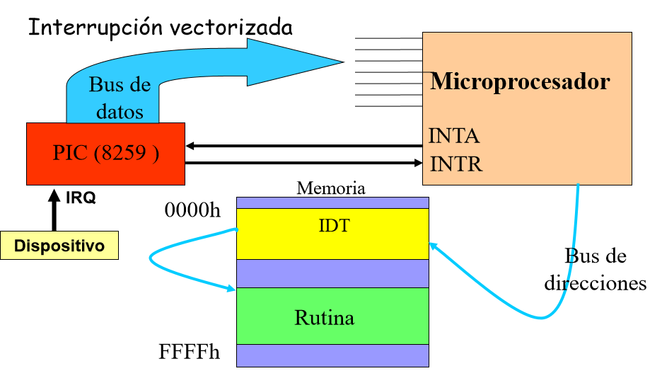

# Interrupciones

Las interrupciones son una señal externa que interrumpe al micro para requerir un servicio de atención. Hay dos tipos de interrupciones:

- **Interrupción de Hardware**: Son las interrupciones generadas por dispositivos conectados al microprocesador o periféricos. Estos dispositivos están conectados al Controlador Programable de Interrupciones (PIC). Este controlador puede manejar hasta 8 dispositivos distintos, y se encarga de manejar el flujo de informacion por los pines `INTA` e `INTR`. El procesador obtiene del PIC el pedido de interrupción por el pin `INTR` y luego de completar el ciclo actual del procesador, este le respondera al PIC en el pin `INTA` un acknowledge para que sepa que pueda ejecutar a su interrupcion. 

  Cuando el microprocesador acepta la interrupción, este le pide informacion sobre que dispositivo esta haciendo la interrupción al PIC y luego el microprocesador busca lo que debe hacer en la sección de memoria llamada `IDT` (interruption descriptor table) y ejecuta la rutina en otro sector de la memoria.

  La IDT debe estar en memoria RAM, no importa donde este pero debe estar dentro de la memoria fisica.

  Adicionalmente, los procesadores tienen un flag `IF` que indica si se deben atender a las interrupciones externas. Básicamente permite bloquear a las interrupciones. Este flag se maneja con las instrucciones `cli` (clear interrupt) y `sti` (set interrupt).

  Dentro de las interrupciones de hardware, hay dos tipos de interrupciones:

  - **Interrupción Enmascarable**: Al deshabilitar el flag `IF` este tipo de interrupciones no llegan al procesador.
  - **Interrupción no Enmascarable**: Estas interrupciones llegan por el pin `NMI` y no puede ser ignoradas. Un claro ejemplo de estas interrupciones suceden al apagar la computadora desde el botón o para mantener la temperatura.

- **Interrupción por Software**: son las interrupciones generadas por código. Un buen ejemplo de esto son las interrupciones ejecutadas con la instrucción `int 80h`. Esto básicamente genera una instrucción, hace que el procesador vaya al `IDT` a buscar la posición `80h` y de ahí salta a la subrutina que se debe ejecutar al encontrarse con esa interrupción. Este tipo de rutinas son tambien llamadas rutinas globales y se suelen usar para que los programas de userspace tengan acceso al hardware (controlado por el kernel) mediante syscalls.

## PIC

El PIC es el controlador programable de interrupciones, y es el encargado de registrar las interrupciones de los dispositivos conectados y notificarle al procesador. El proceso es bastante simple, primero un dispositivo conectado le comunica al PIC que tiene una interrupción, este le avisa al procesador que sucedió una interrupción, y el procesador es el encargado de responderle si puede atenderla en el momento (si esta bloqueando las interrupciones externas). Luego de que el procesador confirme que acepta la interrupción, el PIC le manda por el bus de datos el índice de la tabla de interrupciones (`IDT`) de interrupción que esta sucediente y de ahí el procesador recupera un puntero hacia la rutina que se debe ejecutar. En caso de que múltiples dispositivos le notifiquen al PIC, hay implementada una lista de prioridad donde se decide que interrupción va al procesador primero.

Los puertos de entrada y salida de la PC son el `20h` y el `21h`. El puerto `20h` es utilizado para programar el PIC (Lo utiliza la BIOS a la hora de arrancar el sistema), mientras que el puerto `21h` es utilizado para acceder al registro `IMR` (**Interrupt Mask Register**), donde podemos setear que interrupciones llegan al procesador y cuales no.

Como en un PIC solo pueden conectarse una cantidad finita de dispositivos, pueden conectarse varios PICs en serie para soportar a mas dispositivos. En las PCs se utiliza el `IRQ2` para conectar a un segundo PIC.

## Interrupciones en Modo Protegido

En modo protegido, cada entrada de la IDT es un descriptor de una interrupción, además cada descriptor contiene la dirección de la rutina de atención a la interrupción como datos de permisos. Las primeras 32 interrupciones son excepciones, de las cuales solo son utilizadas 20 por el momento.

En modo protegido se utiliza una tabla llamada `GDT` (Global Descriptor Table) o `LDT` (Local Descriptor Table) que guarda la dirección de memoria base del sector de memoria donde la función relacionada a una interrupción. La `IDT` especifica el offset de la función y con un puntero indica el `offset collector` que es una posición en dichas tablas. Junto al offset y a la dirección base se puede formar la dirección de memoria donde esta ubicada la rutina asociada a cada excepción.

### Excepciones

Una excepción es un evento generado por el procesador cuando detecta una o mas condiciones predefinidas al ejecutar una instrucción. Existen 3 tipos de excepciones:

- **Faults**: Son excepciones que pueden corregirse. El procesador guarda en la pila la dirección de la instrucción que produjo la falla.
- **Trap**: Se utilizan para realizar accesos al sistema operativo.
- **Abort**: No siempre se puede obtener la instrucción que causo la excepción. Reporta errores importantes.

Estas son las excepciones implementadas:

|  Id  |         Descripción         |
| :--: | :-------------------------: |
|  0   |       `Divide Error`        |
|  1   |      `Debug Exception`      |
|  2   |   `Nonmaskable Interrupt`   |
|  3   |        `Breakpoint`         |
|  4   |         `Overflow`          |
|  5   |       `Bounds Check`        |
|  6   |      `Invalid Opcode`       |
|  7   | `Coprocessor not Available` |
|  8   |       `Double Fault`        |
|  9   |        `(Reserved)`         |
|  10  |        `Invalid TSS`        |
|  11  |    `Segment not Present`    |
|  12  |      `Stack Exception`      |
|  13  |    `General Protection`     |
|  14  |        `Page Fault`         |
|  15  |        `(Reserved)`         |
|  16  |     `Coprocessor Error`     |

## Interrupciones en Multi-Core

A diferencia de los procesadores de un solo núcleo, en los procesadores multinúcleo se utiliza otro integrado para manejar las interrupciones llamado `APIC` (Advanced Programmable Interrupt Controller). En este caso el `I/O` posee un `APIC` mientras que cada núcleo tiene un `APIC` local. Este nuevo integrado se encarga de hacer el ruteo de los periféricos a los núcleos.