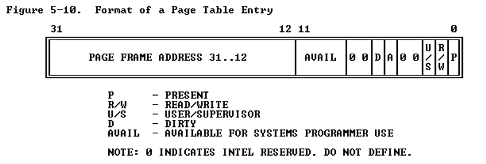

# Memoria Virtual

La memoria virtual es un concepto que genera el procesador, no el sistema operativo, este ultimo solo utiliza al concepto. Esto trae a la paginación dentro de la ecuación, esto permite transformar las direcciones de memoria virtuales que se asignan a cada proceso en posiciones de memoria física, pero solo el procesador se entera de esta cambio. Estas direcciones virtuales pueden apuntar a la misma o distintas direcciones física que otro proceso. Un ejemplo de esos son las librerías estándar, que puede que varios procesos la requieran pero no es eficiente que se cargue toda la librería por cada vez que se linkedita contra esa función, por lo que múltiples procesos pueden leer a la misma posición de memoria física.

## Paginación

Para acceder a las páginas en los procesadores Intel de 32 bits, se hace de forma indexada. Para acceder a una pagina se debe acceder por una posición de memoria, donde los 12 bits mas significativos son la dirección de la memoria, seguidos por 10 bits que indican a que pagina se quiere acceder y por ultimo 10 bits donde se indica el offset para indicar a que posición de memoria se quiere acceder, dentro de cada pagina.

Las tablas de páginas están compuestas por la siguiente estructura, llamada `Page Table Entry`:

El bit de presencia `P` indica que esa tabla se puede utilizar para obtener una dirección de memoria. Si esta en 0 significa que no se puede utilizar. Cuando el procesador se encuentra con esta situación suele tirar una excepción, y si el sistema operativo soporta memoria virtual, se ejecutara la rutina que va a buscar la memoria al disco duro.

 El bit `U/S` indica los permisos de esa tabla. Puede ser 3 si se trata de un usuario mientras que si la memoria es propiedad del kernel va a tener almacenado un 0, 1 o 2 en esos 2 bits.

### Protección Combinada

Cuando la paginación esta habilitada, el procesador primero chequea los permisos en la segmentación y luego en la paginación, de esta forma se pueden definir segmentos de datos que están compuestos por páginas solo de lectura y de escritura.

### Modelo FLAT

Debido a la protección combinada, algunos sistemas operativos como UNIX utilizan el modelo FLAT de memoria. Este modelo funciona declarando 2 segmentos de código y de datos que referencian a toda la memoria. Esto permite un manejo mas simple de las mismas y a su vez mas portabilidad, ya que mochos procesadores no tienen unidad de segmentación pero si de paginación. Al hacer un segmento único permite ignorar la segmentación, ya que solo hay un segmento, y dentro están todas las páginas.

## Swapping

Cuando se necesita una pagina en memoria pero la memoria esta completa, Linux elije una pagina que no ha sido accedida recientemente y guarda un clon exacto en el disco. Luego setea al bit de presencia en 0 a la pagina guardada en memoria, permitiendo que sea escrita con nueva informacion. Esta informacion suele ser almacenada en una zona especial destinada para este tipo de operaciones. A este proceso se lo llama **pagging**.

Tambien existe el proceso de **swapping**, que implica guardar en disco todas las páginas de un proceso.

### Ejemplo

Nosotros vamos a tomar el tamaño de la pagina como `4kb`, por lo que un procesador de 32bits, que puede manejar hasta 4 Gb de memoria, va a tener $2^{20}=\frac{2^{32}}{2^{12}}=2^{10}\times 2^{10}$ páginas. Por lo que hay $2^{10}$ grupos de páginas, que cada uno contiene $2^{10}$ páginas.