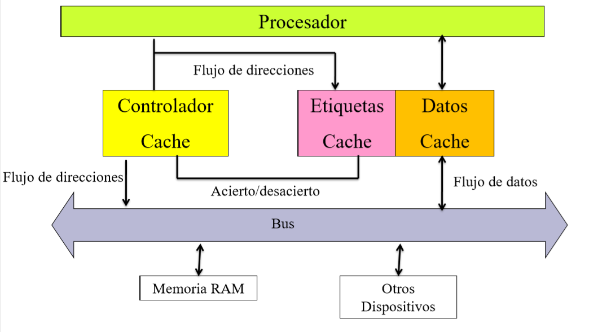

# Memoria Cache

La memoria cache es la memoria mas rápida de la computadora y se encuentra dentro del procesador. El trabajo de esta memoria es guardar informacion que el procesador haya utilizado recientemente con el objetivo de que si requiere esa informacion de vuelta, no tenga que ir hacia la memoria RAM para recuperar la informacion sino que puede acceder a ella rápidamente.

Este tipo de memorias es mucho mas rápido y caro que la memoria RAM común y utiliza una tecnológica llamada SRAM, que le permite mantener la memoria sin tener que refrescarla cada algunos milisegundos. La velocidad de respuesta de esta memoria es acorde a la velocidad del CPU. Hoy en día existen 3 tipos de memoria cache L1, L2 y L3.

Esta memoria se compone de 3 elementos, memoria para almacenar datos, memoria para almacenar etiquetas y un controlador que selecciona que informacion será guardada en la memoria de datos.

## Comunicación con la memoria RAM

Como este tipo de memoria se encuentra en el camino entre el procesador y la memoria RAM, todos los pedidos de memoria del procesador van a pasar por acá primero, para ver si puede acceder a ella mas rápido.

La comunicación entre el procesador y la memoria cache se realiza en paquetes WORD de 2 bytes de tamaño Luego, esta se comunica con la memoria RAM mediante bloques de un tamaño fijo.

### Ejemplo

Si tenemos una <u>memoria RAM de 1MB</u> ($1M\times 8b $), <u>los bloques de transferencia son de 32 bytes</u> y tenemos una <u>cache de datos de 4K</u>, podemos calcular que la cache tendrá almacenamiento para 128 entradas, cada una de 256 bits (32 bytes):
$$
4K = 2^{12} \rightarrow \frac{2^{12}}{2^5} = 128
$$
Se accede a la memoria cache de forma similar a la paginación, de forma tal que como en este caso las direcciones son de 20 bits, y nuestra cache es de 9 bits (0.5 KB), entonces los 11 bits mas significativos y a eso lo llama etiqueta, mientras que  que los 9 bits menos significativos son el offset. Como la cache no tiene tanta memoria, se fija si la etiqueta obtenida esta guardada dentro de la memoria, y si lo esta accede mediante el offset.

==PREGUNTAR POR EL TAMA:O DE LA MEMORIA DE ETIQUETAS==

## Mapeos

Las memoria cache tiene dos tipos distintos de mapear la memoria:

- **Mapeo Directo**: Un bloque de memoria solo se puede mapear a una unica ranura en el cache. Es un método simple pero poco utilizado.
- **Mapeo Asociativo**: Un bloque de memoria se puede mapear a cualquier ranura del cache. Este método es mas complejo pero mas utilizado.

## Política de Sustitución

A la hora de almacenar nueva informacion en la cache, distintos procesadores utilizan técnicas distintas, pero las 3 mas comunes son que actué como <u>una pila FIFO</u>, que sea de <u>forma aleatoria</u>, o que se implemente un flag para poder aplicar el algoritmo <u>least recently used</u>.

## Actualizacion de RAM

Hay dos formas de actualizar a la memoria:

- **Escritura inmediata**: Tambien llamado **write through**, mediante este proceso se actualizan ambas memorias juntas y es mas económico que la alternativa, pero tambien es mas lento.
- **Escritura olvidada**: Conocido como **write back**, actualiza solo la informacion estrictamente necesaria y es mas rápido, pero es menos económico y tiene problemas tanto con los procesadores multi-core y con dispositivos DMA.

