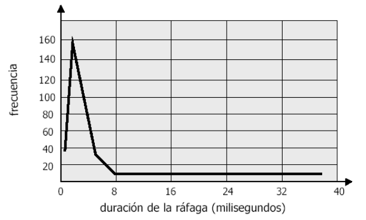

# Gestión de Procesos

## Criterios y Tipos de Planificación

El objetivo de la multiprogramación es tener siempre un proyecto en ejecución para aprovechar mejor los recursos del CPU. Esto genera problemas cuando estamos ejecutando mas programas que núcleos, ya que solo puede haber un programa en ejecución en un determinado momento por núcleo. Para solucionar esto, el sistema operativo mantiene en memoria a varios procesos a la vez y se los va a entregar al procesador cuando sea su turno de ser procesados.

#### Ciclos de ráfagas de CPU y E/S

La ejecución de un proceso consiste en un ciclo de ejecución alternando de manera sucesiva:

- **Ráfagas de CPU**: son los ciclos del CPU durante los cuales el proceso ejecuta instrucciones.
- **Ráfagas de E/S**: son los ciclos de CPU durante los cuales el proceso utiliza o espera a la E/S.

Las ráfagas de CPU varían considerablemente entre un proceso y otro, pero mantienen una curva de frecuencia bien tipificada. Esta curva se representa en el siguiente grafico:

Si un proceso tiene ráfagas de CPU cortas significa que esta limitado por la E/S, mientras que si son largas entonces esta limitado por el CPU.

#### Planificación Exprópiativa

Las planificaciones de CPU se toman según cuatro situaciones:

1. Cuando un proceso pasa del estado en ejecución a en espera.
2. Cuando un proceso pasa del estado en ejecución a listo.
3. Cuando un proceso pasa del estado en espera al estado listo.
4. Cuando un proceso termina.

Los casos 1 y 4 corresponden a una planificación no exprópiativa, es decir que a la fuerza hay que escoger un nuevo proceso. Los casos 2 y 3 corresponden a una planificación exprópiativa.

#### Criterios de Planificación

La planificación se hace en base a los siguientes criterios:

- **Utilización de CPU**: Es el porcentaje de tiempo que le CPU esta ocupado.
- **Rendimiento**: Es el numero de procesos (trabajos) que se completan por unidad de tiempo.
- **Tiempo de Retorno**: Tiempo transcurrido entre la llegada de un proceso y su finalización.
- **Tiempo de Espera**: Tiempo que un proceso permanece en la cola de preparados.
- **Tiempo de Respuesta**: Tiempo que un proceso bloqueado tarda en entrar en el CPU desde que ocurre el suceso hasta que lo bloquea.

En base a esto se puede empezar a planear nuestro gestor de procesos. Nuestros objetivos suelen ser:

- Minimizar el tiempo de medio espera o de retorno
- Maximizar la utilización de CPU
- Mantener el tiempo de respuesta por debajo de un valor máximo.

Si desarrollamos sistemas interactivos, como los sistemas operativos actuales (comparten tiempo de procesamiento entre varios procesos), se consideran también los valores medios de estas medidas. Pero la verdad es que ninguna estrategia es perfecta y siempre terminamos dependiendo del tipo de procesos o de un criterio.

## Algoritmos de Planificación

#### First Come, First Served (FCFS)

Es un algoritmo de planeación de servicio por orden de llegada, el primer proceso que solicita acceso al CPU lo obtiene. El problema esta en el tiempo de espera promedio que suele ser bastante largo.

#### Shortest Job First (SJF)

Este algoritmo permite que los trabajos mas cortos se ejecuten primero. Calcula cual es el proceso mas corto en base a las ráfagas del CPU y minimiza el tiempo de espera medio.

Este algoritmo no es implementable ya que solo se pueden estimar las duraciones de los procesos en base a su historial, además es probable que los procesos mas largos nunca se ejecuten.

#### Planificación por Prioridad

Cada proceso tiene una prioridad asignada y entra al CPU el proceso con mayor prioridad. Esta prioridad puede ser definida por el usuario o por el sistema operativo. Este algoritmo tiene un problema similar al anterior: los procesos con menor prioridad pueden no ejecutarse nunca. Este problema es resuelto haciendo que los procesos mas viejos tengan mas prioridad.

#### Round Robin (RR)

Es una implementación adecuada para sistemas operativos de tiempo compartido y posee un comportamiento similar al del FCFS, con la diferencia que cada proceso dispone de un tiempo máximo.  La cola de procesos es gestiona como FIFO.

Este algoritmo se comporta de distintas formas dependiendo del tiempo de ejecución de cada proceso:

- Si el tiempo es muy grande, entones los procesos terminan sus ráfagas antes de que lo corte el sistema operativo, entonces se comporta como un FCFS.
- Si el tiempo es de una magnitud normal, entonces se tiene a un sistema en el que cada proceso dispone de un procesador de $\frac 1 n$ de la velocidad del procesador real.
- Si el tiempo es muy pequeño, entonces suceden cambios de contexto constantemente y el rendimiento disminuye.

#### Colas de Múltiples Niveles

En este algoritmo se distingue entre procesos que pueden tener distintas necesidades en cuanto al tiempo de respuesta y por lo tanto distintas necesidades de planificación. Estos procesos se suelen dividir entre:

- Procesos que se ejecutan en primer plano o **interactivos**.
- Procesos que se ejecutan en segundo plano o **por lotes**.

Este algoritmo divide a la cola de procesos listos en varias colas, y cada una de ellas tiene su propio algoritmo de planificación, y el tiempo de ejecución se puede dividir entre las colas de forma igualitaria o por prioridades.

#### Colas de Múltiples Niveles y Retroalimentación

Es una variación del método anterior donde los procesos que pertenecen a una cola pueden moverse a otra cola. De esta forma si un proceso gasta demasiado tiempo de CPU, se pasa a una cola de menor prioridad, mientras que si un proceso tiene que esperar mucho, se mueve a uno de mayor prioridad.

### Implementación en Multiprocesadores

Para implementar cualquiera de estos algoritmos tenemos que tener en cuenta que si tenemos mas CPUs, se va a complejizar mas el problema. Por esto vamos a asumir que cualquier procesador puede ejecutar cualquier proceso de la cola y que la cola va a ser común para todos los procesadores, es decir que no va a haber procesadores al pedo ni procesadores trabajando a full.

Para encarar a esto hay dos estrategias, podemos hacer que cada procesador se auto planifique, asegurándose que todos los procesos tengan tiempo de procesador y que nunca haya dos procesadores que elijan el mismo procesos. También podemos designar a un núcleo como planificador, y este le indica a los demás núcleos que procesos correr.

## Evaluación de Políticas de Planificación

Hay dos formas principales de elegir a un algoritmo de planificación. Se deben evaluar los criterios de evaluación del algoritmos y se deben evaluar las políticas del algoritmo.

Para evaluar los criterios de evaluación de un algoritmo utilizamos el grado de utilización del CPU, el tiempo de respuesta y el rendimiento. 

Por otro lado, para evaluar las políticas del algoritmo hay distintas formas:

- **Modelado Determinista**: Es una evaluación analítica del algoritmo, se calcula el desempeño de un algoritmo teniendo en cuenta la carga de trabajo del sistema. Este modelado es cómodo de realizar y proporciona magnitudes exactas para comparar algoritmos, pero limita su validez a un tipo especifico de trabajos.
- **Modelado de Colas**: Se evalúa a partir de una distribución estadística de ráfagas de CPU y de E/S, se hace una distribución de los tiempos de llegada al sistema
- **Simulaciones**: Consiste en la programación de un modelo del sistema de computación. En ese modelo se utilizan generadores aleatorios para generar procesos, ráfagas, llegadas, etc. Estas tareas suelen ser simulaciones costosas que requieren tiempo y recursos, además de ser complicados de diseñar y analizar.
- **Implementación**: Es el método mas confiable, ya que consiste en programar al algoritmo y probarlo dentro de nuestro sistema operativo. Esto mismo causa problemas ya que estamos modificando el sistema operativo.

La solución a estos problemas es encararlo con distintos análisis del algoritmo. Primero se debe hacer un análisis preliminar de las políticas candidatas mediante modelos deterministas, luego simulaciones y por ultimo implementar las opción optima, para probarlo en el sistema operativo y decidir si se envía a producción.

