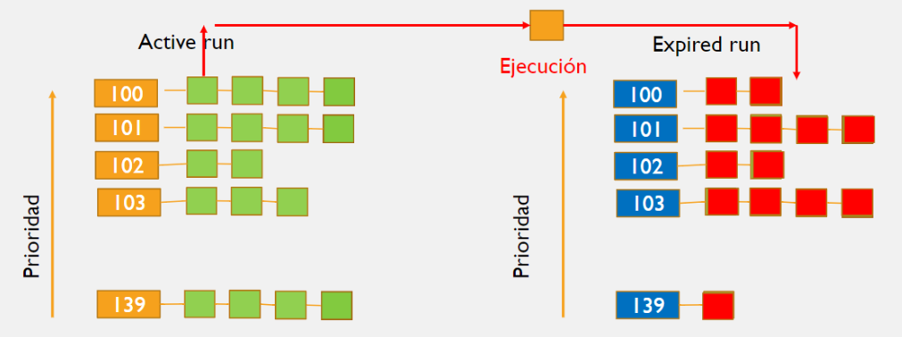
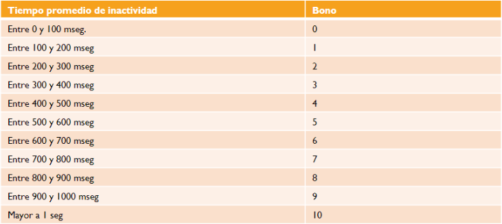
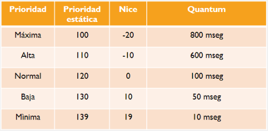
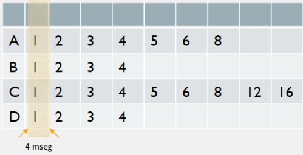

# Scheduling 

Linux maneja dos tipos de procesos:

- **Real Time**: Son prioritarios y no deben quedar en espera por procesos normales. Suelen ser aplicaciones industriales con poca interacción del usuario.
- **Normales**: Pueden cambiar de interactivo a batch (o viceversa) a mitad del proceso.
  - **Interactivos**: Tiene interacción con el usuario mediante una GUI o por consola. El proceso se puede despistar rápidamente en menos de 150 milisegundos luego de una acción del usuario.
  - **Batch**: Se ejecutan en el background. Pueden estar pausados mas tiempo ya que el usuario no interactúa con estos

En Linux hay 3 schedulers:

- **O(n)**: Implementado en Linux 2.4 a 2.6. El tiempo que tarda en tomar su decisión es proporcional a la cantidad de procesos.
- **O(1)**: Implementado en Linux 2.6 a 2.6.22. El tiempo que tarda en tomar su decisión es fijo y no depende de la cantidad de procesos.
- **CFS (Complete fair scheduler)**: Implementado a partir de Linux 2.6.23.

#### Scheduler O(n)

Este scheduler recorre la cola de procesos, evalúa la prioridad de cada uno y selecciona el proceso a ejecutar. Si tiene muchos procesos tarda mucho este scheduler y no es escalable.

La cola de procesos listos es global, entonces no sirven para computadoras con procesadores multicore, ya que cada núcleo miraría a la misma cola de listos.

### Scheduler O(1)

Este scheduler tarda un tiempo fijo en tomar su decisión. Para lograrlo divide a sus procesos en distintas colas y les asigna un numero de prioridad. Las prioridades de 0 a 99 están reservadas para procesos real time y de 100 a 139 están reservadas para procesos normales. Los procesos normales pueden cambiar su prioridad dentro de esta cola, mientras que los real time no.

**Procesos normales**



Este scheduler crea dos listas de colas en cada procesador, una llamada `active run` y la otra llamada `expired run`. Cada una de estas listas tienen 40 colas de prioridades donde 100 es la mas alta y 139 es la mas baja. Le asigna mas tiempo a los procesos con mayor prioridad. A todos los procesos con la misma prioridad se le asigna la misma cantidad de tiempo.

Luego de ejecutar la tarea con mayor prioridad en `active run`, la envía a la lista de colas `expired run` y se continua con la próxima tarea de la misma prioridad y si no hay de la misma, se pasa a la próxima cola de prioridad.

Al terminar de ejecutar a la cola activa se invierte `active run` con `expired run` y comienza todo el proceso de vuelta.

Para cambiar la prioridad de un proceso se puede utilizar el comando `nice` en la terminal de Linux. Cada programa tiene pode efecto la prioridad 120, y al cambiarla se puede indicar si queremos que aumente 19 posiciones o decremente 20 posiciones.

```
nice -n N ./a.out
```

Siendo N un valor entre $[-20,19]$.

**Prioridad Dinámica**

La prioridad de cada proceso (normal) puede cambiar cada vez que el procesador pausa al proceso. Para lograrlo usa una métrica heurística llamada *bono* y la prioridad se calcula de la siguiente forma:
$$
max(100, min(base-bono+5,139))
$$
Siendo base = 120 o la cantidad indicada con el comando `nice`.

El bono es un valor entre 0 y 10. Si este valor es menor a 5 significa que es un proceso CPU bound. Si es mayor a 5 significa que tiene interacción con el usuario y se aumenta la prioridad dinámica a 100. El valor del bono se calcula con la siguiente tabla de tiempos de inactividad:



**Estableciendo el Quantum**

El Quantum es el tiempo de ejecución que le asigna el procesador a un proceso por ciclo. Este se calcula de la siguiente forma:

- Si la prioridad es menor a 120, entonces : $Quantum = (140 - prioridad) \times 20 $ ms

- Si la prioridad es mayor a 120, entonces : $Quantum = (140 - prioridad) \times 5 $ ms.

Estos cambios se ven reflejados en la siguiente tabla:



**Limitaciones**

La heurística utilizada para calcular a la prioridad de los procesos es muy compleja y genera una dependencia entre el quantum y la prioridad del proceso. Además genera que los valores de prioridad y quantum no son uniformes

### CFS

Este algoritmo no posee heurística, y esta basado en el algoritmo Rotating Staircase Deadline Schedule (RSDL). Este algoritmo permite un manejo mas elegante del CPU.

Este algoritmo reparte de forma igualitaria el tiempo de procesamiento entre los procesos. Se define un quantum de tiempo y ese es el tiempo que se divide entre los procesos. Por ejemplo, si tengo un quantum de 4ms y 4 procesos: A,B,C y D, donde cada proceso tiene un tiempo de rafaga de 8ms, 4ms, 16ms y 4ms respectivamente:



Luego de que finaliza cada quantum, se chequea que procesos siguen vivos y se vuelve a dividir al tiempo entre estos procesos.

La idea del algoritmo es que para elegir que procesos ejecutar primero, va a tener en cuenta el virtual runtime y priorizara a los que tengan menor cantidad. Para evitar estar verificando todo el tiempo cual es el proceso con menor virtual runtime utilizamos un red black tree. Cada nodo representa  una tarea ejecutable y se ordena a los nodos con menor virtual runtime.

Este tipo de estructura alinea al árbol de forma tal que los procesos con mayor necesidad de CPU están a la izquierda y los que menos lo necesita (mayor runtime) a la derecha. Luego de ejecutar a un proceso, se reacomoda al árbol y se vuelve a ejecutar al nodo mas a la izquierda. Esto permite que un proceso pueda ser ejecutado mas de una vez en el mismo turno.

Durante el cambio de contexto se busca el nodo mas a la izquierda, y como se mantiene un puntero a este nodo, el tiempo de acceso es O(1). La inserción en el árbol es O(log(n)).

Se eligió un red black tree por que sus operaciones son siempre O(log(n)) y por que es auto balanceado.

A la hora de agregar un proceso, se le asigna un valor pequeño de virutal runtime para asegurarse que sean ejecutados rápidamente.

#### Virtual Runtime

Es un contador almacenado en el PCB que incluye el tiempo total de ejecución de este proceso.

#### Prioridades

CFS modifico al algoritmo inicial para permitir el uso de creaciones prioritarios. Para solucionar esto se usa la misma función de antes, pero se hace un mapeo de 100-139 a valores cercanos a 1 en un multiplicador especial. Por lo que si le asignamos una prioridad alta, el multiplicador va a tener un valor bajo y al ser multiplicado por el tiempo de ejecución del proceso va a dar un tiempo menor en el árbol.

#### Procesos CPU y I/O bound

Los procesos I/O bound suelen tener mayor prioridad por tener menos tiempo de runtume, ya que son interactivos y pasan bastante tiempo esperando por input del usuario. Por otro lado, los procesos CPU bound van a ser ejecutados completamente, por lo que suelen tener menos prioridad.

