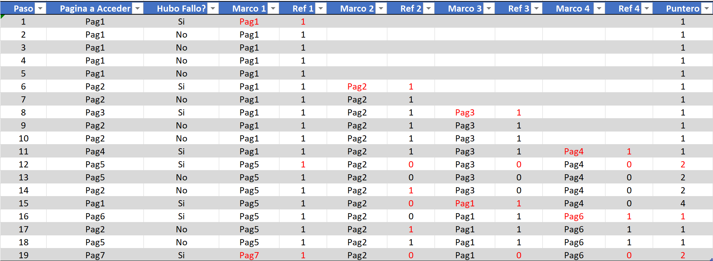
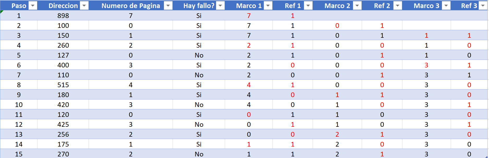

# Memoria Virtual

## 1

¿En qué medida influye cada uno de estos factores en la tasa de fallos de página de un sistema? 

1. El tamaño de página.

   Si el tamaño de pagina es muy chico, esto significa que cuando el proceso necesite una seccion de memoria en especial, no va a estar en las paginas ya cargadas, entonces tiene que ir a buscarla al almacenamiento mediante un fallo de pagina.

2. El tamaño de la TLB.

   La TLB es la tabla que contiene las paginas cargadas actualmente en memoria. Si esta tabla es mas grande, siempre que la memoria ram lo permita, va a poder mantener mas paginas en memoria y evitar fallos de paginas.

3. El tamaño de la memoria principal.

   Junto a la TLB, el tamaño de la memoria principal ocupa un papel crucial, ya que si no tiene memoria suficiente la computadora, va a tener que guardar paginas en almacenamiento temporáneamente (swapping) y traer nuevas paginas mediante un fallo de pagina.

4. La velocidad del procesador.

   No afecta a la tasa de fallos de pagina.

## 2

Supongamos que tenemos una máquina con <u>16 MB de memoria principal</u> y un esquema de gestión de memoria virtual paginado con <u>páginas de 4 KB</u>. Un proceso produce la siguiente secuencia de accesos a direcciones de memoria (mostradas aquí en hexadecimal): 

 ```
02D4B8, 02D4B9, 02D4EB, 02D4EB, 02D86F, F0B621, F0B815, F0D963, F0B832, F0BA23, D9D6C3, D9B1A7, D9B1A1, F0BA25, 02D4C7, 628A31, F0B328, D9B325, D73425
 ```

El sistema operativo asigna al proceso 4 marcos de memoria principal. Se pide: 

1. Dar la cadena de referencia de las páginas accedidas por el proceso. 

   Voy a definir a las siguientes paginas:

   ```
   Pagina 1: 0x02D000 -> 0x02DFFF
   Pagina 2: 0xF0B000 -> 0xF0BFFF
   Pagina 3: 0xF0D000 -> 0xF0DFFF
   Pagina 4: 0xD9D000 -> 0xD9DFFF
   Pagina 5: 0xD9B000 -> 0xD9BFFF
   Pagina 6: 0x628000 -> 0x628FFF
   Pagina 7: 0xD73000 -> 0xD73FFF
   ```

2.  Si el sistema operativo utiliza 4 marcos de memoria principal, describir el comportamiento del gestor de memoria utilizando cada uno de los siguientes algoritmos de reemplazo de páginas, indicando cuántos fallos de página se producen con cada algoritmo: 

   1. Algoritmo FIFO.

      Ahora, sabiendo que mi proceso tiene asignado 4 marcos, voy a ir paso por paso indicando cuando hay una falla de memoria:

      ```
      Marcos Actuales: [][][][]
      ```

      1. Se pide la dirección `0x02D4B8`: Como todos los marcos estan vacios, se genera un fallo de pagina y se carga la pagina 1

         ```
         Marcos Actuales: [Pag1][][][]
         ```

      2. Se pide la dirección `0x02D4B9`: Esta vez, la pagina esta cargada, entonces no se genera un fallo de pagina:

         ```
         Marcos Actuales: [Pag1][][][]
         ```

      3. Se pide la dirección `0x02D4EB`: Misma situacion que la anterior

         ```
         Marcos Actuales: [Pag1][][][]
         ```

      4. Se pide la dirección `0x02D4EB`: Misma situacion que la anterior

         ```
         Marcos Actuales: [Pag1][][][]
         ```

      5. Se pide la dirección `0x02D86F`: Misma situacion que la anterior

         ```
         Marcos Actuales: [Pag1][][][]
         ```

      6. Se pide la dirección `0xF0B621`: Se genera un fallo de pagina por que no esta esta posicion de memoria en ninguna pagina activa

         ```
         Marcos Actuales: [Pag1][Pag2][][]
         ```

      7. Se pide la dirección `0xF0B815`: Ya se encuentra la posicion en una pagina activa

         ```
         Marcos Actuales: [Pag1][Pag2][][]
         ```

      8. Se pide la dirección `0xF0D963`: Se genera un fallo de pagina por que no esta esta posicion de memoria en ninguna pagina activa

         ```
         Marcos Actuales: [Pag1][Pag2][Pag3][]
         ```

      9. Se pide la dirección `0xF0B832`: Ya se encuentra

         ```
         Marcos Actuales: [Pag1][Pag2][Pag3][]
         ```

      10. Se pide la dirección `0xF0BA23`: Ya se encuentra

          ```
          Marcos Actuales: [Pag1][Pag2][Pag3][]
          ```

      11. Se pide la dirección `0xD9D6C3`: Fallo de pagina

          ```
          Marcos Actuales: [Pag1][Pag2][Pag3][Pag4]
          ```

      12. Se pide la dirección `0xD9B1A7`: Se genera fallo de pagina, pero como estan todos los marcos ocupados, descarto al primero.

          ```
          Marcos Actuales: [Pag5][Pag2][Pag3][Pag4]
          ```

      13. Se pide la dirección `0xD9B1A1`: Ya se encuentra

          ```
          Marcos Actuales: [Pag5][Pag2][Pag3][Pag4]
          ```

      14. Se pide la dirección `0xF0BA25`: Ya se encuentra

          ```
          Marcos Actuales: [Pag5][Pag2][Pag3][Pag4]
          ```

      15. Se pide la dirección `0x02D4C7`: fallo de pagina, reemplazo a la pagina 2 con esta por ser la mas vieja.

          ```
          Marcos Actuales: [Pag5][Pag1][Pag3][Pag4]
          ```

      16. Se pide la dirección `0x628A31`: Fallo de pagina, reemplazo pag3 con pag6

          ```
          Marcos Actuales: [Pag5][Pag2][Pag6][Pag4]
          ```

      17. Se pide la dirección `0xF0B328`: Ya se encuentra

          ```
          Marcos Actuales: [Pag5][Pag2][Pag6][Pag4]
          ```

      18. Se pide la dirección `0xD9B325`: Ya esta

          ```
          Marcos Actuales: [Pag5][Pag2][Pag6][Pag4]
          ```

      19. Se pide la dirección `0xD73425`: Fallo de pagina, reemplazo pag4 con pag7

          ```
          Marcos Actuales: [Pag5][Pag2][Pag6][Pag7]
          ```

   2. Algoritmo de la segunda oportunidad. 

      

      El algoritmo funciona de la siguiente manera:

      Si la pagina no esta en memoria ya, la tengo que traer. Si hay marcos disponibles, cargo la pagina en ese marco y le pongo el bit de referencia del marco en 1. 

      Si no hay marcos disponibles, entonces tengo que moverme desde mi puntero, viendo los bit de referencia de cada marco. Si el bit de referencia esta en 1 significa que no puedo sacar a la pagina y solo le decremento el bit de referencia. Si el bit de referencia esta en 0, entonces puedo reemplazar esa pagina por la que quiero traer. Luego de traer la pagina nueva, le asigno 1 en su bit de referencia y cambio el puntero al proximo marco.

      Si la pagina ya existe, entonces cambio su bit de referencia a 1.

## 3

Un sistema con un solo procesador y con memoria virtual con paginación bajo demanda posee un <u>espacio direccionable máximo de 4 GB</u> y utiliza <u>páginas de 128 bytes</u>. Actualmente el sistema dispone de <u>128 MB de memoria principal.</u>

El <u>tiempo de acceso a memoria es de 150 nanosegundos</u>, <u>la tasa de fallos de página es del 5%</u> y <u>el tiempo medio de servicio de fallo de página es de 6 milisegundos</u>. 

La política de reemplazo es local, utiliza la <u>LRU</u> y  permite un tamaño máximo de área de trabajo por proceso de <u>tres marcos de página</u>. 

La búsqueda de marcos libres se realiza mediante una búsqueda lineal empezando por el marco cero.  

El núcleo del sistema operativo tiene un tamaño de <u>134 216 448 bytes y está ubicado de forma contigua a partir del primer marco de página de la memoria.</u>  

 En el sistema aquí descrito se ha ejecutado un único proceso que tiene un tamaño de 5300 bytes y ha generado las siguientes direcciones de memoria principal: 

```
898, 100, 150, 260, 127, 400, 110, 515, 180, 420, 120, 425, 256, 175, 270.
```

A partir de estos datos, responda a las siguientes cuestiones: 

1. ¿Cuál es la estructura de una dirección virtual en este sistema? 

   Como el sistema tiene un maximo direccionable de 4GB, entonces puedo decir que su memoria virtual es de 32 bits. Luego indica que las tablas son de 128 bytes, lo que implica que tiene 25 bits de numero de pagina y 7 bits de desplazamiento.

2. ¿Cuál es el número máximo de entradas que tendrá la tabla de páginas de un proceso? 

   Como el numero de pagina ocupa 25 bits, el maximo de entradas que puede tener la tabla es `2^25`

3. ¿Cuántas entradas tiene la tabla de marcos de página? 

   Como la memoria actual es de 128 MB, eso implica que la direccion real es de 27 bits. Gracias a esto podemos decir que maximo de pagias asignadas a un proceso es de `2^20` paginas.

4. ¿Qué páginas del proceso estarán en memoria principal en cada momento de su ejecución?

   

   El algoritmo funciona de la siguiente forma:

   Si tengo que traer una pagina y tengo lugar, la traigo y pongo su bit de referencia en 1.

   Si no tengo lugar, entonces busco de izquierda a derecha y reemplazo la primer pagina que encuentre que tenga un 0 en su bit de referencia. Al resto de los bits de referencia los cambio a 0.

   Si no hay fallo, entonces pongo en 1 el bit de referencia.

5. ¿En qué estado se encuentra la tabla de páginas del proceso después del último acceso a memoria?

   Como en la ultima linea de la tabla anterior.

## 4

Responde a las siguientes cuestiones de forma breve y justificando adecuadamente tus argumentos.

- ¿Por qué el tamaño de página debe ser siempre una potencia de 2? 

  Por que el calculo de las direcciones seria mucho mas complejo sin potencias de dos.

- En un sistema multiprogramado, cuando ocurre un cambio de contexto lo normal es limpiar el contenido actual de la TLB. ¿Cuál puede ser el motivo?

  Por que tengo una tabla de pagina por cada proceso. Si cambio de contexto la traducción de memoria y pagina no seria correcto con la tabla de otro proceso.

## 5

- ¿Es técnicamente posible que un procesador maneje un espacio de direcciones lógicas de 64 bits y direcciones físicas de 32 bits? 

  Si, es posible

- ¿Esto es posible con segmentación, paginación o con ambas técnicas? 

  Con ambas técnicas

- ¿Qué utilidad podría tener esta diferencia de tamaño entre el espacio lógico y el físico?

  Correr aplicaciones desarrolladas para procesadores de 32 bits en un procesador de 64 bits. ??? ==TAMI==

## 6

Un sistema realiza una gestión de memoria virtual mediante paginación por demanda. <u>El tamaño de página es 512 bytes</u>, <u>el espacio lógico de direcciones 8KB</u> y el <u>espacio físico de direcciones 4KB</u>. Suponga que en el sistema se encuentra en memoria un solo proceso y que el contenido de los marcos de página es el siguiente: 


Asumiendo una política de reemplazo local de páginas mediante el algoritmo óptimo, y dada la siguiente secuencia de direcciones lógicas de acceso a memoria 0x0458, 0x066D, 0x0801, 0x026E, 0x0AD8: 

1. Represente el estado final de la memoria física y de la tabla de páginas del proceso tras la secuencia de accesos a memoria. 

   

   El algoritmo optimo asume que conoces todo el estado del proceso y todos los accesos a memoria que va a hacer el proceso en su ejecución. Con esta información, a ojo, podes ver que pagina te conviene cambiar en caso de fallo de pagina y que todos los marcos estén ocupados, para que haya la menor cantidad de fallos de paginas posibles.

2. Se tiene un sistema de memoria virtual con paginación a dos niveles que permite agrupar las páginas en “directorios de páginas”. Cada directorio de páginas puede contener hasta 256 páginas. Los espacios de direcciones lógicas de este sistema son de 4Gbytes y el tamaño de página es de 4Kbytes. El espacio de direcciones físicas es de 1Gb. Describa la estructura de las direcciones lógicas y de las direcciones físicas de este sistema de memoria virtual. 

   ==Tami??== arqui??

## 8

Sea un computador con las siguientes características: 

- Ancho de palabra de 32 bits 
- Direcciones de 32 bits 
- Memoria física de 64 MB 
- Memoria virtual: 
  - Tamaño de página: 2 KB
  - Política de reemplazo: FIFO

En un determinado momento, se está ejecutando en este computador un proceso que tiene asignados exclusivamente 8 marcos de página. El fragmento de código correspondiente al periodo que se considera es: 

 ```c
s = 0; m = 0; r = 0; 

for (i = 0; i < 2047; i++)
{
	s = s + a[i];
}

for (i = 0; i < 2047; i++)
{
    m = m + a[i] * b[i];
}

for (i = 0; i < 2047; i++) 
{
    r = r + a[i] + c[i];
}
 ```

La variable de control del bucle `i` y las variables `s`, `m` y `r` están asignadas a registros del procesador. 

Todas las variables que aparecen son enteros de 32 bits.

 Las estructuras `a[i]`, `b[i]` y `c[i]` están asignadas por el procesador a direcciones consecutivas, en ese orden, a partir de la dirección `H’0000`.

 Considerando sólo los accesos a direcciones de datos, se pide: 

1. Escriba la traza del programa, indicando la secuencia de páginas a las que se accede. 

   Teniendo en cuenta que cada arreglo ocupa 2048 elementos por 4 bytes (asumo) , es decir 8KB (4 paginas). Podemos decir que el proceso ocupa 24KB (12 paginas). Trace:

   ```
   Antes del primer for:
   Marcos = [][][][][][][][]
   En el primer for:
   Marcos = [a][a][a][a][][][][]
   En el segundo for:
   Marcos = [a][a][a][a][b][b][b][b]
   En el tercer for:
   Marcos = [c][a'][c][a'][c][a'][c][a']
   ```

   En el ultimo estado tengo a `a'` por que al utilizar el algoritmo fifo, tengo que sacar primero las paginas de `a` ya que son las mas viejas y recargarlas inmediatamente por que las necesitan.

2. Indique los fallos de página que se producen durante la ejecución. 

   Suceden 16 fallos de pagina:

   - Suceden 4 fallos en el primer ciclo for, donde se cargan todas las paginas de `a`.
   - Suceden 4 fallos en el segundo ciclo for, donde se cargan todas las paginas de `b`.
   - Suceden 8 fallos en el tercer ciclo for, donde se cargan las 4 paginas de `c` y se recargan las 4 paginas de `a`

3. Repita el apartado b) suponiendo que la política de reemplazo es LRU.

   Suceden 12 fallos de pagina:

   - Suceden 4 fallos en el primer ciclo for, donde se cargan todas las paginas de `a`.
   - Suceden 4 fallos en el segundo ciclo for, donde se cargan todas las paginas de `b`.
   - Suceden 4 fallos en el tercer ciclo for, donde se cargan las 4 paginas de `c`.


