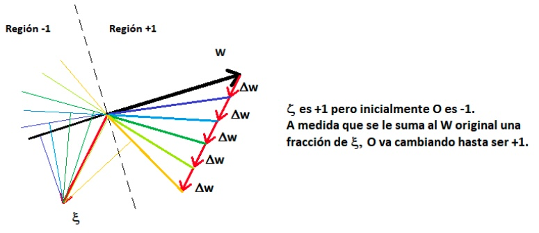
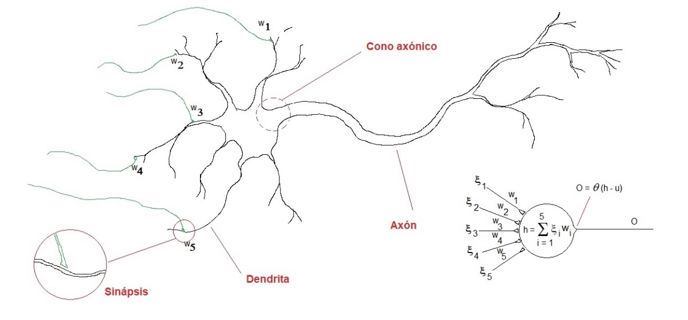
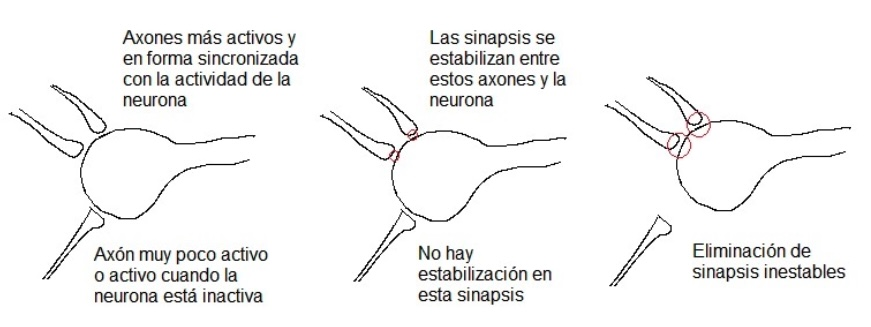

# Perceptron

Perceptron trata de obtener, a partir de un dataset, un plano que separe de la mejor forma a todos los puntos de este dataset. Esta información puede ser tanto de una sola dimensión, como multidimensional.


Hay varias formas de obtener este plano, una posibilidad seria crear un convexo a partir de los puntos de cada clase y luego tratar la recta más directa entre ambos convexos. Ahora podemos calcular nuestro plano como el cual corta a esa recta de forma perpendicular:


## El hiperplano

Consideremos a nuestro hiperplano representado en su forma normal, con el nombre $w$. En $\R^2$ se representaria como $(w_1,w_2)$. Sobre el ejemplo anterior, podemos ver como se representa:


A partir de esto, podemos tomar todos los puntos rojos y consideramos el vector que comparte el origen con $w$ y que llega al punto en cuestión. Luego repetimos lo mismo con los puntos negros:


Vemos que la proyección del vector sobre los puntos rojos es positiva, mientras que para los puntos negros es negativa.

Sabemos que en $a,b \in \R^n$, se puede definir al producto interno entre dos vectores es:
$$
a \cdot b = \sum^n_{i=1} a_i\times b_i = \lVert a \rVert \times \lVert b\rVert \times \cos \alpha
$$
Por lo que podemos representar a la proyección de $b$ como:
$$
\lVert a \rVert \times \cos \alpha = 
\frac{a \cdot b}{\lVert b \rVert} = 
\frac{\sum_{i=1}^n{a_i \times b_i}}{\lVert b \rVert}
$$
Entonces, si consideramos a los puntos de nuestro conjuntos de dato como $\xi_i^u$ donde $i$ se refiere a la clase y $u$ se refiere a la indice del punto, entonces obtenemos que la proyección de $\xi_i^u$ sobre $w$ es (asumiendo que $1\leq i \leq 2$ y que la norma de $w$ es $1$):
$$
\sum_{i=1}^2 \xi_i^u w_i
$$
 En general, para $n$ Dimensiones, podemos describir a un hiperplano como:
$$
\sum_{i=1}^n x_n\times t_n = t_0
$$
Donde $t_i, i\in \{0,\dots,n\}$ son constantes pertenecientes a los reales, mientras que $x_i$ pertenece a las variables representando a las dimensiones. Podemos adaptar a esta formula a nuestro problema. Si en un espacio $\R^n$ tenemos puntos distribuidos correspondientes a dos clases diferentes y linealmente separables, entonces obtenemos que nuestra ecuación general para el hiperplano es:
$$
\sum_{i=1}^n w_i\xi_i - w_0 = 0
$$

## Aprendizaje Automatico

Asumiendo la [Conjetura de Hebb](#La Conjetura de Hebb), consideramos que cada vez que el perceptron recibe un nuevo estimulo (entrada $\xi^\mu$) las condiciones sinápticas tendrían la posibilidad de actualizarse:
$$
w_i^{\text{nuevo}} = w_i^{\text{viejo}} + \Delta w_i
$$
El valor de actualización $\Delta w_i$ debería depender de la entrada $\xi_i^\mu$ y la salida $O^\mu$, según la conjetura de Hebb. Como nosotros estamos pidiendo que la entrada sea igual al estado de activación de la neurona ($\zeta^\mu = O^\mu$), entonces podemos definirlo como:
$$
\Delta w_i = 2 \eta\xi_i^\mu \zeta^\mu
$$
Donde $\eta$ es una constante de proporcionalidad llamada **tasa de aprendizaje**. Entonces si, cuando se presenta la entrada $\xi^\mu$,  el estado de activación $O^\mu$ de la neurona coincide con su salida deseada $\zeta^\mu$, no es necesario actualizar $w_i$, mientras que en el caso opuesto lo debemos hacer, modificamos a la función para reflejar este cambio:
$$
\Delta w_i = 
\left\{
\array{
	2 \eta \xi^\mu_i \zeta^\mu & \text{si } O^\mu \neq \zeta^\mu \\
	0 &	\text{else}
}
\right.
$$
Ademas, si los parámetros $O^\mu,\zeta^\mu$ solo pueden tomar el valor $\{1,-1\}$, podemos seguir simplificando a la función:
$$
\Delta w_i = \eta (\zeta^\mu-O^\mu) \xi_i^\mu
$$
Con esta formula podemos ver como, si $\zeta^\mu > O^\mu$, entonces lo que estamos haciendo es mover (al ritmo de $\eta$) el vector $w$ hacia $\xi^\mu$ y esto provocara que la próxima vez que calculemos el producto interno $w\xi^\mu$ sera mayor y sera mas probable que $O^\mu$ sea igual a $\zeta^\mu$.



Por el contratio, si $\zeta^\mu < O^\mu$, entonces lo que estamos haciendo es alejar a $w$ de $\xi^\mu$, causando la reacción opuesta.

==DUDA==

En ambos casso es mas probable que $O^\mu$ Sea igual a $\zeta^\mu$??

==END DUDA==

### Implementation Simple

Definición de los parámetros:

- Una **epoca** es cuando fueron expuestos al perceptron todas las entradas del conjunto de entrenamiento.
- **p** es la cantidad de entradas del conjunto de entrenamiento.
- **x[.]** el conjunto de entrenamiento donde cada entrada tiene dimension $N+1$, ya que se el agrega una dimension para el umbral.
- **y[.]** es la salida deseada.
- **w** es el vector de pesos sinapticos que incluye el umbral.
- **signo()** es la función de activación.

```pseudocode
i = 0
w = zeros(N+1,1)
error = 1
error_min = p * 2
while error > 0 and i < COTA:
	x_i = randomInt.From(1).To(p)
	h = x[x_i].w // Calcula la exitacion
	O = signo(h) // Calcula la activacion
	delta_w = tasa_de_aprendizaje * (y[x_i] - O).x[x_i]
	w = w + delta_w
	error = CalcularError(x,y,w,p)
	if error < error_min:
		error_min = error
		w_min = w
	end
	i = i + 1
end
	
```

### Perceptron Simple Lineal

Si en vez de tener una función de activación escalón, la misma es lineal, entonces el algoritmo se denomina como **perceptron simple lineal**:
$$
O^\mu = \sum_{i=0}^N w_i\times \xi_i^\mu
$$
En este caso, a diferencia del perceptron simple, la salida deseada deja de pertenecer al espacio $\{-1,1\}$ y pertenece a los reales. Para solucionar este problema, se puede formular una función de costo que adoptara un mínimo absoluto cuando el valor del vector de pesos $w$ haga que la salida sea $O^\mu = \zeta^\mu$ para cada entrada $\xi^\mu$:
$$
E(w) = \frac 1 2 \sum_{\mu=1}^{p} (\zeta^\mu - O ^\mu)^2 = \frac 1 2 \sum_{\mu=1}^{p} (\zeta^\mu - \sum_{i=0}^N w_i\xi_i^\mu)^2
$$
Para lograr legar al mínimo de $E$ podemos usar el metodo del gradiente descendiente, mediante el cual tenemos que ir cambiando $w$ de acuerdo a una proporción del gradiente:
$$
\Delta w_i = - \eta\times \sum_{\mu=1}^p (\zeta^\mu - O^\mu) \xi_i^\mu
$$
La convergencia de este metodo depende fuertemente de $\eta$, ya que si este valor es muy bajo, entonces el metodo puede demorar en su convergencia, mientras que si es muy alto, va a divergir.

### Perceptron Simple No Lineal

Es un caso especial del perceptron simple lineal, donde el estado de activación se obtiene de:
$$
O^\mu = g\left( \sum_{i=0}^N w_i\xi_i^\mu \right)
$$
Donde $g()$ puede ser una función sigmoidea como:

- $g(x) = \tanh (\beta x)$
- $g(x) = \frac{1}{1+\exp^{-2\beta x}}$

En este caso, la función de costo $E$ queda definida como:
$$
E(w) =\frac 1 2 \sum_{\mu=1}^{p} \left(\zeta^\mu - g\left(\sum_{i=0}^N w_i\xi_i^\mu\right)\right)^2
$$
Para utilizar el metodo del gradiente descendiente, tenemos que hacer el mismo proceso, pero este caso podemos usar la regla de la cadena para encontrar a la derivada de $g()$:
$$
\Delta w_i = \eta \times \sum_{\mu=1}^p \left(\zeta^\mu 0 g(h^\mu) \right) g'(h^\mu) \xi^\mu_i
$$
Donde:
$$
h^\mu = \sum_{i=0}^N w_i \xi_i^\mu
$$


## Redes Neuronales Artificiales

El modelo de neurona propuesto inicialmente estaba muy relacionado al modelo natural:



El modelo propuesto fue:


Formalmente, el modelo de neurona de McCulloch y Pitts es:
$$
O = \theta\left(\sum_{i=1}^n w_i\xi_i - \text{umbral}\right)
$$
Donde la función $\theta$ esta definida como:
$$
\theta(x) = 
\left\{
\array{
1 & x \ge 0 \\
0 & x \lt 0
}
\right.
$$
Podemos modificar a este modelo para adaptarlo a nuestro problema y resolver la cuestion de separabilidad lineal. Para esto tenemos que reemplazar al umbral por $w_0$, y redefinir a la función $\theta$ como:
$$
\theta(x) = 
\left\{
\array{
1 & x \ge 0 \\
-1 & x \lt 0
}
\right.
$$

### La Conjetura de Hebb

Las conexiones donde intervienen neuronas cuyo estado de actividad están correlacionados a lo largo del tiempo son reforzadas y este refuerzo depende de la intensidad y periodo de tiempo en que esto a ocurrido:



Esta conjetura permitió dar explicaciones a diferentes fenómenos observados en la psicología actual


