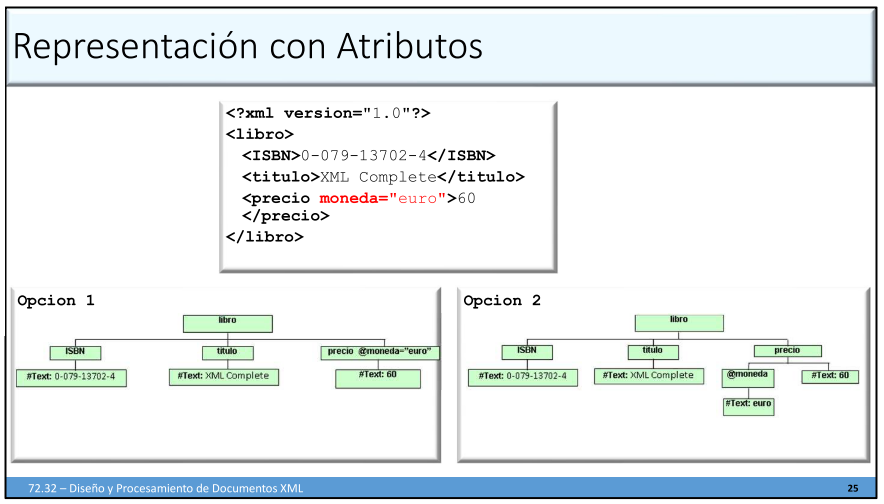

# Modelado de Datos

## Partes de un documento XML

El documento esta formado por un **prologo**, seguido por **elementos**. El documento **debe estar bien formado** y **puede ser valido** (Opcional).

Las indentaciones son solo para dar claridad y los tags son case-sensitive.

### Prologo

Esta ubicado en la primer línea y declara la versión del XML y el conjunto de caracteres utilizado. Esto ultimo es opcional, por defecto es `UTF-8`.

```xml
<?xml version="1.0" encoding="ISO-8859-1"?>	
```

### Elementos

Los elementos son el vocabulario del documento. Un elemento es reconocido dentro del documento por tener un **tag de inicio y de fin** con el mismo nombre. El elemento puede tener un **contenido**, **subelementos**, **ambos** o estar **vacío**. Un elemento vacío puede abreviarse con una tag que incluya su finalización. Otro posible contenido de los elementos son los **atributos**.

#### Valores no permitido en el contenido

Los documentos XML no permiten la utilización de los caracteres `<,>,&,",'`. Si se desea utilizarlos hay dos formas:

1. Reemplazándolos por cadenas alternativas:

| Carácter | Reemplazo |
| -------- | --------- |
| <        | \&lt;     |
| >        | \&gt;     |
| &        | \&amp;    |
| "        | \&quote;  |
| '        | \&apos;   |

2. Indicando que el siguiente texto no debe ser parseado de la siguiente forma:

```
<![CDATA[   /*texto*/   ]]>
```

3. Utilizando el valor Hexadecimal del carácter de la siguiente forma: `&#xValue;`

#### Comentarios

Los comentarios dentro de un documento XML se indican con los signos `<!--` y `-->`, y deben estar en la misma línea.

#### Atributos

Los atributos son componentes adicionales de los elementos y el valor de cada atributo debe se especificado entre comillas. El mismo atributo no puede repetirse en el elemento.

```
<Elemento atributo1="valor1" atributo2='valor2'>
```

## XML Bien Formado

Para que un documento XML este bien formado debe cumplir con las siguientes reglas:

- Hay un solo elemento raíz que abarca al resto.
- Todos los elementos tienen un tag de comienzo y uno de fin, o están vacíos.
- Los elementos forma una jerarquía, es decir que no pueden solaparse.
- Los valores de los atributos van entre comillas dobles o simples.

## Representación

Los documentos XML se suelen representar con un **árbol rotulado en forma natural**. Se suele marcar a los nodos internos con los elementos  y se rotulan con los nombres del tag. Los nodos hojas corresponden al contenido.

En el caso que haya atributos puede realizarse de dos formas, asignando el atributo y su valor en el rotulo del elemento mientras que la otra es que los atributos sean nodos hijos del elemento.



## Parseo y Verificación

Para verificar si un  documento esta bien formado, es cuestión de abrirlo en cualquier explorador de internet. Tambien se puede validar instalando un parser.

### Parsers

Los parsers son **programas que analizan la estructura del documento, caracter por caracter**. Conocemos dos parsers para validar documentos XML:

- **Document Object Model (DOM)**: Construye todo el árbol del documento completamente en memoria y después lo muestra.
- **Simple API for XML (SAX)**: Solo crea el árbol del documento a pedazos, a medida que los necesite.

Teniendo estos dos parsers, si nuestro documento es muy grande, nos conviene utilizar **SAX** ya que no carga todo el árbol en memoria, pero la ventaja de **DOM** es que te permite un acceso no secuencial al documento.

Los parsers se usan para verificar que u  archivo es un documento XML **bien formado** y para garantizar que es **valido**, es decir, que corresponde a cierto tipo de documentos.


