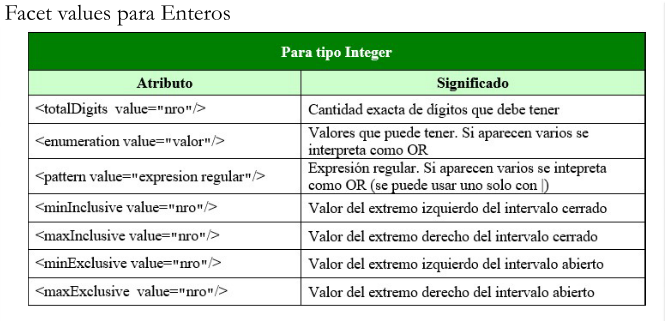
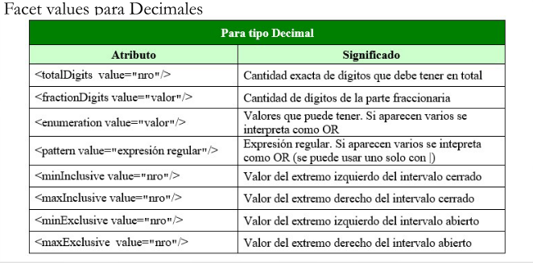
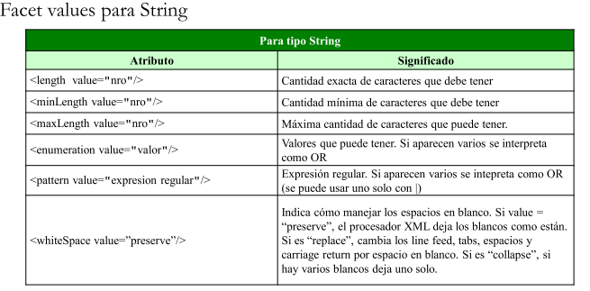

# Validación con XML Scheme

Este tipo de esquema valida con dos métodos distintos:

1. **Content Model Validation**: Se fija que los tags sean correctos, que las secuencias estén bien formadas, etc.
2. **Datatype Validation**: Validan el tipo de dato y su rango. Tiene tipos creados por defecto como `int`, `boolean`, etc, aunque tambien el usuario puede definir sus propios tipos.

## Historia

Luego de la aparición de XML 1.0, los DTDs probaron ser insuficientes, por lo que a principios de 1998 se empezó a trabajar en un nuevo esquema. Entre los esquemas propuestos estaban XML Data, DCD, DR y SOX, entre otros. Pero en 1999 se creo un grupo de trabajo orientado a resolver los problemas del esquema a crear, y para 2001 se presento **XML Schema** como una recomendación oficial.

## Declaracion

El archivo XSD no puede ir dentro del XML, por lo que hay que indicar en el nodo raíz donde esta guardado el esquema. Ejemplo:

```xml
<Raiz 	xmlns:xsi="http://www.w3.org/2001/XMLSchema-instance"
      	xsi:noNamespaceSchemaLocation="Validacion.xsd" 
>  
```

## Tipos de Datos

XML Scheme permite definir dos tipos de elementos:

- `simpleType`: El elemento no puede tener subelementos ni atributos, solo puede tener texto.
- `compleType`: El elemento puede contener subelementos y/o atributos.

Tambien se pueden crear tipos de forma:

- **Anónima**: No se les asigna un nombre y son locales a la declaración del elemento, es decir, no se puede reutilizar.
- **Con nombre**: Son definidos globalmente y pueden reutilizarse.

### SimpleType

Se pueden modificar de 3 formas a un tipo de datos simple, pero este siempre devolverá un tipo de datos simple. Para poder modificar a un atributo de un elemento, este debe tener el atributo `fixed="false"`. Todas estas modificaciones se pueden aplicar a tipos anónimos o con nombre:

- **Restricciones**:

Las restricciones permiten limitar el tipo de informacion que hay en un elemento, por ejemplo, dándole un rango de números para elegir (`minInclusive`,`maxInclusive`) o dándole una lista de valores (`enumeration`). Tambien se pueden utilizar Regex (`pattern`), entre otros. 

Un ejemplo seria:

```xml
<xsd:simpleType>
	<xsd:restricction base="string">
    	<pattern value="[1-9]?[1-9]"/>
    </xsd:restricction>
</xsd:simpleType>
```

Para ver todas las restricciones posibles hace click [aca](#Tabla de restricciones por tipo:)

- **Uniones**:

Las uniones permiten que un tipo de datos pueda ser guardado como distintos tipos, pero solo puede ser visualizado como uno de ellos. En el próximo ejemplo se puede ver un caso donde el tipo de datos permite que se ingrese una fecha o un string, pero no ambos:

```xml
<xsd:simpleType>
	<xsd:union>
		<xsd:simpleType>
			<xsd:restriction base=“string”/>
		</xsd:simpleType>
		<xsd:simpleType>
			<xsd:restriction base=“date”/>
		</xsd:simpleType>
	</xsd:union>
</xsd:simpleType>
```

- **Listas**:

Las listas permiten definir un tipo de datos, y luego el elemento podrá contener varios elementos de ese tipo de dato, siendo separado por espacios. El ejemplo muestra una lista de string:

```xml
<xsd:simpleType>
	<xsd:list itemType="string"/>
</xsd:simpleType>
```

### ComplexType

Los tipos de datos complejos permiten tener a otros elementos dentro suyo y tambien permiten tener atributos. Estos elementos y atributos pueden ser tanto de tipo complejo como simple. Estos tipos de datos se pueden crear de dos formas, mediante la creación de un nuevo tipo o aplicando una restricción a un tipo existente:

- **Sequence**:

Se define a una secuencia de elementos internos que debe seguir cuando se cree el documento XML. Dentro de si misma **se pueden crear** mas elementos del tipo **secuencia**, **choice** o **elementos normales**.

Al ser tipos de datos complejos, podemos **agregarle atributos**, siempre y cuando estos estén definidos al final del tag `complexType`. Tambien se puede trabajar con la cardinalidad de la misma forma que antes, agregando atributos al final del tag `sequence`.

Ejemplo:

```xml
<complexType>
	<sequence maxOccurs=“2”>
		<element name=“x” type=“integer” />
		<element name=“y” type=“integer” />
	</sequence>
	<attribute name=“Unit”>
		<simpleType>
			<restriction base=“string”>
				<enumeration value=“meters”/>
				<enumeration value=“centimeters”/>
			</restriction>
		</simpleType>
	</attribute>
</complexType>
```

- **Choice**

El choice cumple una función opuesta al `sequence`, con la particularidad de que **solo permite que se utilice uno de los elementos ingresados**. Aquí la cardinalidad funciona de forma similar. Si se aplica al choice, cualquier elemento va a poder estar $n$ veces, y si se aplica al elemento, solo ese elemento va a poder estar $n$ veces.

Ejemplo:

```xml
<complexType>
	<choice>
		<element name=“CUIT” type=“string” maxOccurs=“2” />
		<element name=“DNI” type=“string” maxOccurs=“2” />
	</ choice >
</complexType>
```

- **All**:

`All` es bastante similar a `sequence`, pero sin la limitación de que los elementos tienen que estar en cierto orden. Pero tambien trae una limitación, **solo puede tomar elementos**, y no secuencias o choices. Otra restricción es que **no se puede tener mas de un elemento igual** dentro del `All` y como mucho los elementos pueden ser opcionales (Indicando mínima cardinalidad 0). 

Ejemplo:

```xml
<complexType>
	<all>
		<element name=“Nombre” type=“string” />
		<element name=“DNI” type=“string” />
	</all>
</complexType>
```


## Estructura

Los documentos XSD (XML Scheme) son documentos XML, por lo que tienen un elemento raíz llamado `schema` y sus atributos sirven para indicar el namespace.

Los elementos se pueden definir dentro de la raíz o dentro de otros elementos y son básicamente un tag de XML. Este tag puede tener los siguientes atributos:

- `name`: nombre del elemento.
- `minOccurs`,`maxOccurs`: veces que se puede repetir el elemento.
- `type`: tipo de dato del elemento.
- `default`:
- `fixed`: es un valor booleano, donde se especifica si al derivar al tipo de dato, se puede modificar el atributo.

Aquí se puede ver un ejemplo de un elemento que puede tanto no estar en el documento o puede estar ilimitadas veces, del tipo `string`:

```
<xsd:element name="ElementName" minOccurs="0" maxOccurs="unbounded" type="string"/>
```

Por otro lado, para definir un atributo solo hay que crear un tag dentro del elemento deseado y asignarle un tipo simple. Por ejemplo

```
<xsd:attribute name="att" type="string"/>
```

### Componentes Globales y Locales

Se pueden definir componentes globales, que son hijos directos del tag `schema`. El nombre global debe ser único. Luego se pueden definir componentes locales, donde su alcance corresponde a la declaración que lo contiene.


# Anexo: 

## Tabla de restricciones por tipo:





