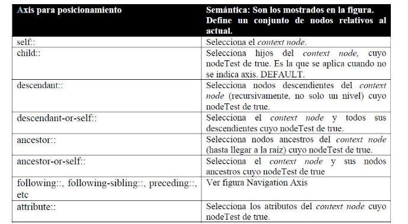
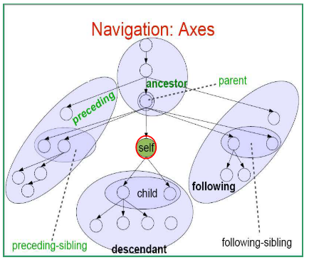
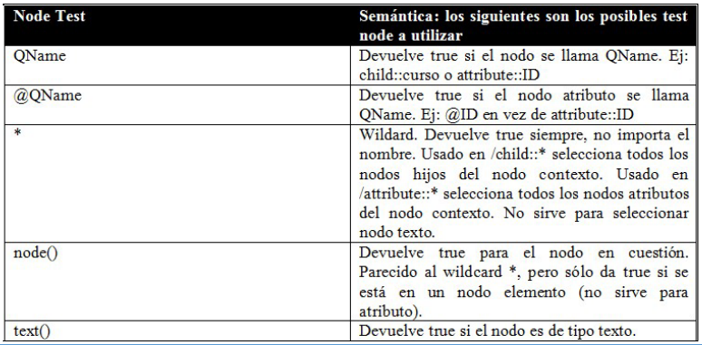
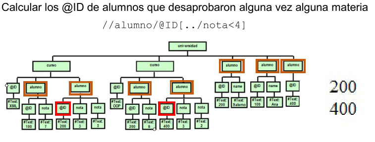
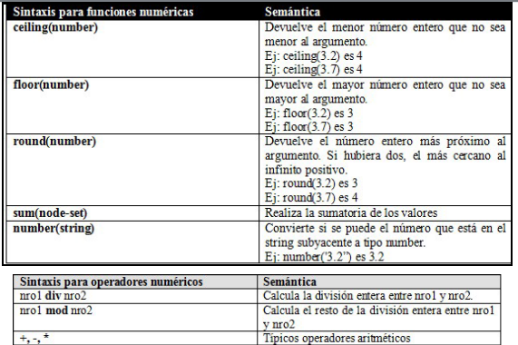
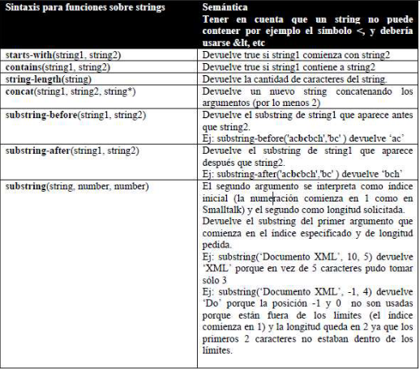
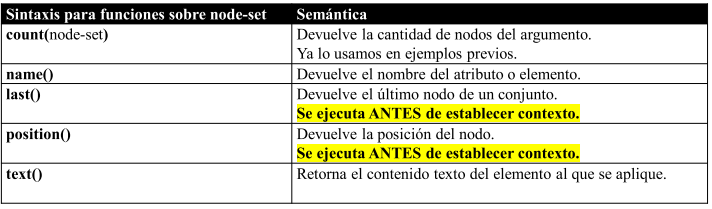
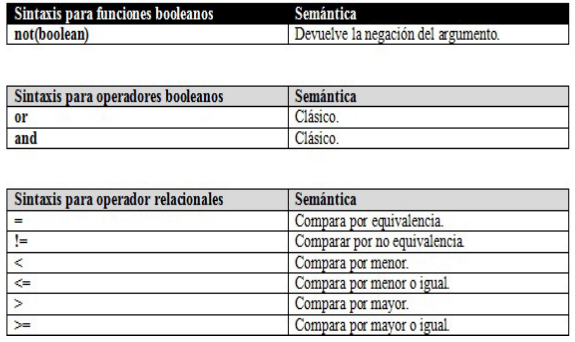
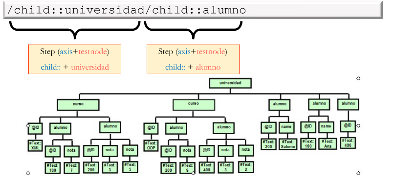

# XPath

El lenguaje XPath se basa en el concepto de navegación. Dado que al estructura a navegar es jerárquica, la **navegación es posicional**. Permite recuperar parte del documento XML por medio de expresiones que pueden escribirse usando un conjunto de funciones estándares. Por dentro, funciona creando un árbol del documento XML, similar a DOM.

Para navegar por el documento, XPath construye un árbol que tiene 7 tipos distintos de nodos:

- Comentario
- Processing Instruction
- Namespace
- Raíz
- Elemento
- Atributo
- Texto

## Limitaciones

XPath es muy potente para hacer consultas, pero todavía hay cosas que no puede resolver:

- Agrupar
- Ordenar
- Definir funciones de usuario
- Crear nuevos nodos.

## Expresiones

Las expresiones de XPath tiene un direccionamiento similar al FileSystem, y esta compuesto por pasos. Cada paso, a su vez, esta compuesto por 3 elementos:

- Axis
- NodeTest: Es el nodo sobre el que va a actuar o una wildcard `*`.
- Predicados: Puede tener 0 o mas predicados para filtrar a los nodos seleccionados.

La combinación entre Axis y NodeTest indican cual será el nuevo nodo contexto, a partir del cual se seleccionaran el nodo contexto actual.

### Axis

En esta tabla se pueden ver las diferentes combinaciones para el Axis:

Tambien se puede ver en este árbol como son las relaciones:

#### Nodos hijo

Con el axis `child::` se seleccionan a todos los elementos hijos de un elemento. Cuando se esta moviendo por el documento, si no se le especifica un axis, va a tomar a `child::` por defecto.

#### Nodos Atributo

Con el Axis `attribute::` se seleccionan a todos los atributos con un nombre en especifico de la lista de nodos contexto actuales.

#### Nodos Descendiente

Con el axis `descendant::` se obtienen todos los nodos descendientes del contexto actual que cumplan con un nombre en especifico. Esto implica nodos hijos, nietos, bisnietos, etc.

#### Nodos Predecesores

Con el axis `ancestor::` se obtienen todos los nodos predecesores del contexto actual que cumplan con un nombre especifico. Una característica de este axis es que elimina duplicados. Esto se debe a que en realidad se maneja con punteros a memoria, entonces si dos elementos tiene la misma posición de memoria, solo se queda con uno.

### NodeTest

En esta tabla se puede ver la lista de NodeTest:

### Predicado

Se le puede agregar un predicado mediante el cual se filtraran los nodos que no cumplan con el.

Cuando se usa una condición dentro de un predicado hay que tener cuidado por que:

- Si se coloca un `QName` se considera elemento hijo al context node (path relativo)
- Si se coloca `@QName` se considera atributo del context node (path relativo)
- Si se coloca `..` o `.` se considera al context node (path relativo).
- Si se coloca `/` o `//` como inicio de expresión, se pierde el nodo contexto y se evalúa independiente de este caso (path absoluto).

Estas expresiones van entre brackets `[ ]` y pueden utilizar operadores lógicos y matemáticos como `>`, `<`, `and` y `or`, entre otros. Por ejemplo:

Tambien se pueden utilizar funciones.

#### Combinación de conjuntos

Tambien se pueden aplicar combinaciones entre conjuntos, con el operador `|`. Este operador toma dos funciones que devuelven NodeSets y las combina en uno solo.

## Funciones

Las funciones se pueden utilizar en los predicados y utilizan los mismos tipos de datos que XML Scheme. Las funciones pueden ser:

- Numéricas
- Booleanas
- Strings
- Nodos

### Funciones Numéricas

Para aplicar una función sobre un elemento se toma su contenido y si se puede (y es necesario) se lo transforma en un numero.

### Funciones sobre Strings

### Funciones sobre NodeSet

### Funciones Lógicas

## Evaluador

El motor evaluador de XPath toma al documento XML y la expresión XPath. La evaluación utiliza el concepto de **nodo contexto actual**. A medida que evalúa una subexpresion cambia la lista de nodos contexto actuales por una nueva lista.

Antes de comenzar a evaluar, XPath selecciona como primer nodo a la raíz XPath, que no es el primer elemento del documento, sino que esta afuera de ese.

Ejemplo:

## Observaciones

- No es lo mismo seleccionar al nodo hijo elemento que a un nodo hijo atributo.
- Cuando se recupera un nodo elemento se obtiene toda su informacion, incluyendo tag, subelementos y atributos.
- Cuando se recupera un nodo atributo se obtiene solo el texto que contiene.
- Cuando se llega a un nodo atributo no se puede seguir bajando por que este tipo de nodo no puede contener a nada mas.

