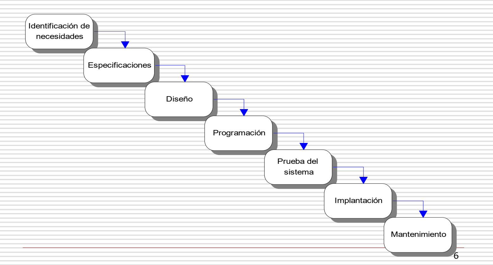
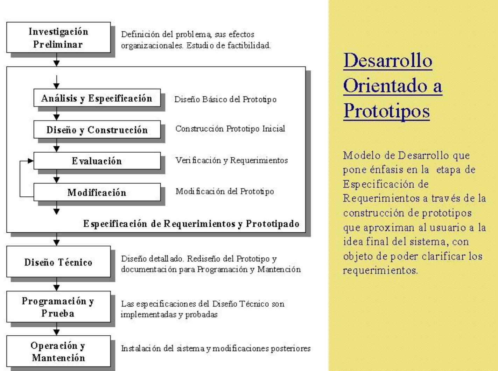
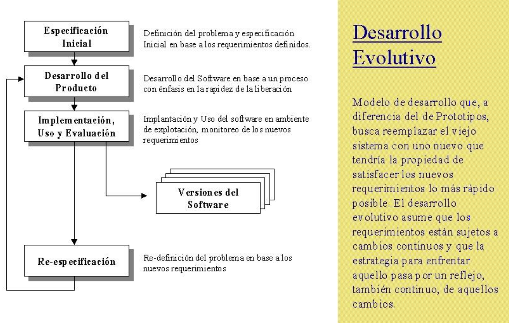
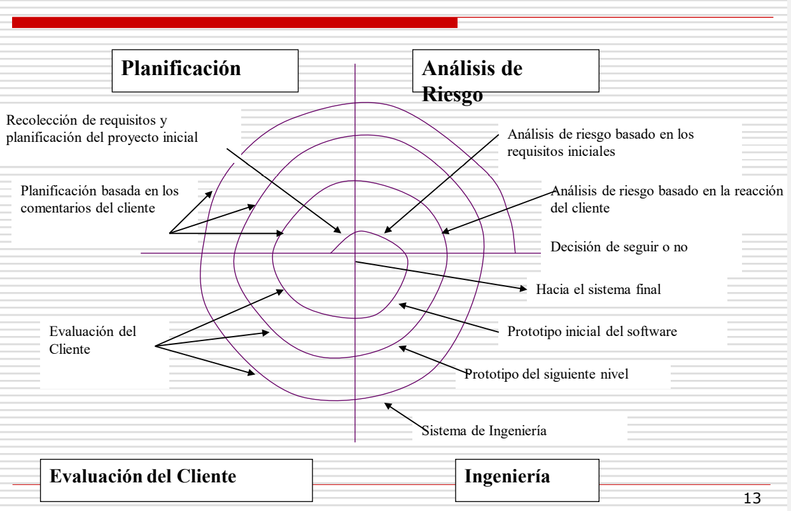
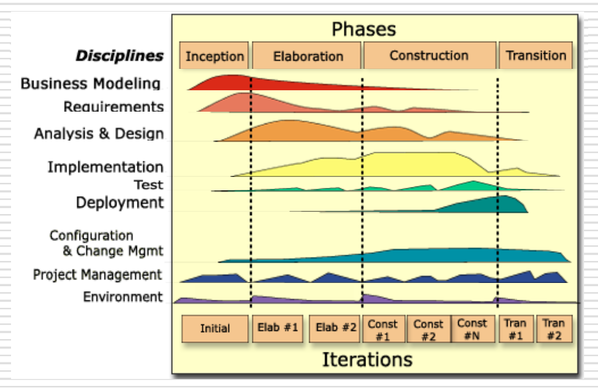

# Life Cycle

No hay solo una forma de organizar el desarrollo de software, sino que hay multiples procesos actualmente. Existen dos  tipos de metodologias:

1. **Presciptivo**: Asociado a las ciencias duras, tienen que ser planeados desde el principio y no suelen poder modificarse mucho despues de haber empezado el proceso.
2. **Agiles**: Son procesos que pueden cambiar en cualquier momento. Este tipo de desarrollos es comun en la ingenieria de software.

### Ciclo de vida tradicional en cascada

Es la forma antigua de realizar los proyectos. Las nuevas metodologias siguen utilizando las 7 estapas de este modelo pero suele estructurarlas de distinta forma o agruparlas. Este metodo es <u>prescriptivo</u>, por lo que no permite cambios durante el desarrollo.

### Desarrollo orientado a prototipos

Este metodo se basa en hacer un prototipo y darselo a probar a los usuarios. Este prototipo va a ser modificado hasta que el usuario quiera usarlo, y una vez que lo acepta, este pasa a produccion.

### Desarrollo Evolutivo

Esta metodologia se basa en sacar una primera version con pocas caracteristicas y luego ir iterando sobre el producto y agregando nuevas funciones. Cada una de estas versiones tienen que tener las caracteristicas de la version anterior y deben ser utilizadas en produccion. Tambien te permite tener un versionado del producto.

### Modelo Incremental

Este proceso requiere un planeo anterior a empezar a desarrollar el producto, luego se va aplicando cada funcion por separado. Este metodo se puede combinar con los dos metodos anteriores.

### Modelo Espiral

Es similar al modelo incremental pero de otra perspectiva.

## Unified Process (UP)

Se creo un proceso nuevo junto a una forma de describir al proceso, llamada UML. Este proceso puede documentar cualquier software, ya que tiene mas de 50 artefactos para realizarlo. Solo muy grandes empresas pueden aplicar completamente UP.

Este proceso tiene solo 4 etapas:

La complejidad del proceso es que hay varios flujos de trabajo simultaneos, y cada uno de estos flujos tiene a una persona a cargo. Con este metodo no se puede empezar a pensar en el dise;o del producto hasta no haber definido el modelo de negocios y los requerimientos.

La primera etapa (<u>Inception</u>) debe utilizar solo dos artefactos: ...

### Mejores Practicas

1. Cada ciclo debe durar entre 2 y 6 semanas.
2. El modelado visual (maqueteado) es fundamental.
3. El cliente debe colaborar con el usuario. El cliente se llama product owner.
4. Incentivar el reuso de componentes.
5. ..
6. ...
7. ...

==VER FILMINA==

### Casos de uso

UP propone casos de uso pero no lo impone. Esto debe ser parte del documento de inception.

### Errores Comunes

1. No respetar flujos de trabajo

2. Hacer los timeboxes muy grandes o muy chicos

3. Hacer demasiada documentacion.

4. Priorizar las funciones con mayor riesgo (las mas necesarias).
5. No hay que hacer planeamientos predictivos, ya que bloquean todas las otras posibilidades de desarrollo.  Hay que usar planeacion adaptativa, es decir, planear hasta terminar el sprint.

