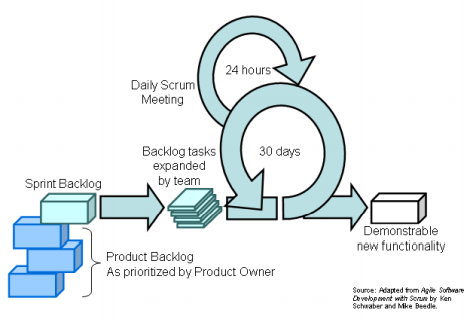

# Metodologías Agiles

El propósito de los proyectos es proveer soluciones de alta calidad y bajo costo a los usuarios, pero esto suele llevar a problemas técnicos o financieros. Hoy en día se utilizan distintos procesos para poder solventar estos problemas, entre ellos se encuentran **RUP**, **XP** y **Scrum**.

Estos procesos tienen muchas ventajas, entre las cuales se encuentra:

- Proveer código de calidad.
- Generar valor al negocio.
- Avanzar con el trabajo.
- Reaccionar rápido ante los cambios.
- Mejoras en el managment de la proyecto.

Pero este tipo de procesos no son los únicos que hay, sino que tambien existen los denominados **procesos formales**. Las diferencias principales es que los procesos agiles pueden responder mucho mas rápidos a los cambios, además de necesitar menos gente ordenando el proyecto.

## XP

XP es una metodología liviana, eficiente, de bajo riesgo, flexible, predecible y científica. Esta metodología esta orientada a equipos peque;os o medianos para desarrollar software teniendo como premisa que los requisitos cambian rápidamente.

XP **promete a los programadores** que van a trabajar en proyectos que les interesan, con la libertad de aplicar todo su potencial en la construcción del software. Tambien van a poder tomar decisiones en los temas que dominan, y no en aquellos con los cuales no se sientan cómodos.

XP **promete a los clientes y managers** que van a tener el mayor redito de cada semana de programación. En pocas semanas verán progresos concretos en los objetivos que les interesa y podrán realizar cambios en el proyecto durante el desarrollo sin ver aumentos significativos del costo del proyecto.

Pero tambien tiene sus **riesgos** propios. Entre ellos se encuentran las entregas tardías, cancelaciones de proyectos o sistemas desactualizados. Otros errores que suele presentar son una alta tasa de errores y problemas a la hora de establecer las reglas de negocio, cambios de requerimientos y la deserción de programadores.

Pero esta modalidad propone soluciones a los riesgos:

- **Entregas tardías**: La idea es hacer iteraciones cortas de 1 a 4 semanas y que las tareas tambien lo sean, durando no mas de 3 días.
- **Cancelación de proyectos**: El cliente elige cual es la menor release que le da valor al sistema.
- **Sistema desactualizado**: Apertura ante los cambios.
- **Alta tasa de errores**: testeo unitario y funcional, además de especificación iterativa.
- **Reglas de negocio sin entender**: El cliente forma parte del grupo de desarrollo.
- **Cambios de requerimientos**: Iteraciones cortas.
- **Deserción de programadores**: El programador acepta la responsabilidad de estimar y completar su propio trabajo. El contacto con los integrantes del grupo es fundamental. Los integrantes del grupo van aceptando mas responsabilidades a medida que pasa el tiempo.

Por ultimo, XP propone las siguientes **prácticas**:

- **Juego de planificación**: Determinar rápidamente el alcance de la próxima release combinando las prioridades del negocio y las limitaciones técnicas. Este planeamiento es a corto plazo ya que no se debe planear a mas de dos meses, y de no llegar con los tiempos, se suele actualizar el plan.
- **Releases pequeñas**: La idea es poner en producción el sistema funcional mas peque;o posible e ir agregando iteraciones con funcionalidades nuevas.
- **Metáforas**: La idea es guiar a todo el grupo de desarrollo con una historia simple de como el sistema debería funcionar, ayuda a comprender los elementos básicos del sistema y la relación entre los mismos. Estas metáforas deben ser refinadas a medida de que el proyecto avanza.
- **Diseño simple**: El sistema debe ser lo mas simple posible. Esto implica que si el futuro es incierto, no se debe planear mas allá de una funcionalidad, pero lo mas importante es que el diseño sea correcto. Para lograr esto se tiene que cumplir con lo siguiente:
  - Debe pasar todos los testeos
  - No debe tener lógica duplicada
  - Muestra la intención del programador
  - Tiene la menor cantidad de clases y métodos posibles
- **Testeo**: Los testeos unitarios deben ser parte del código y los testeos funcionales deben ser parte del programa, pero esto no implica que cada método debe ser testeado, sino que solo debe realizarse este testeo en caso de  que lo amerite.
- **Refactoreo**: Implica llevar al programa a la forma mas simple una vez que se introducen los cambios, además se debe eliminar el código duplicado.
- **Pair programming**: Se basa en la idea de que una persona escribe el código y la mejor forma de implementarlo, mientras que la otra piensa de forma estratégica si es la mejor solucion o hacen falta mas casos de testeo. La idea es que las parejas se vayan intercambiando el rol.
- **Compartir autoría**: En esta metodología no existe el concepto de ser *dueño del código, sino que cada uno que ve una oportunidad de mejorar el programa debe hacerlo. Esto lleva a corregir bugs en mas rápido.
- **Integración Continua**: El código debe ser integrado y testeado regularmente, por lo general se tiene una computadora dedicada a esta tarea. Cualquier cambio que se quiera agregar tiene que pasar todos los tests implementados.
- **40 horas semanales**: No se debe trabajar mas de 40 horas semanales ya que esto degrada la capacidad creativa del equipo y aumenta directamente la cantidad de bugs presentes. Esta permitido que una semana se trabaje mas horas, pero si esto se vuelve a repetir entonces el problema no puede ser resuelto solo agregando mas horas.
- **Cliente on-site**: El cliente debe ser parte del grupo, para poder responder a cualquier duda que pueda surgir.
- **Estándares de programación**: Se deben definir para facilitar la practica de la autoría compartida de código. Se debe enfatizar en la comunicación y tener como premisa hacer el mínimo trabajo posible.

________

## SCRUM

SCRUM es una metodología ágil orientada al management de proyectos que surgió en los últimos años. La idea es formar un backlog de tareas para hacer y se van eligiendo algunas de esas tareas para formar un sprint, es decir, una iteración. Luego de la iteración sale una versión con nuevas funcionalidades y se repite el ciclo.

En este metodologia, cada integrante tiene un **rol**:

- **Product Owner**: Es quien mantiene la definición de éxito y maneja el ROI utilizando las prioridades en el armado de las iteraciones.
- **Scrum Master**: Es el dueño del proceso y la conexión entre el Product Owner y el Team.
- **Team**: Es el dueño de la producción.

Además, SCRUM implementa las siguientes **practicas**:

- **Sprint planning meeting**: Al comienzo de cada sprint se debe hacer una reunión donde el product owner describe las funcionalidades con mayor prioridad del proyecto y el team se encarga de decidir que se va a implementar en sprint (**sprint backlog**)
- **Sprint**: Son sesiones de tiempo fijo donde se van a implementar los cambios acordados en la sprint planning meeting. Estas actividades están en el sprint backlog y el burndown chart.
- **Sprint review meeting**: Es una reunión al final del sprint para ver las funcionalidades implementadas.
- **Sprint Retrospective**: Se analiza el ultimo sprint y se ve que cosas se pueden mejorar.
- **Daily Scrum**: Es una pequeña reunión diaria donde se discute lo implementado, lo que se va a implementar y los problemas encontrados.

Por ultimo, SCRUM utiliza artefactos para poder mejorar la organización del proyecto:

- **Product Backlog**: Es una tabla donde se establecen todas las tareas que se deben implementar, junto a su prioridad y estimación.
- **Sprint Backlog**: Es una tabla donde se establecen las tareas que pertenecen al sprint, junto a su estación y tiempo trabajado.
- **Sprint Burnout Chart**: Es un grafico donde se ven la cantidad de tareas que se van resolviendo por día, y cuantas quedan.