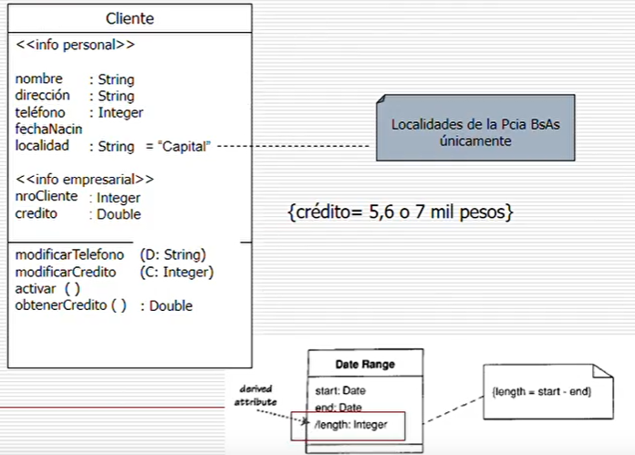

# Clases UML

Una **clase** es una descripcion de un tipo de objecto, que encapsula atributos y metodos. Los **atributos** son una propiedad de la clase y describe un rango de valores que la propiedad podra contener en cualquier instancia de la clase. Por el otro lado, los **metodos** son las acciones que la clase puede realizar.

Esta forma de representar es muy grafica y permite ve las relaciones entre las distintas clases en un programa.

En el caso de las propiedades, estas pueden tener distintos niveles de visibilidad:

- `-` : Visibilidad Privada
- `#` : Visibilidad Protegida
- `+` : Visibilidad Publica
- `~` : Visibilidad Package

## Estrategias para identificar clases

Vamos a usar el metodo semantico, que consiste en identificar en la definicion de los requerimientos cuales son los sustantivos a los cuales se hace referencia. Estos sustantivos serian las clases, los adjetivos calificativos serian los atributos y los verbos son los metodos. De esta manera tenemos clases que ejecutan verbos y formamos una red de conexiones y responsabilidades.

La mensajeria entre objetos 

