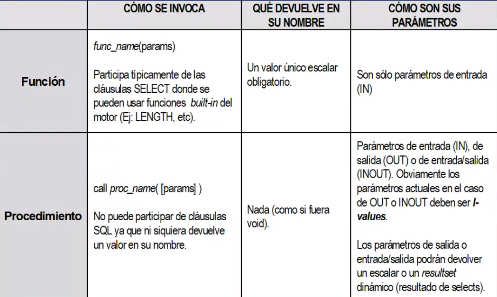

# Persistent Stored Module (PSM)

### Diferencias con funciones normales




### Definición

```mssql
CREATE FUNCTION nombreFuncion ([Parametros])
RETURNS tipoDevuelto
[DETERMINISTIC | NOT DETERMINISTIC]
[NO SQL | CONTAINS SQL | READS SQL | MODIFIED SQL DATA]
[DYNAMIC RESULT SETS]
BEGIN
... SQL ...
END
```

##### `[NO SQL | CONTAINS SQL | READS SQL | MODIFIED SQL DATA]`

- `[NO SQL]`: No contiene codigo SQL
- `[CONTAINS SQL]`: Contiene instrucciones `INSERT`, `UPDATE`, `SELECT` o `DELETE`.
- `[READS SQL]`: Solo utiliza la instruccion `SELECT`.
- `[MODIFIED SQL DATA]`: ???

### Reglas de Funciones en Postgress

- Si hay un solo parametro `OUT` o `INOUT` genera un returns con eso.
- Si hay mas de un `OUT` o `INOUT`, genera un `RETURNS RECORD`
- ???


