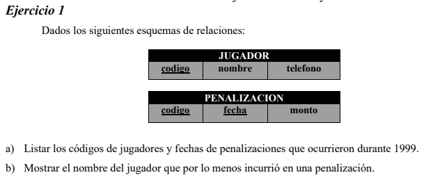
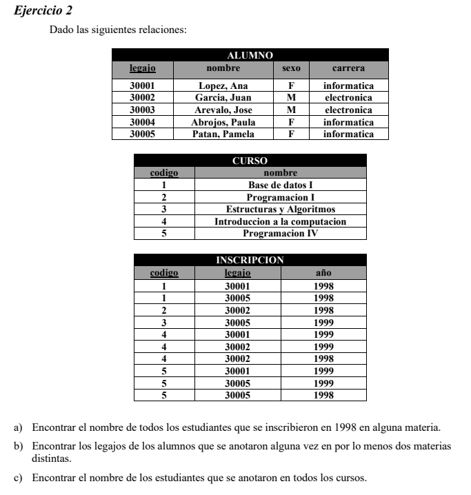
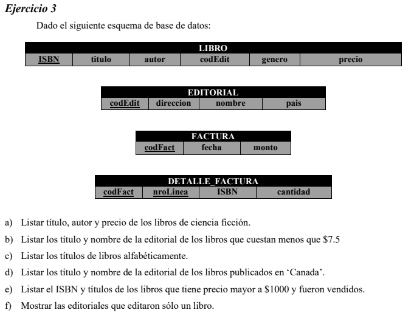

# Calculo Relacional

**a)**
$$
\{ T\ |\ (\exist U)(JUGADOR(U) \land (\exist V) (PENALIZACION(V) \land 1/1/1999 \le V[\text{fecha}] \le31/12/1999) \land T[\text{codigo}] = U[\text{codigo}]) \}
$$
**b)**
$$
\{ T\ |\ (\exist U)(JUGADOR(U) \land (\exist V) (PENALIZACION(V) \land U[\text{codigo}] = V[\text{codigo}]) \land T[\text{nombre}] = U[\text{nombre}] ) \}
$$

**a)**
$$
\{ T\ |\ (\exist U) (Alumno(U) \land (\exist V) (Inscripcion(V) \land U[\text{legajo}] = V[\text{legajo}] \land V[\text{ano}] = 1998) \land T[\text{nombre}] = U[\text{nombre}])\}
$$
**b)**
$$
\{ T\ |\ (\exist U)(Inscripcion(U) \land (\exist V (Inscripcion(V) \land U[\text{legajo}] = V[\text{legajo}] \land U[\text{codigo}] < V[\text{codigo}]) ) \land T[\text{legajo}] = U[\text{legajo}]  ) \}
$$
**c)**
$$
\{ T\ |\ (\exist U) (Alumno(U)\\ \land (\forall V) (Curso(V) \land (\exist C) (Inscripcion(C)\land V[\text{codigo}] = C[\text{codigo}] ) \land U[\text{legajo}] = C[\text{legajo}])\\ \land T[\text{nombre}] = U[\text{nombre}] )\}
$$

**a)**
$$
\{ T\ |\ (\exist U) (Libro(U) \land U[\text{genero}]=\text{'Ciencia Ficcion'} \land T[\text{titulo}] = U[\text{titulo}] \land T[\text{autor}] = U[\text{autor}] \land T[\text{precio}] = U[\text{precio}]) \}
$$
**b)**
$$
\{ T\ |\  (\exist U)(Libro(U) \land U[\text{precio}]<7.5\\ \land (\exist V) (Editorial(V) \land V[\text{codEdit}] = U[\text{codEdit}] \land T[\text{editorial}] = V[\text{editorial}])\\  \land T[\text{titulo}]=U[\text{titulo}]) \}
$$

