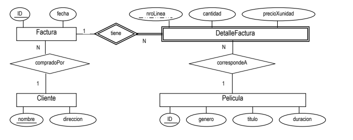

# Parcial 1

## Ejercicio 1

### 1.1

Listar los nombres de los autores que siempre han escrito libros sin compartir autoría (o sea siempre escribieron libros solos). Los nombres deben aparecer una sola vez en el listado. Asumir que no hay autores que están en la tabla AUTORES y no aparezcan en la tabla AUTORIA

```sql
select nombre from autor
where not exists(select * from autoria a1 
                where a1.autorid=autor.autorid and exists(select * from autoria a2
                            where a1.isbn=a2.isbn and a1.autorid<>a2.autorid));
```

### 1.2

Sólo para aquellos alumnos cuyo porcentaje de ejemplares todavía retenidos en su poder respecto de los ejemplares que algunas vez sacaron en préstamo (no importa si fueron o no devueltos) supere el 50%, escribir una consulta SQL en DB2 para obtener un listado de dos columnas llamadas LEGAJO y PORCENTAJE, obviamente la primera con el legajo y la segunda con el porcentaje junto al símbolo %. 

```sql
select legajo, concat(cast (
						cast(
								100 * (count(fechaprestamo) - count(fechadevolucion)) as decimal(6,2)
						)
						/ count(fechaprestamo)  as decimal(6,2)
					), ' %')
					as procentaje
from prestamo
group by legajo
having count(fechaprestamo) > 2 * count(fechadevolucion);
```

### 1.3

Solamente para aquellos libros (no ejemplar) tal que no tengan ejemplares fuera de la biblioteca, calcular el máximo período (en cantidad de días) en que el libro permaneció prestado (para este cálculo no distinguir entre sus ejemplares). Para ellos se pide escribir una consulta SQL en DB2 y obtener un listado de dos columnas llamadas ISBN y PERIODOMAXIMO, obviamente la primera con el ISBN y la segunda con el periodo máximo en días que duró el préstamo. Tener en cuenta que no debe aparecer en el listado aquellos libros que nunca fueron devueltos.

```mssql
select  isbn, 	(
					select extract( day from fechadevolucion  - fechaprestamo) from prestamo
					where p1.isbn = isbn and not fechadevolucion ISNULL 
					group by fechaprestamo, fechadevolucion
					having	extract( day from (fechadevolucion - fechaprestamo)) >=all(
								select extract (day from fechadevolucion - fechaprestamo) 
								from prestamo p3
								where p1.isbn = isbn and not fechadevolucion ISNULL 
								)
				)
as periodo
from prestamo p1
group by isbn
having  count(p1.fechadevolucion ) = (
									select count(isbn) from prestamo
									where p1.isbn = isbn
								 );
```

### 1.4

Se quiere saber cuál es la descripción de los libros tal que todos sus ejemplares catalogados en la biblioteca fueron prestados por lo menos alguna vez a una misma persona. Escribir la consulta SQL DB2 que permita obtener este resultado ordenado descendentemente por descripción 

```mssql
select descrip
from prestamo natural join libroo4f
group by isbn, legajo, descrip
having count(distinct subnumero) = (
									select count(distinct subnumero) 
									from ejemplar 
									where isbn = prestamo.isbn
									) ;
```

### 1.5

Averiguar cuáles son los libros tal que todas las veces que tuvieron ejemplares en préstamo ya devueltos, su demora no fue mayor a 24 horas. Solo listar ISBN sin repetirlos. 

```mssql
select isbn
from prestamo p2
where not p2.fechadevolucion isnull
group by p2.isbn
having   0 =all	(
						select  extract(day from p1.fechadevolucion - p1.fechaprestamo)
						from prestamo p1
						where p1.isbn = p2.isbn and not p1.fechadevolucion ISNULL
					);
```

## Ejercicio 3



Elegir verdadero o falso:

- **3.1)** Una misma película no puede haberse vendido a dos precios diferentes.

  Es <u>verdadero</u> por que el precio de la pelicula se lo indica en el detalle de la factura y no en la definicion de pelicula

- **3.2)** No puede aparecer en una factura el registro de dos clientes distintos.

  Es <u>verdadero</u>, ya que para cada cliente puede haber muchas facturas, pero para cada factura hay solo un cliente.

- **3.3)** Si un cliente cambia de dirección, las facturas pasadas quedan automáticamente con la nueva dirección.

  Es <u>verdadero</u> por que la factura no tiene una direccion, sino que se utiliza el campo del cliente a la cual esta relacionada.

- **3.4)** Los números de líneas no pueden repetirse para facturas distintas

  Es <u>falso</u> ya que la primary key de `DetalleFactura` tiene una clave debil, por lo que cada entrada de la tabla `DetalleFactura` de identifica mediante el `ID` de la factura a la cual pertenece y su propia clave `nroLinea`.
  
- **3.5)** En la misma factura no puede haber dos líneas con la misma película.

  Es <u>verdadero</u>. ==Preguntar por que==.

- **3.6)** Si se borra una línea de detalle factura, automáticamente se borra la factura correspondiente.

  Es <u>falso</u>. Debido a que `DetalleFactura` es una entidad debil y `Factura` una entidad normal, al borrar una entrada de `Factura` se eliminan todas las entradas de `DetalleFactura`, pero no al reves.


