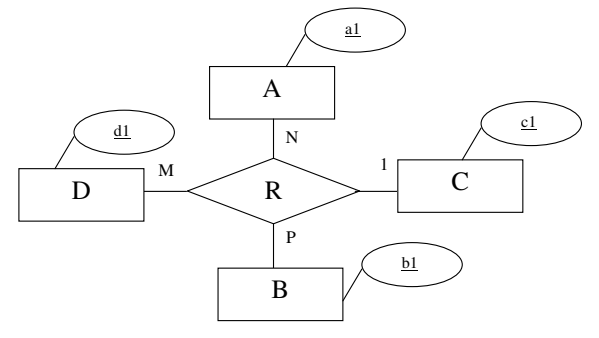

# Parcial 2

## Ejercicio 1

### 1.1 

Mostrar cada DNI acompañado por la cantidad de colores distintos de autos que alquiló sólo para aquellos clientes que nunca han alquilado un auto azul (sin importar si lo devolvieron o no) Se pide que los clientes que nunca alquilaron nada no aparezcan en el resultado. 

```mssql
select distinct dni, count(color)
from (alquila natural join auto) aa
group by dni
having   not 'azul' in (
					select color
					from (alquila natural join auto) pq
					where   pq.dni = aa.dni
				);
```

### 1.2

Listar las patentes de los autos que sólo fueron devueltos en la ciudad de residencia del conductor. Es decir, que nunca fueron devueltos en una ciudad distinta a la de residencia del conductor. Realizar este cálculo excluyendo del análisis las tuplas en las cuales los autos todavía no fueron devueltos. 

```mssql
select patente
from alquila aa
where not exists(
			select * 
			from cliente bb
			where aa.dni = bb.dni and ciudadD <> ciudad 
);
```

### 1.3

Crear la vista KILOMETROS que contenga para cada cliente, la suma de los km realizados con sus autos alquilados, sólo para los clientes que no superan la suma de 1600 kms. Para este cálculo deben tomarse las personas de la tabla Cliente. Los autos no devueltos se consideran para este cálculo con recorrido 0(cero). Los clientes que no alquilan autos se consideran para este cálculo con recorrido 0(cero). 

```mssql
create view kilometros as
select cliente.dni, sum(case when km is null then 0 else km end) as kilometros
from cliente left outer join alquila on cliente.dni = alquila.dni
group by cliente.dni
having sum(case when km is null then 0 else km end) < 1600;
```

### 1.4

Para obtener el promedio de kilómetros recorridos por día por un auto, se calcula la suma de sus kilómetros recorridos en todos sus alquileres y se lo divide por la suma de la cantidad de días en que el auto estuvo alquilado. Tomando como base este promedio, se dice que un auto pertenece a: 

- **Categoría 1**: si el promedio de kilómetros recorridos por día es menor que 200, es decir, en el intervalo [0,200)
- **Categoría 2**: si el promedio de kilómetros recorridos por día está en el intervalo [200, 300)
- **Categoría 3**: si el promedio de kilómetros recorridos por día es mayor o igual a 300, es decir, en el intervalo [300, ∞) 

No se deben tener en cuenta los autos que aún no han sido devueltos. Se pide obtener la suma total de los kilómetros recorridos por los autos alquilados, correspondientes a las categorías antes mencionadas. En el resultado se debe mostrar Categoría y Cantidad de kilómetros.

```mssql
select distinct categoria, sum(km)
from alquila natural join (
			select patente, case
						when (sum(km) / sum(date_part('day',age(fechaD,fechaR)))) < 200 then 'Categoria 1'
						when (sum(km) / sum(date_part('day',age(fechaD,fechaR)))) < 300 then 'Categoria 2'
						else 'Categoria 3'
					end as categoria
			from alquila
			where not fechaD isnull
			group by patente
			) as cat
where not fechaD isnull
group by categoria;
```

## Ejercicio 2

Se dice que dos consultas SQL son <u>equivalentes</u> si al ejecutarlas para cualquier instancia, producen el mismo resultado (salvo quizás el orden de aparición de las tuplas resultantes que es lo único en lo que podrían diferir). Para que dos consultas SQL se consideren equivalente sus resultados deberían coincidir hasta en la cantidad de tuplas. 

Dado el siguiente esquema: 

**R**(<u>A</u>,B) y **S**(<u>D</u>, <u>E</u>, F) 

Para el cual:

- En R: A es clave primaria 
- En S: DE es clave primaria D es clave foránea que referencia a R(A). 
- Todos los atributos son de tipo entero. 

### 2.1

Dada la consulta: 

```mssql
SELECT DISTINCT A, B 
FROM R JOIN S ON R.A=S.D 
WHERE S.F = 9;
```

 Escribir una consulta SQL equivalente que no utilice el DISTINCT. 

```mssql
select  a,b
from R join S on R.A = S.D
where F = 9 
group by a,b;
```

### 2.2

Dada la consulta: 

```mssql
select max(f)
from S;
```

 Escribir una consulta SQL equivalente que no utilice funciones de agregación.

```mssql
select f
from s as q
where not exists (select * from s where q.f < f);
```

## Ejercicio 3

Para los siguientes ejercicios se utiliza el esquema de relación del ejercicio 1. 

### 3.1

Dada la siguiente consulta expresada en Cálculo relacional de tuplas 
$$
\{T|\\
(∃ C)(cliente(C) ∧ ¬ (∃ R) (auto(R) ∧ R[color]=’beige’ ∧ \\
	¬ (∃ S) (alquila(S) ∧ S[patente]=R[patente] ∧
S[dni]=C[dni] ) ∧\\ T[nombre]=C[nombre]))\}
$$
Escribir una consulta en Algebra Relacional que devuelva el mismo resultado. 
$$
\pi_{nombre}( 
\text{cliente}
\div
\rho_{patente}(
	\sigma_{color=\text{'beige'}}\text{(auto)}
	\Join
	alquila
	)
)
$$

### 3.2

Dada la siguiente consulta expresada en Algebra Relacional:
$$
\text{Auxi} \leftarrow 
	\pi_{\text{dni}} ( \\ \sigma_{\text{a1.dni = a2.dni and a1.patente ≠ a2.patente}} (
		\rho_\text{a1}(
			\sigma_{
			\text{fechar $\ge$ ‘01/02/2015’} \and \text{fechar $\le$‘28/02/2015’}}(alquila))
		)\\
         \times\\ 
         (\rho_\text{a2} (
         	\sigma_{\text{fechar>= ‘01/02/2015’ and fechar<=‘28/02/2015’}}(alquila)))
      \\
      )\\
\text{Resultado} \leftarrow 
	\pi_{\text{nombre}}(
		(\pi_{\text{dni}}(
			\sigma_{\text{fechar>=‘01/02/2015’ and fechar<=‘28/02/2015’}}(alquila)
         ) – \text{Auxi}) \Join cliente) 
$$
Escribir una consulta en Calculo Relacional por Dominios que devuelva el mismo resultado. 
$$
\{ T | 
(\exist C)
	[ \text{alquila(C)} \and 
      \text{C[fechar]>=01/02/2015} \and
      \text{C[fechar]<=28/02/2015} \and \\
      \neg \exists (G)
      		[
      			\text{alquila(G)} \and
      			\text{G[dni] = C[dni]} \and
      			\text{G[patente] \neq C[patente]} \and \\
      			\text{G[fechar]>=01/02/2015} \and
      			\text{G[fechar]<=28/02/2015}
      		] \and \\
	  \text{T[nombre]=C[nombre]}
	]
\}
$$


## Ejercicio 4

Ya se tienen creadas las tablas correspondientes a las entidades A, B, C y D. Escribir la sentencia SQL que genere la tabla correspondiente a la relación R. No omitir las claves candidatas. 



```mssql
create table R (
	c1 integer primary key,
	a1 integer,
	b1 integer,
	d1 integer,
	foreign key (c1) references C(c1),
	foreign key (a1) references A(a1),
	foreign key (b1) references B(b1),
	foreign key (d1) references D(d1)
);
```


