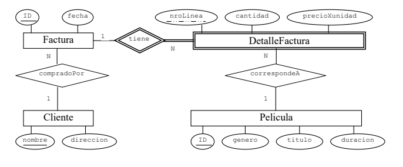

# Parcial 3

## Ejercicio 1

El siguiente diagrama de Entidad-Relacion representa las peliculas que graba la Warner Bors y su comercializacion en el mercado



### 1.1

Escribir las sentencias SQL que permitan crear las tablas y todas las restricciones mostradas en el diagrama. No asumir nada que no esté indicado en el diagrama E/R. 


### 1.2

Verdadero o falso:

- **1.2.1)** Una misma película no puede haberse vendido a dos precios diferentes.

  Es <u>verdadero</u> por que el precio de la pelicula se lo indica en el detalle de la factura y no en la definicion de pelicula

- **1.2.2)** No puede aparecer en una factura el registro de dos clientes distintos.

  Es <u>verdadero</u>, ya que para cada cliente puede haber muchas facturas, pero para cada factura hay solo un cliente.

- **1.2.3)** Si un cliente cambia de dirección, las facturas pasadas quedan automáticamente con la nueva dirección.

  Es <u>verdadero</u> por que la factura no tiene una direccion, sino que se utiliza el campo del cliente a la cual esta relacionada.

- **1.2.4)** Los números de líneas no pueden repetirse para facturas distintas

  Es <u>falso</u> ya que la primary key de `DetalleFactura` tiene una clave debil, por lo que cada entrada de la tabla `DetalleFactura` de identifica mediante el `ID` de la factura a la cual pertenece y su propia clave `nroLinea`.

- **1.2.5)** En la misma factura no puede haber dos líneas con la misma película.

  Es <u>verdadero</u>. ==Preguntar por que==.

- **1.2.6)** Si se borra una línea de detalle factura, automáticamente se borra la factura correspondiente.

  Es <u>falso</u>. Debido a que `DetalleFactura` es una entidad debil y `Factura` una entidad normal, al borrar una entrada de `Factura` se eliminan todas las entradas de `DetalleFactura`, pero no al reves.

## Ejercicio 2

Se dice que dos consultas SQL son equivalentes si al ejecutarlas para cualquier instancia, producen el mismo resultado (salvo quizás el orden de aparición de las tuplas resultantes que es lo único en lo que podrían diferir). Para que dos consultas SQL se consideren equivalente sus resultados deberían coincidir hasta en la cantidad de tuplas. 

A continuación se muestran pares de consultas para investigar si son equivalentes. Notar que se está trabajando sobre relaciones en SQL y no en el modelo puro relacional. 

Para cada ítem se pide indicar si las consultas son o no equivalentes. De no serlo, mostrar un contraejemplo, o sea, una instancia que evidencie el problema, indicando los resultados que generarían Q1 y Q2. Si el problema es que alguna de las consultas ni siquiera compila, señalarlo claramente explicando su error sintáctico.

Todas las consultas se aplican sobre los siguientes esquema de relación:

**R1**(<u>A</u>, B, C) tiene como clave al atributo A.

**R2**(<u>F</u>, G, H) tiene una clave foránea sobre el atributo F que referencia la relación R1.

Ningún atributo puede ser NULL (todos fueron definidos NOT NULL)

### 2.1

**a)**

```mssql
SELECT A 
FROM R1 
WHERE EXISTS (SELECT * FROM R2 WHERE F = A)
```

**b)**

```mssql
SELECT F 
FROM R2 
WHERE EXISTS (SELECT * FROM R1 WHERE F = A)
```

Son equivalentes

### 2.2

**a)** 

```mssql
SELECT A 
FROM R1 
WHERE EXISTS (SELECT * FROM R2 WHERE F = A)
```

**b)**

```mssql
SELECT F 
FROM R2 
WHERE F IN (SELECT A FROM R1)
```

Son equivalentes

### 2.3

**a)**

```mssql
SELECT R1.*, R2.* 
FROM R1 JOIN R2 
ON A = F
```

**b)**

```mssql
SELECT R1.*, R2.* 
FROM R2 LEFT OUTER JOIN R1 ON A = F
```

Son equivalentes

### 2.4

**a)**

```mssql
SELECT R1.*, R2.* 
FROM R1 JOIN R2 ON A = F 
```

**b)**

```mssql
SELECT R1.*, R2.* 
FROM R2 RIGHT OUTER JOIN R1 ON A = F
```

Son equivalentes

### 2.5

**a)**

```mssql
SELECT A 
FROM R1, R2 
WHERE A = F 
GROUP BY A 
HAVING A > 1
```

**b)**

```mssql
SELECT DISTINCT A 
FROM R1, R2 
WHERE A = F AND A > 1
```

Son equivalentes

### 2.6

**a)**

```mssql
SELECT A 
FROM R1, R2 
WHERE A = F 
GROUP BY A 
HAVING COUNT(B) > 1
```

**b)**

```mssql
SELECT DISTINCT A 
FROM R1, R2 
WHERE A = F AND COUNT(B) > 1
```

## Ejercicio 4

### 4.1

Escribir una consulta SQL en DB2 para mostrar los nombres de los ingredientes tales que en todas las recetas en las cuales lograron intervenir lo hacen en una proporción correspondiente a por lo menos el 20% de la composición (en gramos) de dicha receta.

```mssql
select distinct nombre
from formadapor f1
where not exists 	(
					select ID
					from formadapor f2
					group by ID	
					having f1.cant < 0.2 * sum(f2.cant)
				);
```

### 4.2

Escribir una consulta SQL en DB2 para mostrar el nombre de cada receta y cuanto costaría preparar una sola porción de la misma, sólo para aquellas recetas que lleven no más de 4 productos en su composición. 

```mssql
select receta.descripcion, cast (costo / porcion as decimal(6,2))
from (receta right outer join (
								select id
								from formadapor
								group by id
								having count(*) <=4
							) as aux(recID) on receta.id = recID)
							natural join
							(
								select id, sum(precio * cant / gramaje) as costo
								from formadapor natural join ingrediente
								group by id
							) as pre;
```

### 4.3

Escribir una consulta SQL en DB2 para averiguar el identificador de las recetas que son amargas y usaron todos los ingredientes posibles registrados en INGREDIENTE. Se consideran amargas aquellas recetas que usaron como mucho un 5% de su composición en azúcar. Aclaración: Se asegura que el ingrediente Azucar está presente en la tabla ingrediente. 

```mssql
select id
from  ((
		select distinct id
		from formadapor f1
		group by id
		having count(distinct nombre) = (select count(nombre) from ingrediente)
		) as a 
		natural join 
		formadapor ) a
group by a.id
having (select cant from formadapor f3 where a.id=f3.id and f3.nombre='Azucar')< 0.05 * sum(a.cant);
```

## Ejercicio 5

Se tiene la relación CURSADA que almacena las notas de cursada de los alumnos de una facultad en la cual las materias no pueden dictarse en más de un cuatrimetre por año. Su esquema es CURSADA(legajo, materia, año, nota). 

Dada la siguiente consulta sobre la tabla CURSADA: 

```mssql
SELECT legajo 
FROM CURSADA 
GROUP BY legajo 
HAVING MAX(nota) > 4.0 
```

### 5.1

Indicar si en el **álgebra relaciona**l vista en clase puede realizarse una consulta que produzca el mismo resultado que la dada. En caso afirmativo escribirla y en caso negativo justificar la imposibilidad. 
$$
\pi_{legajo}(
\sigma_{\text{nota>4}}(cursada)
$$

### 5.2

Indicar si en el **cálculo relacional de tuplas** visto en clase puede realizarse una consulta que produzca el mismo resultado que la dada. En caso afirmativo escribirla y en caso negativo justificar la imposibilidad. 
$$

$$

### 5.3

Indicar si en el **cálculo relacional de dominios** visto en clase puede realizarse una consulta que produzca el mismo resultado que la dada. En caso afirmativo escribirla y en caso negativo justificar la imposibilidad. 
$$
\{T\ |
	(\exist C) [
		\text{cursada(C)} \and C[nota]>4 \and T[legajo] = C[legajo]
	]
\}
$$


