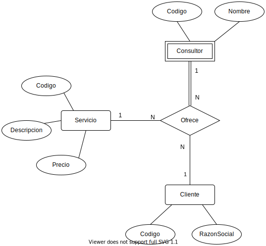

# Parcial 4

## Ejercicio 1

### 1.1

Listar sólo para aquellos clientes que contrataron todos los servicios ofrecidos (los cuales deben consultarse dinámicamente de la tabla Servicio), el/los nombre/s de el/los servicio/s donde más horas acumuladas contrataron junto con dicha cantidad. Cada línea del listado debe presentar el nombre del cliente, la descripción del servicio y la cantidad acumulada de horas por ese servicio. En caso que un cliente presente la misma cantidad máxima de horas en varios servicios, deben aparecer todos. 

```mssql
select distinct razonsocial, descripcion, sum(cantidad)
from  	((
			select cliente
			from hora
			group by cliente
			having count(distinct tiposervicio) = (select count(codigo) from servicio)
		) as clientes
		natural join hora
		 left outer join cliente on cliente.codigo = hora.cliente
		left outer join servicio on hora.tiposervicio = servicio.codigo) tt
group by razonsocial,cliente, descripcion
having sum(cantidad) >=all (select sum(h.cantidad) from hora h where tt.cliente = h.cliente group by h.tiposervicio );
```

### 1.2

En función al monto total de facturación por consultor y servicio, se arma la siguiente categorización:

- Si el consultor facturó para un tipo de servicio \$10.000 o más: MUY BUENO.
- Si el consultor facturó para un tipo de servicio menos de ​\$10.000 pero $5000 o más : BUENO
- Si el consultor facturó para un tipo de servicio menos de ​\$5000: REGULAR 

Se pide listar, sólo para el año 2012, el nombre del consultor, el tipo de servicio, el valor total facturado (para ese consultor y tipo de servicio), y el cartel indicando su categoría. En la columna facturación no debe aparecer sólo un valor numérico sino también el símbolo pesos ($). Si el consultor no facturó nunca algún tipo de servicio en 2012, no debe aparecer en el listado. 

```mssql
select  consultor.nombre, servicio.descripcion ,concat('$ ', sum(cantidad * precio)) as facturacion, 	case
					when sum(cantidad * precio) < 5000  then 'regular'
					when sum(cantidad * precio) < 10000 then 'bueno'
					else 'muy bueno'
				end as grupo
from consultor right outer join hora on consultor.codigo = hora.consultor
				left outer join servicio on hora.tiposervicio = servicio.codigo
where extract (year from fecha) = 2012
group by consultor.nombre, servicio.descripcion;
```

### 1.3

 Se pide hallar los nombres de los consultores que facturaron por lo menos dos tipos de servicios distintos a un mismo cliente para un mismo mes de 2012. El listado deberá mostrar el nombre del consultor, el nombre del cliente y el mes en que sucedió este evento. Recordar que para extraer el mes de un tipo de dato fecha se puede usar la función month de un solo parámetro que devuelve números entre 1 y 12. 

```mssql
select distinct b.nombre, b.razonsocial, extract(month from fecha) as mes
from (consultor right outer join hora on consultor.codigo = hora.consultor
	 left outer join cliente ON cliente.codigo = hora.cliente ) b

where extract (year from b.fecha) = 2012 
	 and exists (
				select * from hora a
				where extract (year from a.fecha) = 2012 and
					 extract (month from a.fecha) = extract (month from b.fecha) and 
					 a.consultor = b.consultor and a.cliente = b.cliente and 
         			   a.tiposervicio <> b.tiposervicio
				);
```

### 1.4

Mostrar cada cliente acompañado por el monto total que debió abonar hasta ahora. Si un cliente no tiene contratado ningún servicio aún, igual debe aparecer en el resultado con monto 0. El listado debe aparecer ordenado descendentemente sobre el total acumulado.

```mssql
select razonsocial, sum(case when precio isnull then 0 else (cantidad * precio)end) as total
from  cliente left outer join hora on cliente.codigo = hora.cliente
	  left outer join servicio on hora.tiposervicio = servicio.codigo
group by razonsocial
order by total desc;
```

## Ejercicio 3

Utilizando el esquema del ejercicio 1

### 3.1

 Expresar en Cálculo Relacional de tuplas la consulta que permita obtener el nombre de los todos los consultores que trabajaron en COTO pero no en LA ANONIMA, en el mes de agosto de 2012. 
$$
\{ T\mid \\
	(\exist U) (
		hora(U) \and U[cliente] = A124 \and \text{1/8/2012} \le U[fecha] \and U[fecha] \le \text{31/8/2012}
		\\ \neg (\exists R)(
			hora(R) \and U[consultor] = R[consultor] \and R[cliente] = A531 \and \text{1/8/2012} \le R[fecha] \and R[fecha] \le \text{31/8/2012}
		) \and
        \\ (\exist Q)(
        	consultor(Q) \and U[consultor] = Q[codigo] \and Q[nombre]=T[nombre]
        )
		\\
	)  
	\\
\}
$$

### 3.2

 Expresar en Álgebra relacional la consulta que permita obtener el precio del servicio más barato ofrecido junto con la descripción del mismo. Para nuestra muestra el resultado debería ser el que se muestra a continuación, ya que hay 3 servicios que tienen el menor precio.
$$
aux \leftarrow\sigma_{\text{s1.precio < s2.precio}}(\rho_{\text{s1}}(SERVICIO)\times \rho_{\text{s2}}(SERVICIO))\\
\pi_{\text{a1.s1.descripcion, a1.s1.precio}}(\sigma_{\text{a1.s1.precio < a2.s1.precio}}(\rho_{\text{a1}}(aux) \times \rho_{\text{a2}}(aux)))
$$

## Ejercicio 4

El siguiente Modelo Entidad/Relación extendido con notación Teorey corresponde al esquema descripto en el ejercicio 1 pero teniendo en cuenta el siguiente agregado 

1. En caso que un consultor no trabaje más en la empresa, no se desea conservar sus datos ni el trabajo realizado.
2. Un consultor puede trabajar en más de un cliente en la misma fecha y a cada uno darle el mismo o diferentes servicios.
3. Puede haber más de un consultor trabajando en un mismo cliente en una misma fecha, y pueden estar ofreciendo el mismo o diferentes servicios. 

Se pide agregar en el esquema:

- Cardinalidad 
- Atributos (con su detalle correspondiente)

Y en caso de ser necesario: 

- Cambiar la representación a participación total 
- Cambiar la representación para transformar una entidad fuerte en una entidad débil

No agregar ni entidades, ni relaciones ni cambiar aridades. 

Explicar con palabras aquello que no se haya podido representar respecto de los ítems a), b) y c)

