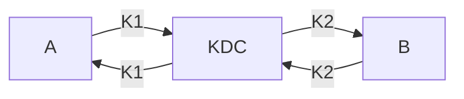

# Distribución de Claves

Un criptosistema **CCA-Secure** permite enviar información manteniendo:

- Confidencialidad
- Integridad

Pero requerir que ambas partes conozcan una misma clave. Compartir las claves es un problema, ya que no pueden transmitirse por un canal no seguro.

## Key Distribution Center

Una solución a este problema consiste en crear un punto de confianza, llamado Key Distribution Center (**KDC**). Este servidor centraliza el conocimiento e intercambio de claves.

En general, estos servidores comparten una clave con cada cliente que se quiere conectar y la comunicación entre los dos clientes se realizan mediante este servidor, es decir, un medio seguro.

El KDC va a generar $n$ claves simétricas, una para cada cliente que se conecte, entonces el cliente no tiene por que saber la clave del otro cliente con quien se quiere conectar:

Este sistema permite tener una cantidad limitada de claves, pero también representa un único punto de falla.

## Protocolo de Intercambio de Claves

A diferencia del KDC, este protocolo permite que dos clientes puedan generar una clave simétrica compartida a través de un medio no seguro.

Es un protocolo $\Pi(n)$ ejecutado por dos partes:

- $\Pi:(n)\rarr \text{Tran},k_a,k_b$
- No tiene entrada, salvo por el parámetro de seguridad.
- La salida del protocolo es:
  - Un conjunto de mensajes encriptados
  - Una clave $K_a$ conocida solo por una de las partes
  - Una clave $K_b$ conocida solo por la otra parte

Se tiene que coincidir la siguiente condición fundamental:
$$
k_a = k_b
$$

### Diffie-Hellman

El algoritmo de intercambio de Diffie-Hellman es el siguiente:

Sea $p$ un numero y $g$ un numero primo tal que $1 \leq g \leq p$ llamado **generador**, ambos siendo conocidos públicamente:

1. $A$ genera un valor $a$.
2. $B$ genera un valor $b$.
3. $A$ envia a $B$:   $g^a \mod p$
4. $B$ envia a $A$:   $g^b \mod p$
5. $A$ genera la clave simetrica compartida $g^{ab} \mod p$
6. $B$ genera la clave simétrica compartida $g^{ab} \mod p$

Ahora que ambos tienen la misma clave simétrica compartida, lo pueden usar como un seed para un algoritmo de cifrado como lo es AES.

### La Seguridad

Dado $g^a \mod p,g^b\mod p$ no debería ser posible obtener $a$ o $b$, ya que este es el problema del logaritmo discreto y no tiene una solución eficiente. 

Ademas se necesita la conjetura de decisión DH:

- Dados $g,g^x,g^y$, un adversario no puede distinguir $g^{xy}$ de un valor aleatorio.

Esta conjetura se formulo años después de la publicación del algoritmo. Hoy en día se lo conoce como un problema NP-Hard.

La versión original requiere de un canal de transmisión autentificado, mientras que en la práctica esto se soluciona con firmas digitales.