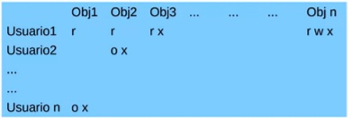
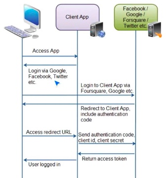

# Control de Acceso

La  **matriz de control de acceso** es el modelo más simple. Este consiste en una fila por usuario y una columna por objeto, con las acciones permitidas en la intersección.

Este modelo permite implementar cualquier política, pero la tabla crece de forma muy rápida y ocupa mucho espacio. Es fácil determinar accesos, pero muy complicado de agregar o eliminar usuarios u objetos.

### Listas de Control de Acceso (ACL)

Las listas de control de acceso representan columnas de una matriz de acceso

Estas se aprovechan del hecho que una matriz tienen pocos valores, ya que la mayoría de los usuarios y objetos no interactuando, y nos dan los derechos de cada usuario para un único objeto.

Formalmente se definen como:
$$
\text{ACL}(o) = \{(s_i,r_i)/ s\in S,r\in R\}
$$
Donde:

- $S$ es el conjunto de sujetos.
- $O$ es el conjunto de objetos.
- $R$ es el conjunto de acciones.

Si un sujeto no tiene entrada en $\text{ACL}(o)$ entonces no tiene ningún derecho.

El derecho de pertenencia (`own`) puede ser asignado a quien crea el objeto o según el tipo de objeto. Ademas, los permisos se pueden transferir de dos formar:

- **Traspaso**: Cambia el sujeto de una entrada del ACL.
- **Delegación**: Un usuario puede darle permisos a otro usuario, pero el primero no los pierde.

Existen **usuarios privilegiados** para los cuales no se aplican todas las reglas de los ACLs. Por ejemplo tenemos la usuario root de Linux, al que no se le aplica ninguna regla de los ACLs. Por el otro lado tenemos a usuarios con ACLs especiales, como el administrador de Windows, que se puede apropiar de cualquier objeto.

Los ACLs también pueden crecer mucho, por los que se implementaron los **roles**. Cada rol es un grupo de usuarios que tienen el mismo nivel de acceso a un objeto.

### Conflictos

Más de un AC pueden aplicar al mismo tiempo. Esto se puede resolver de dos formas:

- **Grant-All**: Requiere que todos los ACs otorguen el derecho, para que el usuario lo tenga.
- **First-Rule**: El primer ACL encontrado es utilizado.

### Derechos por Defecto

Con derechos por defecto se pueden asignad ACs a utilizar sobre sujetos para los cuales todavía no hay un AC en la lista:

- **Override**: Si el sujeto tiene un AC, se utiliza. Si no lo tiene, entonces se usa el valor default.
- **Augment**: Se dan los permisos por default y se agregan los ACs explícitos para el usuario.

### Revocación

Quitar derechos a usuarios es un proceso complicado. Se comienza por alguna de las siguientes opciones:

-  El dueño quita el AC del sujeto del ACL.
- El dueño quita los derechos necesarios dentro del AC.

Luego hay que verificar la delegación de permisos, ya que se deben borrar en cascada los permisos delegados.

## Lista de Capacidades (CAP)

Las listas de capacidades representan a las filas de una matriz de acceso:

Este tipo de control de acceso aparece mucho en sistemas distribuidos masivos, donde queremos un esquema descentralizado. Un buen ejemplo de esto son los JWT.                                                                                             

Formalmente se definen como:
$$
\text{CAP}(s) = \{(o_i,r_i)/o \in O, r \in R\}
$$
Donde:

- $S$ es el conjunto de sujetos.
- $O$ es el conjunto de objetos.
- $R$ es el conjunto de acciones.

Ademas, si un usuario no tiene definido su nivel de acceso a un objeto, significa que este no tiene acceso.

A diferencia de los ACLs, el sistema no controla a estos datos. Deben implementarse mecanismos de protección para evitar que un usuario altere o cree capacidades nuevas. Esto se puede implementar con marcas de bits controladas por hardware (**tags**) o segmentos protegidos de memoria que solo permiten lectura (**paging**).

### Revocación

Revocar permisos implica revistar todas las listas de capacidades, que puede ser muy costoso y hasta imposible. Para evitar este problema se utilizan indices en lugar de las capacidades. Se puede invalidar a un indice sin tener que modificar las listas de capacidad.

## Secretos Compartidos

Los secretos compartidos sirven para la implementación de políticas de separación de privilegios.

Se definen los métodos $(t,n)$ threshold, que generan $n$ partes llamada **sombras** y se necesitan al menos $t$ partes para poder acceder al objeto.

### Método de Shamir

El método de Shamir es un método $(t,n)$ threshold que crea un polinomio de grado $t$ especificado a partir de su evaluación en $t$ puntos diferentes.

Para crear a este polinomio tenemos que definirlo:
$$
P(x) = a_t\times x^t +  \dots + a_1 \times x + a_o \mod p
$$
Donde el secreto a compartir es $a_0$ y $p > s, p>n.$ A partir de esto se pueden calcular las sombras como $P(1),\dots,P(n).$

Para reconstruir el secreto necesitamos tomar $t$ sombras cualquiera y utilizar el método de Lagrange para obtener el polinomio:
$$
P(x) = \sum_{a=1}^{t}\left(s_{i_a} \times \prod_{b=1,b\neq s_{i_a}} \frac{x-i_b}{i_a -i_b} \right)
$$

## OAuth 2.0

Es el standard de los servicios de autorización. Este protocolo perite al dueño de un recurso delegar a una aplicación el acceso del mismo.

 Hay dos tipos de clientes:

- **Confidencial**: Típicamente una aplicación en un servidor, que puede mantener un secreto compartido con el servidor (client-secret). Ejemplos de esto seria una aplicación web como Razor Pages o JPA, donde la lógica de esta en el servidor y no en el navegador.
- **Publico**: Una aplicación que se ejecuta en el contexto del usuario, como lo es una pagina web o una aplicación móvil. Estos no pueden mantener un secreto de forma confiable.

Los clientes deben ser registrados por adelantado, y requieren la siguiente información:

- **Client ID**: Identificador unico.
- **Client Secret**: Secreto compartido para clientes confidenciales.
- **Redirect URI(s)**: Lista de direcciones validas a donde redirigir los accesos.

También hay distintos **grant types**:

- **Authorization Code**: El servidor devuelve un código que puede ser utilizado para obtener el access token junto al client id y el client secret.
- **Implicit**: El servidor de autorización devuelve el access token directamente.
- **Resource Owner Password Credentials**: En lugar de redirigir el pedido, el cliente captura y envia al usuario y contraseña.
- **Client Credentials**: Autorización a nivel de cliente, mediante el client secret.

### OpenID Connect

El protocolo OpenID Connect agrega autenticación a OAuth2. Se basa en un tipo especial de token (Bearer Token) al obtener el access token. El Bearer id es un JWT firmado digitalmente por el provider