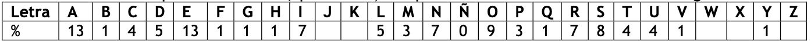

# Guia 1

## Ejercicio 1

Dar una definición formal de los algoritmos Gen, Enc y Dec para los siguientes esquemas:

- **Cifrado de rotación**

  El algoritmo de generación de clave es elegir un numero entre 1 y 26 mediante el cual se va a rotar.

  El algoritmo de codificación implica rotar las letras **n** veces en una dirección.

  El algoritmo de decodificación implica rotar las letras **n** veces en la dirección opuesta. 

- **Cifrado de sustitución monoalfabética**

  El algoritmo de generación de claves es hacer un mapeo uno a uno del alfabeto a un nuevo alfabeto que nosotros designamos.

  Para codificar un mensaje

  ```pseudocode
  var msg = "test"
  var key = "mnopqrstuvwxyzabcefghijkl"
  var alphabet = "abcefghijklmnopqrstuvwxyz"
  var codedMessage = ""
  
  foreach (var char in msg)
  	codedMessage += key[indexOf(char,alphabet)]
  ```

  Para decodificar:

  ```pseudocode
  var msg = ""
  var key = "mnodpqrstuvwxyzabcefghijkl"
  var alphabet = "abcdefghijklmnopqrstuvwxyz"
  var codedMessage = "fpef"
  
  foreach (var char in codedMessage)
  	msg += alphabet[indexOf(char,key)]
  ```

-  **Cifrado de Vigenère**

  Para generar la clave debemos elegir primero la longitud de nuestra clave y luego los caracteres de la misma

## Ejercicio 2


## Ejercicio 3

>  Descifrar el siguiente criptograma, sabiendo que fue encriptado usando el cifrado de rotación, que se corresponde a un texto en español (27 letras) y los espacios fueron suprimidos ¿Cuál fue la estrategia que utilizaste?
>
> VKXYKBKXGKSGWAKQQGYIUYGYWAKXKGQRKSZKJKYKKYIUSYKMAÑX

Utilizando fuerza bruta, puedo iterar por las 27 opciones para nuestra clave de rotacion. De esta forma veo que se puede descifrar el mensaje con ROT-21 y da el siguiente mensaje:

PERSEVERA EN AQUELLAS COSAS QUE REALMENTE DESEES CONSEGUIR

## Ejercicio 4

> Cifrar según Vigenère el mensaje M = UN VINO DE MESA con la clave K = BACO sin usar la tabla, sólo con operaciones modulares

El resultado es WOYXPPGTOFVP

> En un sistema de cifra de Vigenère la clave a usar puede ser CERO o bien COMPADRE, ¿cuál de las dos conviene usar y por qué?

Conviene usar la clave mas larga, ya que evita que los bloques se repitan.

> Mostrar, con un ejemplo, que la composición de dos cifrados Vigenère resulta en otro cifrado Vigenère

==???==

## Ejercicio 5

> Teniendo en cuenta que la frecuencia (aproximada) de aparición de letras en castellano es la siguiente:
>
> 
>
> Decir, para cada criptograma, si se ha obtenido mediante técnicas de sustitución monoalfabética, sustitución polialfabética o de transposición. (No hay que descifrarlos)
> Los criptogramas son:
>
> KOZFVPCYVCWVZHMZLCIOHIFIZGJCZTVVXIGJLZHYZLGVMNVLYZ

Este texto fue codificado con una sustitución monoalfabftica, ya que las frecuencias originales se pueden ver.

> HHMBIWSIPSNNTAWVITQWMEAQVNSPGQJNWELXMJDIBYUGNNRMEUDEM ZIBTMYMBMWURBTIZXNCWZIUPZUQNRMEGJLWRVROPMREUMXXXAXDIP UVFEASMBSASCETAEWOYYAKUSWEABSASCRECIOMEWTQOMYALMTXRAG EWSQQHJDXMVJEAFIRNDUIANW

==???==

Las frecuencias no sirven

> DERTNYLANAOTAABADEAXCEEAIDEJLXHRSUAUJUMXELAATECRTRNAZBIRESOX

Las frecuencias no sirven

## Ejercicio 6

> Se recibe el siguiente criptograma:
>
> ```
> JGAZN WINHY LZDYV BBJLC QHTNK UDQXM OXJNO ZMUSP NONYJ MTEJH QHQFO
> OPUPB CYAÑJ ONCNN QHNMO NDHKU TJMQC MOPNF AOXNT NLOAZ MJDQY MOZCJ
> RNBAO QTUIE NFAIX TLXJG AZMJA XJVAZ MUDNM YLNLJ MUMUY HVUMH TÑIGD
> XDQUC LSJPI BCUSF NUGXX GEEXK AEJME SJÑEN ASLHL BAEYJ ROJXA CQTCN
> MYPUC UNMJW OYNHZ NKUOG AJDUJ XENRY TENJS CNMON TYJNM JYFXF IGJMI
> BUUSN TFAPN FAFKU ROJNY CTUYN BYSGJ VACAU CGQWA ZMJJH JHSNT PAPXM
> GNECO GJUTE NCNGJ GEGAJ SPNUL GDMAÑ JDOFD NPUNN PNTGE NMJSN TTOFD
> KIOXS SQNNF BATOC XMMNV ÑEZNM EZBOS NTUSQ BUDBT JRBBU YPQZI OQFTB
> ANIBV MEDDY RUMUP NAULB OMAED HVHNF OCJOS NMJ
> ```
>
> Si se conoce que ha sido cifrado mediante el algoritmo de Vigenère, se pide:
>
> 1. Comprobar la longitud de la clave.
> 2. Encontrar la clave del sistema y desencriptar sólo los diez primeros caracteres.
>
> Para ello tener en cuenta lo siguiente:
>
> - listar todas las secuencias repetidas de por lo menos 3 caracteres, junto con la distancia a la que se encuentran.
>
> - Ayuda: Aparecen cuatro cadenas de cuatro caracteres que se repiten en el criptograma:
>
>   JGAZ, NMON, PNFA y AZMJ.
>
> - Estimar cuál puede ser la longitud y obtener la frecuencia de aparición de cada letra como primera de cada bloque.

La longitud de la clave es **4** caracteres. Para calcular esto tenemos que tomar las cadenas que se repiten y contar la cantidad de caracteres que hay entre cada ocurrencia de la cadena. En este texto tenemos 4 cadenas que se repiten:

- `JGAZ` Se repite dos veces y tiene 124 caracteres entre si.
- `NMON` Se repite dos veces y tienen 180 caracteres entre si.
- `PNFA` Se repite dos veces y tienen 192 caracteres entre si.
- `AZMJ` Se repite 3 veces y tienen 28 y 180 caracteres entre si.

Tomando las distancias entre si, vemos que 4 es el divisor común mas grande de todas las distancias, y por lo tanto es la longitud de la clave.

 Luego, tenemos que separar el texto en 4 listas de letras y analizarlas mediante un histograma para ver la frecuencia de las letras. Esta frecuencia debería tener la misma forma que la frecuencia que el alfabeto normal, solo que con distintas letras. Esto nos daría indicaciones de cual es la clave.

### 7

> Se cuenta con un texto cifrado que es producto de transposición por columnas (cada **“n”** columnas se reacomodó el texto original) y un cifrado de rotación.
>
>    1. ¿Qué estrategia usarías para recuperar el mensaje original?

Suponiendo que lo descripto es un cifrado de vignere, primero encontraría la longitud de la clave “n” buscando las cadenas que se repitan y teniendo en cuenta el espacio entre las repeticiones. Luego usaría una distribución de frecuencia para descifrar los caracteres de la clave.


>    2. Si el texto cifrado tiene “**m**” caracteres, ¿cuántas pruebas requeriría un ataque de fuerza bruta?

La cantidad de letras del alfabeto elevado a la n?

### 8

> Mostrar que los siguientes cifrados son muy fáciles de quebrar mediante un ataque de **texto plano elegido (chosen-plaintext attack)**.
>
> - **cifrado de sustitución monoalfabética**

Un ataque muy fácil para este cifrado seria enviar el siguiente mensaje:

```
abcdefghijklmnopqrstuvwxyz
```

Entonces sabemos fácilmente cuál es la sustitución realizada.


> - **cifrado de Vigenère**

La forma mas facil seria enviando un mensaje largo con un solo carácter, como por ejemplo:

```
AAAAAAAAAAAAAAAAAAAAAAAAAAAAAAA
```

Al realizarse la transformación, vamos a poder ver claramente como se repiten las cadenas y vamos a obtener fácilmente la longitud de la clave. Luego la clave es mas fácil todavía de encontrar, ya que podemos verla directamente en el texto cifrado.
