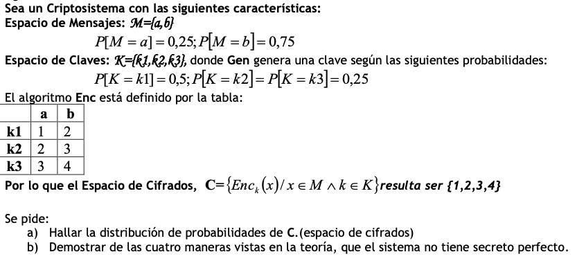

# Criptografía Simétrica

## 1

> 1. Hallar la distribución de probabilidades de C:

Para encontrar la distribución de probabilidades de C, hay que utilizar la tabla y las distribuciones de $K$ y $M$, de la siguiente forma:
$$
P(C=2) = P(K=k_2) \times P(M=a) + P(K=k_1) \times P(M=b) 
$$
Siguiendo esta regla, logramos llegar a que  la distribución es la siguiente:
$$
\array{
P(C=1)= & 0.125\\
P(C=2)=& 0.4375\\
P(C=3)=& 0.25\\
P(C=4)=& 0.1875
}
$$

> Demostrar las cuatro maneras vistas en la teoría por las cuales el sistema no tiene secreto perfecto

1. Si la probabilidad de que el mensaje sea $m$ es igual a la probabilidad de que el mensaje sea $m$ sabiendo el cifrado $c$. Lo que conozco del mensaje tiene que ser lo mismo antes que después del cifrado

   Para poder probar que este cifrado no tiene secreto perfecto, tengo que encontrar un caso donde:
   $$
   P(M = m_1) \neq P(M=m_1/C=c_1)
   $$
   Veo el caso de $m_1 = a, c_1 = 1$:
   $$
   P(M=a) = P(M=a/C=1)\\
   0.25 = 1
   $$
   Claramente no tiene secreto perfecto.

2. Si la probabilidad de que el cifrado sea $c$ es igual a la probabilidad de que el cifrado sea $c$ sabiendo que el mensaje es $m$:

   Para poder probar que este cifrado no tiene secreto perfecto, tengo que encontrar un caso donde:
   $$
   P(C=c) \neq P(C=c/M=m)
   $$
   Si elijo $c=1, m=b$:
   $$
   P(C=1) = P(C=1/M=b)\\
   0.25 = 0
   $$

## 3

> Demostrar que si se encripta un solo símbolo, entonces el cifrado de rotación tiene secreto perfecto.

Si se encripta un solo simbolo, entonces la calve tiene solo 1 dígito. Esto nos da los siguientes espacios:
$$
\array{M=\{a,b,\dots,z\} & K=\{1,2,\dots,26\}& C=\{a,b,\dots,z\}}
$$
Entonces las distribuciones son uniformes:
$$
\forall m \in M,P(M=m) = \frac 1 {26} \\
\forall k \in K,P(K=k) = \frac 1 {26} \\
\forall c \in C,P(C=c) = \frac 1 {26} 
$$
Entonces, podemos ver que tiene secreto seguro por que:
$$
\array{\forall c,m & P(C=c/M=m)= P(C=c)} 
$$

$$
P(C=c/M=m) = P(C=c) \\
P(C=(m+k\equiv c (26))/M=m) = P(C=c)\\
P(k \equiv c-m (26)) = P(C=c)\\
\frac 1 {26} = \frac 1 {26}
$$

## 4

> Mostrar un ejemplo de como el criptosistema cifra un mensaje

Primero voy a dar un ejemplo de como funciona este criptosistema al cifrar el mensaje:
$$
\text{HOLACOMOESTAS}
$$
Primero voy a generar una clave. Siguiendo el algoritmo de generación, tengo que generar primero una longitud $t \in \{1,2,3\}$ De forma aleatoria y uniforme. Elijo $t=3$. Luego tengo que elegir mi clave, que en este caso va a ser $\text{DAC}$.

Separo el mensaje en bloques de tamaño $t$:
$$
\text{HOL ACO MOE STA S}
$$
 Y luego aplico las rotaciones de acuerdo a nuestra clave:
$$
\text{LPO EDR QPH WUD W}
$$
Entonces, vemos que nuestro mensaje cifrado es: $\text{LPOEDRQPHWUDW}$

> Calcular la probabilidad de éxito del experimento $\text{PrivK}^{eav}_{A,\pi}$ para un adversario que hace lo siguiente:
>
> 1. $A$ Emite los primeros mensajes $\{m_0 = \text{aab},m_1=\text{abb}\}$
> 2. Al recibir el cifrado $c$, A emite $0$ si el primer simbolo de $c$ es igual al segundo, y emite $1$ en el caso contrario.

Primero analizamos el caso donde se emite el mensaje $m_0$. Debido a que la probabilidad de generar $t$ es uniforme y esta distribuida a lo largo de 3 elementos, podemos partir a este problema en 3 casos, con probabilidad $\frac 1 3$ cada uno:

- **Caso** $t=1$: En este caso, el cifrado se comporta como un cifrado de rotaciones simple, rotando a todos los caracteres la misma cantidad de veces. Esto significa que, como los primeros dos caracteres de $m_0$ son iguales, entonces van a ser iguales para cualquier texto cifrado que se genere. Por esto podemos decir que $A$ Emite $0$ para todas las claves.
- **Caso** $t=2$: En este caso hay $26^2$ posibles claves, pero debido a la estructura del mensaje, las podemos clasificar en dos grupos:
  - Si los dos caracteres de la clave son iguales, entonces $A$ va a emitir $0$. Esto pasa solo en $26$ casos, es decir, tiene una probabilidad de $\frac 1 {26}$ de suceder.
  - Si los dos caracteres de la clave son distintos, entonces $A$ va a emitir $1$. Esto pasa en el resto de los casos, por lo que tiene una probabilidad de suceder de $\frac {25}{26}$
- **Caso** $t=3$: Este caso es similar al anterior, con la excepción de que se agrega un carácter mas, llevando a la cantidad total de  claves a $26^3$. Aquí también se pueden clasificar en dos grupos:
  - Si los primeros dos caracteres de la clave son iguales (sin importar el ultimo carácter), entonces $A$ va a emitir $0$. Esto pasa solo en $26$ casos, por lo que la probabilidad de suceder es de $\frac 1 {26}$.
  - Si los primeros dos caracteres de la clave son distintos (sin importar el ultimo carácter), entonces $A$ va a emitir $1$. Esto tiene una probabilidad de suceder de $\frac{25}{26}$.

Analizando todos estos casos, podemos obtener que:
$$
P(b=0/M = m_0) = \frac 1 3 + \frac 1 3 \times \frac 1 {26} + \frac 1 3 \times \frac 1 {26} = 0.359\\
P(b=1/M = m_0) = \frac 1 3 \times \frac {25} {26} + \frac 1 3 \times \frac {25} {26} = 0.641\\
$$
Podemos plantear lo mismo para el mensaje $m_1$​. Debido a que la probabilidad de generar $t$ es uniforme y esta distribuida a lo largo de 3 elementos, podemos partir a este problema en 3 casos, con probabilidad $\frac 1 3$ cada uno:

- **Caso** $t=1$: En este caso, el cifrado se comporta como un cifrado de rotaciones simple, rotando a todos los caracteres la misma cantidad de veces. Esto significa que, como los primeros dos caracteres de $m_0$ son iguales, entonces van a ser iguales para cualquier texto cifrado que se genere. Por esto podemos decir que $A$ Emite $1$ para todas las claves.
- **Caso** $t=2$: En este caso hay $26^2$ posibles claves, pero debido a la estructura del mensaje, las podemos clasificar en dos grupos:
  - Si los dos caracteres de la clave siguen el patrón $n+1,n$, entonces $A$ va a emitir $0$. Esto pasa solo en $26$ casos, es decir, tiene una probabilidad de $\frac 1 {26}$ de suceder.
  - Si los dos caracteres de la clave son distintos, entonces $A$ va a emitir $1$. Esto pasa en el resto de los casos, por lo que tiene una probabilidad de suceder de $\frac {25}{26}$
- **Caso** $t=3$: Este caso es similar al anterior, con la excepción de que se agrega un carácter mas, llevando a la cantidad total de  claves a $26^3$. Aquí también se pueden clasificar en dos grupos:
  - Si los primeros dos caracteres de la clave siguen el patrón $n+1,n$ (sin importar el ultimo carácter), entonces $A$ va a emitir $0$. Esto pasa solo en $26$ casos, por lo que la probabilidad de suceder es de $\frac 1 {26}$.
  - Si los primeros dos caracteres de la clave son distintos (sin importar el ultimo carácter), entonces $A$ va a emitir $1$. Esto tiene una probabilidad de suceder de $\frac{25}{26}$.

Analizando todos estos casos, podemos obtener que:
$$
P(b=0/M = m_1) = \frac 1 3 \times \frac 1 {26} + \frac 1 3 \times \frac 1 {26} = 0.026\\
P(b=1/M = m_1) = \frac 1 3 +\frac 1 3 \times \frac {25} {26} + \frac 1 3 \times \frac {25} {26} = 0.974\\
$$
A partir de todas estas probabilidades condicionales, podemos armar la probabilidad de éxito del atacante:
$$
\array{
P(b=b') & = & \frac {P(b=0 / M=m_0) + P(b=1/ M=m_1)} 2 \\
& = & \frac{ 0.351 + 0.974} 1 \\
& = & 0.6625
}
$$

> De acuerdo a lo calculado en el punto anterior, tiene secreto perfecto?

No, no tiene secreto perfecto por que el atacante tiene una probabilidad de éxito mayor a $0.5$.

# 5

Defino a un adversario $A$ como:

- $A$ envia envia los mensajes $m_0 = aa,m_1 = ab$.
- Al recibir $c$, $A$ emite $0$ si ambos caracteres son iguales, $1$ si son distintos.

Cuando $A$ genera mensaje $m_0$, va a recibir un mensaje cifrado:
$$
\array{ c_0 = xx && x\in \text{ alfabeto ingles}}
$$
Entonces podemos ver que va a emitir $0$, ya que $x=x$, para todo valor de $x$.

Cuando $A$ Genera el mensaje $m_1$, va a recibir un mensaje cifrado:
$$
\array{c_1 = xy &&x,y\in \text{alfabeto ingles} / x \neq y}
$$
 En este caso, $A$ va a emitir $1$, ya que $x \neq y$.

Entonces la probabilidad de éxito del atacante es $100\%$ y el cifrado es vulnerable.

==DUDA==

Como hago para plantear esto sin saber la longitud de la clave? Puedo plantear que un mensaje es AAAAAAAAA, pero depende de la longitud del 

# 6

> En el modo CBC un error de un bit en P1, a través de cuantos bloques de texto cifrado se propaga?

En el modo CBC, un error en el primer bloque de texto plano afecta a todos los bloques siguientes de texto cifrado.

> En el modo CBC, un error de un bit en C1, a través de cuántos bloques de texto plano se propaga?

En el modo CBC, un error en el primer bloque de texto cifrado afecta a todos los bloques siguientes de texto plano.

> Si se produce un error de un bit en la transmisión de un carácter del texto cifrado en modo CFB de 8 bits, hasta donde se propaga el error?

Solo afecta a dos bloques.

==CHEQUEAR==

# 7

> Considerando el siguiente cifrado de Bloque:
>
> $$
> E(K,M) = (M*K) \mod 32
> $$
> 1. ¿cuál es el tamaño del bloque? ¿cuál es el espacio efectivo de la clave?
> 

El tamaño del bloque es de 32 caracteres, por lo que termina siendo 5 bits.

El espacio efectivo de la clase es de $2^5 = 16$, aunque también habría que considerar a los números coprimos con el $32$, por que si tenemos los valores $M=2,K=16$, entonces $E(2,16) = 32 \mod 32 = 0$.

> 2. Encriptar el mensaje `24 17 26 25 12` usando modo CBC con vector de inicialización IV = 19 y K = 7
> 

Calculo el bloque 1:
$$
(IV \oplus P_1) = (19 \oplus 24) = 11\\
C_1 = (11 * 7) \mod {32} =  13
$$
Calculo el bloque 2:
$$
(C_1 \oplus P_2) = (13 \oplus 17) = 28\\
C_2 = (28 * 7)  \mod {32} = 4
$$
Calculo el bloque 3:
$$
(C_2 \oplus P_3) = (4 \oplus 26) = 30\\
C_3 = (30 * 7) \mod {32} = 18
$$

Calculo el bloque 4:
$$
(18 \oplus 25) = 11\\
C_4 = (11 * 7) \mod {32} = 13
$$
Calculo el bloque 5:
$$
(13 \oplus 12) = 1\\
C_5 = (1 * 7) \mod {32} = 7
$$
Entonces, el mensaje cifrado es:
$$
13-4-18-13-7
$$

> 3. Desencriptar en modo CBC.

Partimos desde el mensaje cifrado `13 4 18 13 7` con `IV=19` y `K=7`:

Para poder revertir la operación de modulo, en vez de multiplicar por $7$, debemos dividir por $7$, esto se transforma en la operación $\text{E}(x,23)$ ya que dividir por $7$ es lo mismo que multiplicar por $23$ y reducer al modulo 32.

Calculo el bloque 1:
$$
E(13,23) = (13*23) \mod 32 = 11\\
M_1 = (11 \oplus 19) = 24
$$
Calculo el bloque 2:
$$
E(4,23) = 28\\
M_2 =  (28 \oplus C_1) =  28 \oplus 13 = 17
$$
Calculo el bloque 3:
$$
E(18,23) = 30 \\
M_3 = (30 \oplus C_2) = 30 \oplus 4 = 26
$$
Calculo el bloque 4:
$$
E(13,23) = 11\\
M_4 = 11 \oplus 18 = 25
$$
Calculo el bloque 5:
$$
E(7,23) = 1\\
M_5 = 1 \oplus 13 = 12
$$
Entonces el mensaje descifrado es:
$$
24-17-26-25-12
$$

## 8

> Una clave débil para DES es una clave tal que:
> $$
> E_k(E_k(x)) = x, \forall x
> $$
> Analiza por que una clave formada por todos sus bits en 0, o todos sus bits en 1, es una clave débil para DES. Cuales serian las otras dos claves débiles?

La debilidad de estas claves aparece por que DES trata de generar claves corriendo todos los bits de las subclaves anteriores. Se hacen 16 corrimientos a la izquierda, y si el resultado de estos 16 corrimientos es la misma subclave, entonces el cifrado no será seguro.

Por motivos obvios podemos decir que $\{0\}^{6}$ y $\{1\}^{64}$ van a ser claves, por que sin importar las permutaciones y los corrimientos, todas las subclaves serán iguales. Para encontrar las otras dos claves, tenemos que seguir al algoritmo de Feistel.

Vamos a comenzar con una clave de 64 bits, pero el primer paso es descartar todos los bits cuya posición es múltiplo de 8, que serian los bits en la posición 8, 16, 24, 32, 40, 48, 56 y 64. Y a partir de esto obtenemos una clave de 56 bits.

​                            $\Rarr$   

Luego, esta clave de 56 bits va a ser dividida en dos subclaves iniciales, $C_0, D_0$ De la siguiente forma:

Luego, las siguientes claves se van a ir obteniendo a partir de la permutación y corrimiento de las subclaves iniciales, pero siempre se trabaja sobre el set de valores de la subclave inicial.

Por esto tenemos que encontrar claves que luego de la permutación inicial generen:

- $C_0=\{0\}^{24}, D_0=\{1\}^{24}$
- $C_0=\{1\}^{24}, D_0=\{0\}^{24}$

Entonces, nuestra clave de 64 bits puede ser:

- `0xE0E0E0E0F1F1F1F1`
- `0xE1E1E1E1F1F1F1F1`

