# Parcial 1 - 2017

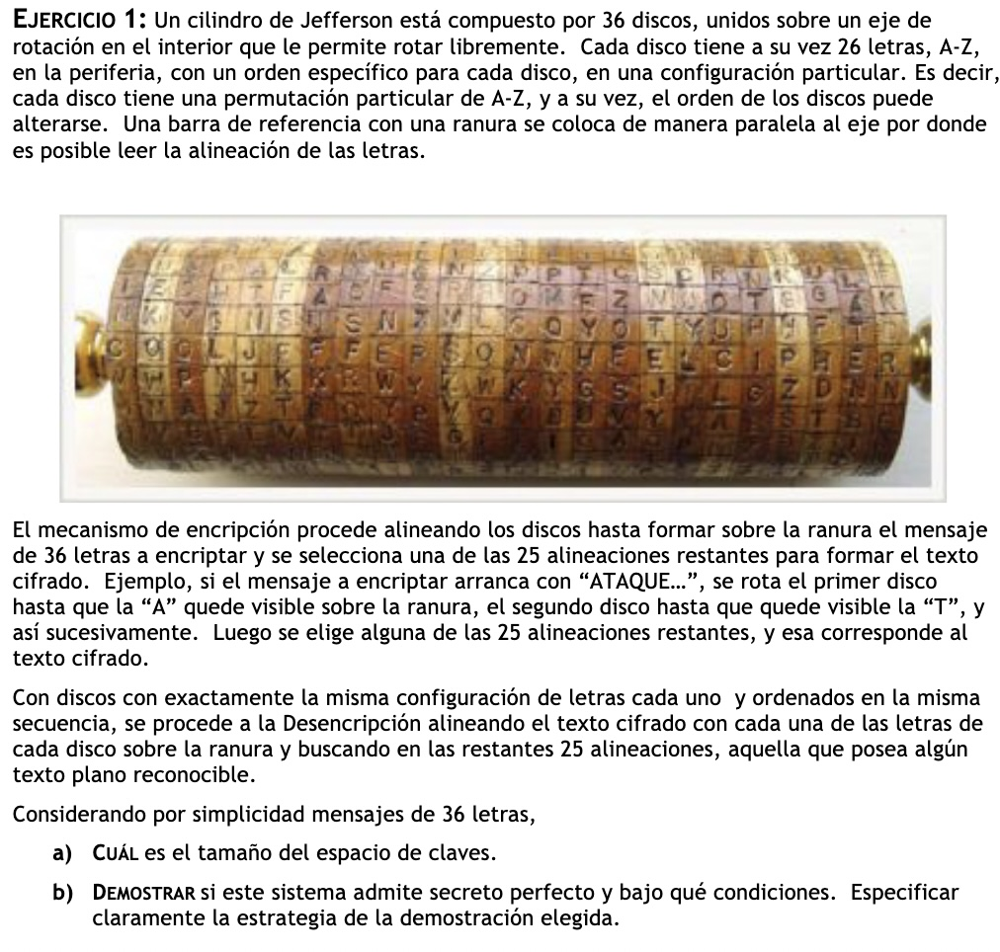

El tamaño del espacio de claves es $36!$ ya que la clave depende del orden de los discos únicos.

El sistema no admite secreto perfecto. Esto se debe a que a la hora de elegir nuestro mensaje cifrado, no se puede elegir al mismo texto que el mensaje de texto plano. Por este motivo, la distribución de los mensajes no es equitativa para todo el espacio de mensajes.

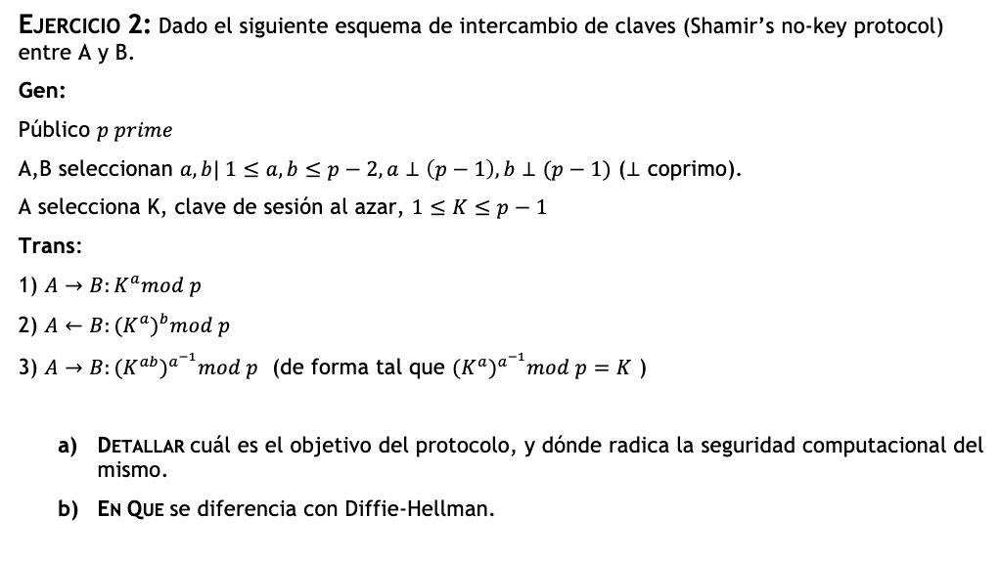

El objetivo del protocolo es compartir el valor $K$ de forma segura, desde $A$ hacia $B$. La seguridad radica en las operaciones de modulo, ya que poder separar $K$ de $K^a$ es un problema NP-Hard conocido como el logaritmo discreto.

La diferencia con diffie-hellman es que en este caso se trata de enviar un valor de forma secreta desde $A$ hacia $B$. En Diffie-Hellman la idea es llegar a un secreto compartido entre ambos.

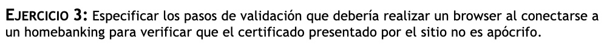

==TLS?==

==KDC?==

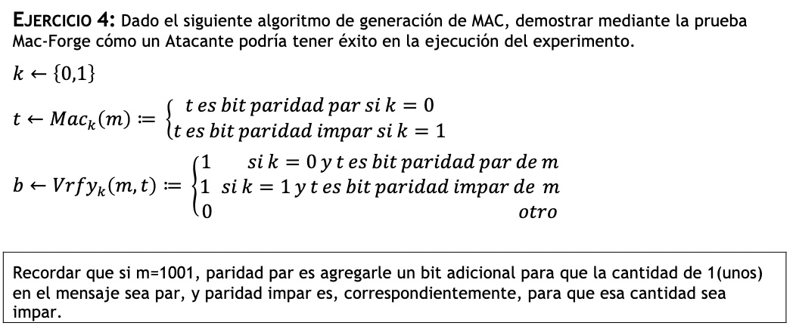

Bit de paridad par: Si la cantidad de 1s es impar, le agrego un 1, sino le agrego un cero.

Bit de paridad impar: Si la cantidad de 1s es par, le agrego un 1, sino le agrego un cero.

Emito $m = 1001,k=0$ y obtengo $t=0$.

En la prueba, emito $m'=m||m,k=0, t=0$.
$$
\text{Vrfy}_0(10011001,0) = 1
$$
Y $m'$ no fue probado anteriormente, entonces gano la prueba de seguridad.

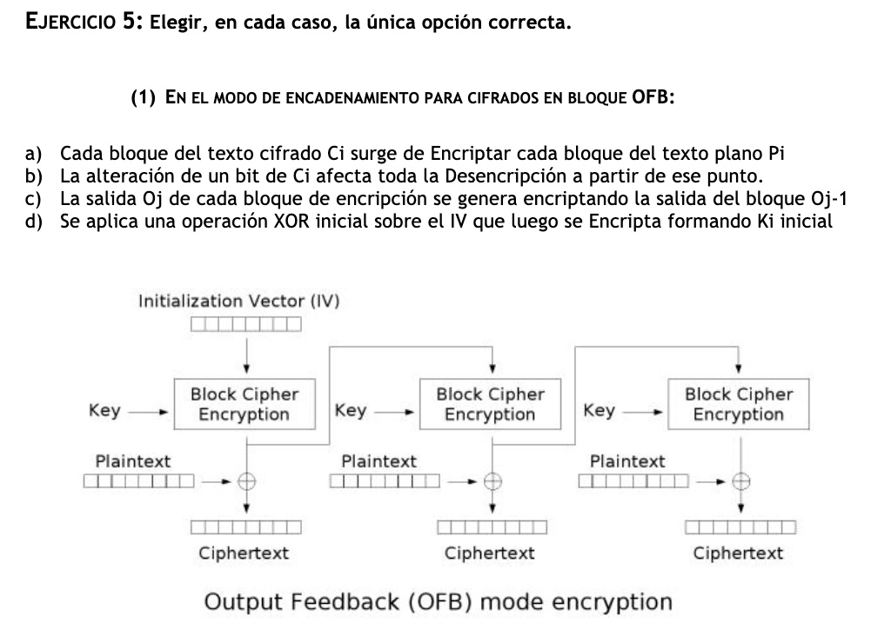

1. **Falso**: Surge de encriptar al IV o bloque de encripción anterior y luego realizar un xor con el bloque de texto plano.
2. **Falso**: Un error en un bloque solo afecta al bloque en cuestión. Lo que se propaga es la clave junto al vector de inicialización.
3. **Verdadero**: Asumiendo que por $O_j$ se refiere a la salida del Block Cipher Encryption.
4. **Falso**: No, se aplica primero la operación de encripción y luego se realiza un xor.

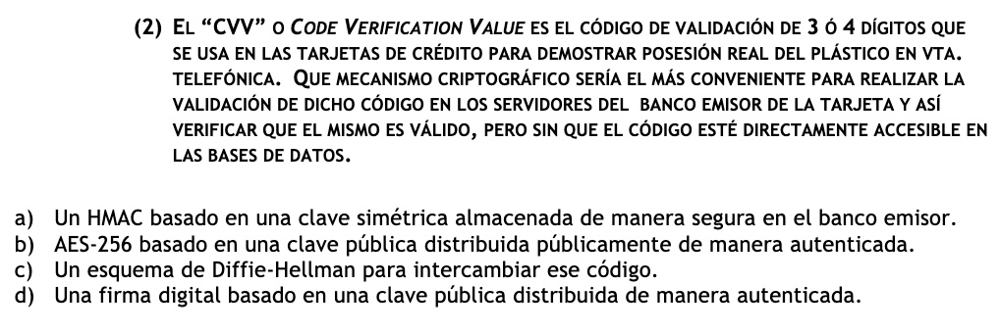 

1.  **Verdadero**: Una HMAC genera una etiqueta que permite verificar que ese numero de tarjeta es valido.
2. **Falso**: AES no generaría una etiqueta, sino que cifraría el numero entero y no podría reducirse a 3 o 4 dígitos.
3. **Falso**: Diffie-Hellman no permite decidir si el codigo es valido, se usa para intercambiar claves.
4. **Falso**: No sirve para validar

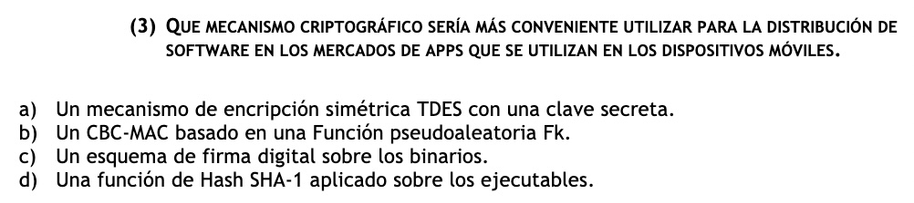

1. **Falso**
2. **Falso**
3. **Verdadero**: Una firma digital sobre los binarios permite que se verifique la identidad del desarrollador.
4. **Falso**

# Parcial 1 - 2015

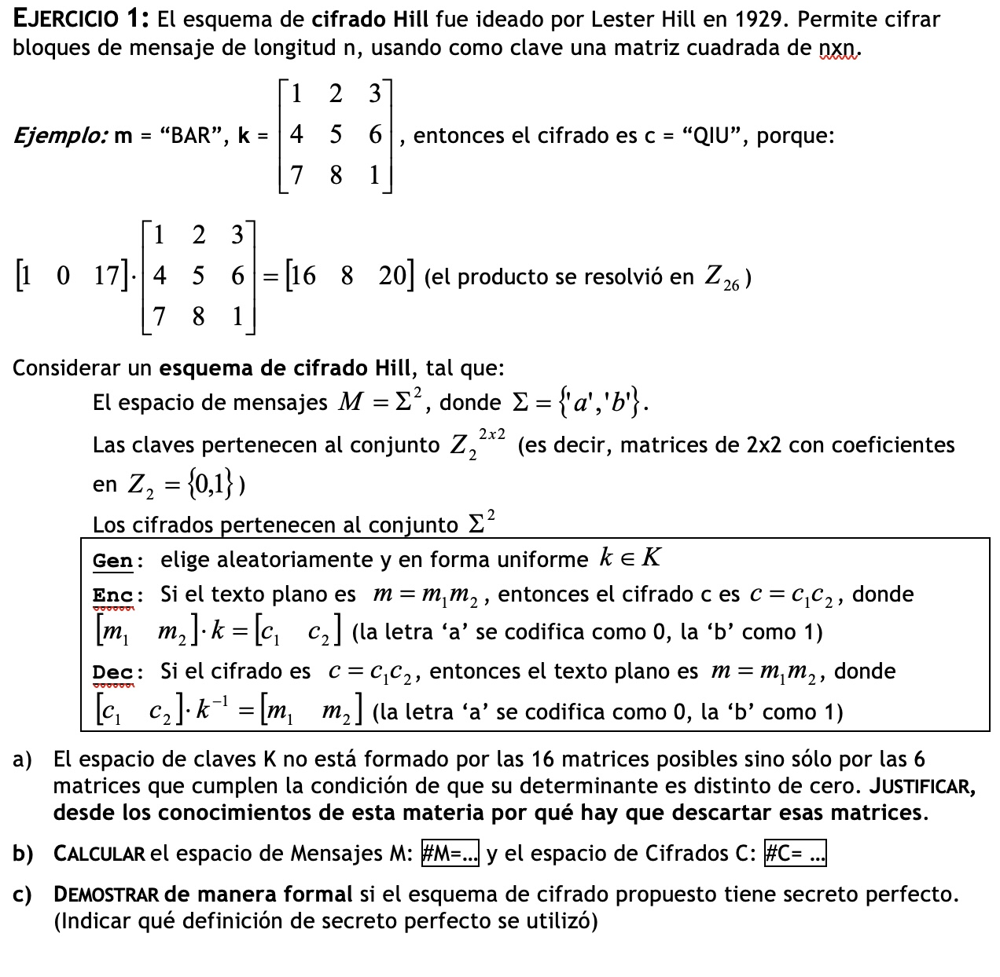

El espacio de claves esta formado solo por 6 matrices por que debemos poder descifrar el mensaje y las operaciones inversas en matrices están solo reservadas para matrices inversibles, es decir, con determinate distinto de 0. Si esta condición no se cumple, entonces la siguiente propiedad de los criptosistemas no se va a cumplir:
$$
m = \text{Dec}_k(\text{Enc}_k(m))
$$
El espacio de mensajes es $\#M=4$, igual que es espacio de mensajes cifrados $\#C = 4$.

Según la propiedad de secreto perfecto:
$$
\Pr(C=c) = P(C=c/M=m)
$$
Tomemos el caso de $m = aa$, si dejamos este mensaje fijo, obtenemos los siguientes resultados:
$$
\Pr(C=aa/M=aa) = 1\\
\Pr(C=ab/M=aa) = 0\\
\Pr(C=ba/M=aa) = 0\\
\Pr(C=bb/M=aa) = 0\\
$$
Ademas, $\forall c \in C.\Pr(C = c) = 0.25$, por lo que no se cumple la propiedad de secreto perfecto:
$$
\Pr(C = aa/M=aa) = 1 \neq 0 = \Pr(C=aa)
$$
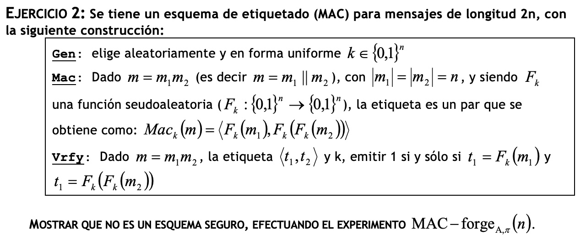

Primero, emito $m = m_1m_1$ y obtengo $t=<F_k(m_1),F_k(F_k(m_1))> = <t_1,t_2>$.

Luego envio el desafio $m'=t_1m_1, t=<t_2,t_2>$
$$
\text{Vrfy}_k(t_1m_1,<t_2,t_2>) = 
\left\{
\array{
F_k(t_1) = F_k(F_k(m_1)) = t_2\\
F_k(F_k(m_1)) = t_2
}
\right .
$$
Y gano el desafio.

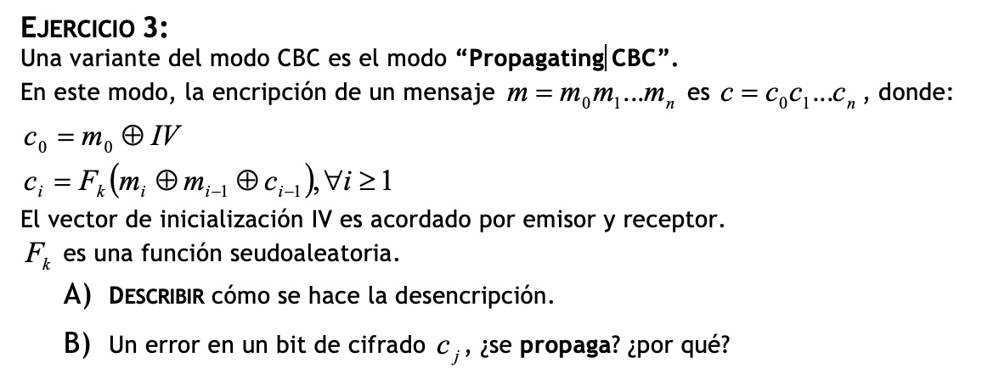

La desencripción se realiza de la misma forma que la encripción. Se comienza por el bloque $c_1$ y se realizan los pasos inversos.

Los errores en el cifrado se propagan, ya que se usa el mensaje anterior como entrada en una operación xor.

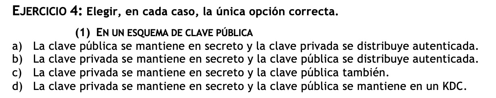

1. **Falso**
2. **Verdadero**
3. **Falso**
4. **Falso**: KDC son para cifrado simétrico.

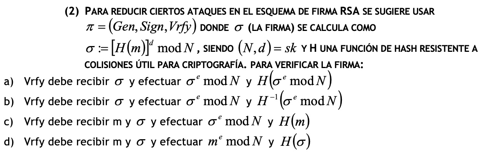

1. **Falso**
2. **Falso**
3. **Verdadero**
4. **Falso**

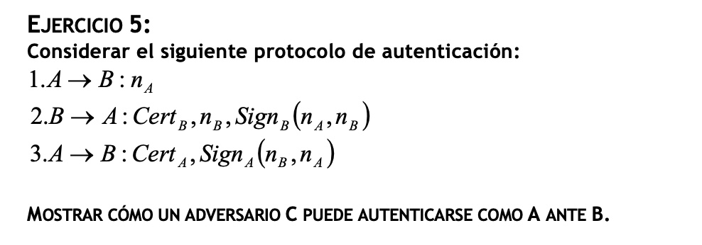

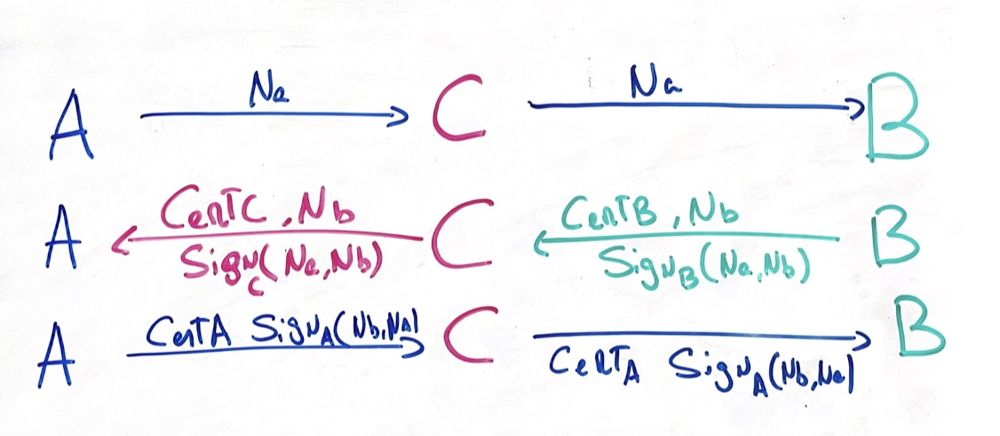

# Recuperatorio Parcial 1 - 2014

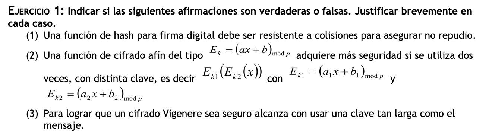

1. **Verdadero**. Si la función de hash tiene colisiones, entonces es posible que dos personas firmen dos documentos y tengan la misma firma.

2. **Falso**: La seguridad seria la misma. Tomemos el ejemplo dado:
   $$
   c' = E_{k_2}(E_{k_1}(m))\\
   c' = E_{k_2}(a_1 \times m + b_1)\\
   c' = a_2\times (a_2 \times m + b_1) + b_2\\
   c' = (a_2 \times a_2) \times m + (a_2 \times b_1 + b_2) \\
   c' = a' \times m + b'
   $$
   Podemos ver que encriptar multiples veces no afecta a la seguridad, sino que equivale a cifrarlo con otra clave.

3. **Falso**. Ademas hace falta que esa clave no sea reutilizada y que sea aleatoria.

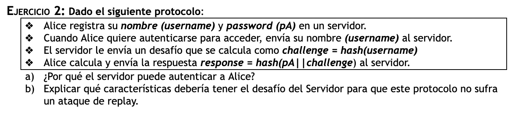

El servidor conoce tanto el usuario como la contraseña de Alice. A la hora de autenticarse, con el usuario de Alice puede crear un desafio para verificar que sea ella. Las contraseñas en este servidor están guardadas como $\text{Hash(password||challenge)}$, por lo que Alice debe resolver el desafío y enviar la respuesta correcta.

Para evitar un ataque de replay, el servidor debe adaptar al desafio para que incluya informacion que no sea estática, como lo seria realizar un hash del usuario. Una de las formas de realizar esto seria agregando un timestamp o un valor generado por el servidor a la hora de generar el desafío.

De esta forma, sí un atacante obtiene el mensaje con la respuesta que contiene al hash del desafío y la contraseña, no puede reenviarlo.

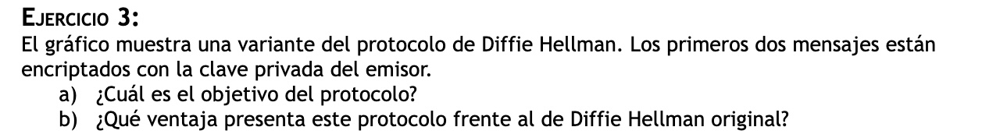

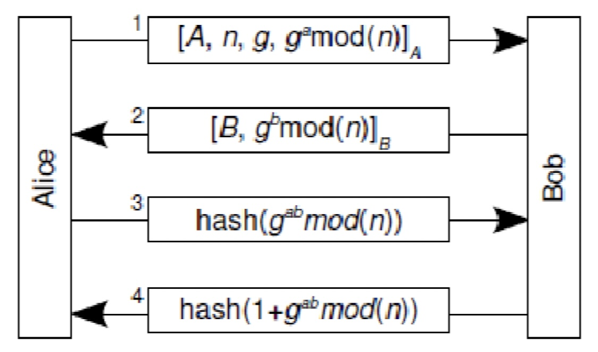

El objetivo del protocolo es crear un secreto compartido entre $A$ y $B$.

La ventaja que presenta frente a Diffie-Hellman es que con los últimos dos pasos esta verificando que el secreto generado sea el mismo en ambas partes.

==Preguntar==

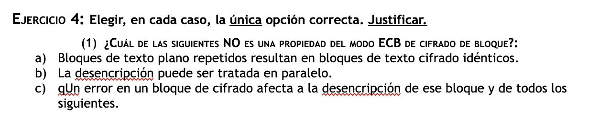

1. **Es una propiedad**
2. **Es una propiedad**
3. **No es una propiedad**. El modelo ECB permite la desencripción de los bloques en paralelo, ya que un bloque solo depende de la clave y nada más.

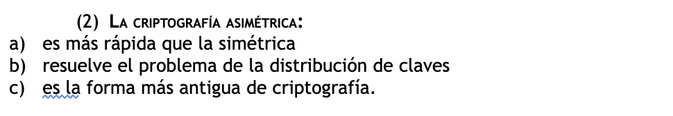

1. **Falso**
2. **Verdadero**: Al tener una clave publica y una privada, se pueden distribuir estas sin tener un sistema centralizado como el KDC para almacenar y utilizar las claves.
3. **Falso**

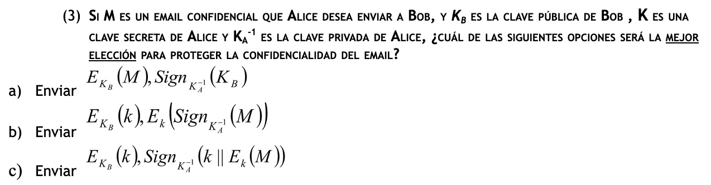

1. **Verdadero**: Utilizo este metodo ya que estoy enviando el mail encriptado y luego envio la firma de la clave de $B$ utilizada para encriptarlo. Con esta información $B$ puede descifrar el mensaje y ademas verificar que fue cifrado con su clave.
2. **Falso**: Solo envia una firma del mensaje
3. **Falso**: Solo envia una firma del mensaje concatenado con el secreto $k$.

==Preguntar== 

# Parcial 1  - 2013

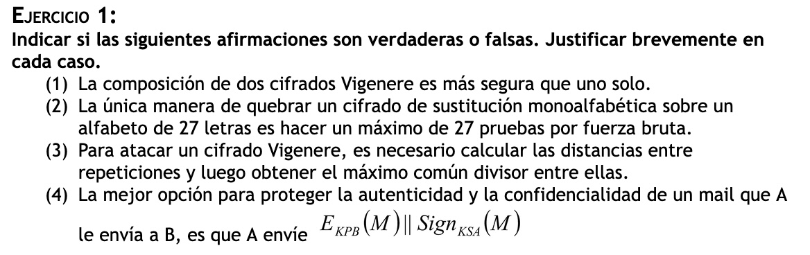

1. **Falso**: componer Vigenere solo resulta en la combinación de las claves. Tenemos dos casos a estudiar:

   - Las claves son del mismo tamaño:

     Las claves simplemente se suman, por ejemplo:
     $$
     \array{k_1 = hola && k_2 = chau 
     \\ & k_{12} = jvlu 
     }
     $$

   - Las claves son de distinto tamaño:

     Las claves se suman y generan una clave de mayor longitud:
     $$
     \array{
     k_1= hola && k_2=no\\
     &k_{12} = hola + nono = ueyo
     }
     $$

2. **Falso**: Se puede utilizar un ataque por distribución de caracteres en el lenguaje original del mensaje. A partir de eso se puede estimar que letra fue transformada en cual otra.

3. **Verdadero**: Esto sirve para obtener la longitud de la clave.

4. **??** ==Preguntar==

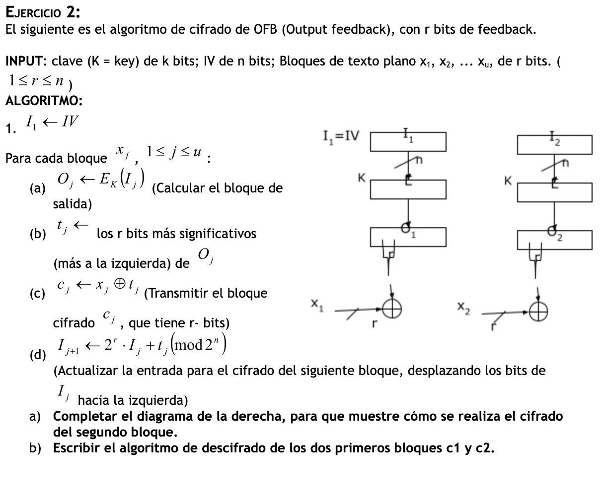

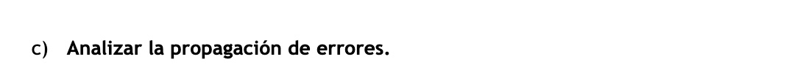

==No entiendo el grafico==

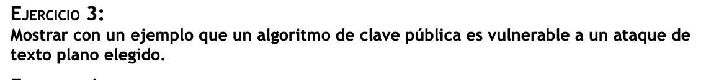

Se puede ver en el RSA original, la seguridad proviene del tamaño de $p \times q$. Si estos números son chicos, entonces el problema del logaritmo discreto tiene una solución fácil.

==preguntar==

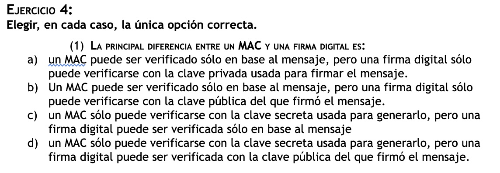

1. **Falso**
2. **Falso**
3. **Falso**
4. **Verdadero**

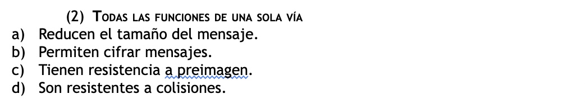

1. **Falso**
2. **Falso**
3. **Verdadero**
4. **Falso**

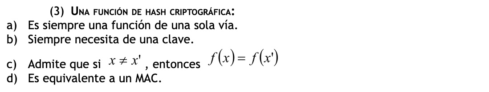

1. **Verdadero**
2. **Falso**
3. **Falso**
4. **Falso**

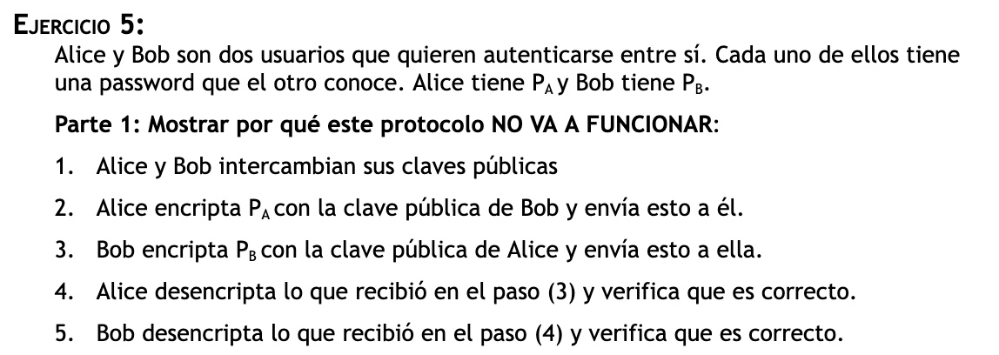

Este protocolo no va a funcionar por que un ataque de man-in-the-middle puede hacer que un tercero suplante a Alice o a Bob:

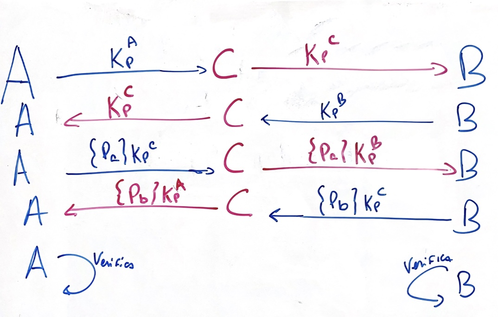

En este caso el atacante $C$ tiene conocimiento tanto de $P_a$ Como $P_b$ y los participantes no se enteraron.

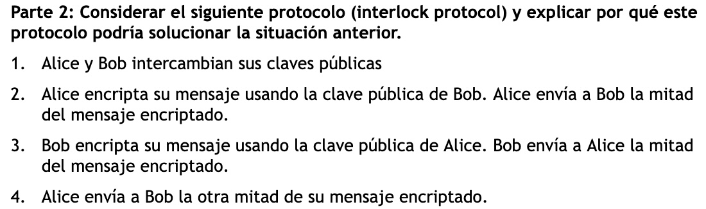

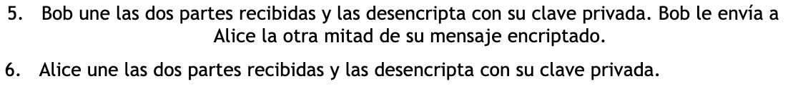

==Preguntar==

# 2021

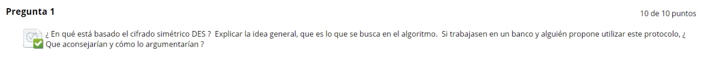

DES se basa en las redes de feistel. El algoritmo toma el mensaje original y lo parte en dos. Con estas dos partes, va a tomar a una y va a pasarla a traves de una caja de feistel junto con una subclave, para luego invertirlas. Va a repetir este proceso un total de 16 veces.

Este algoritmo esta debilitado, por lo que no se recomendaría el uso en ningún ambiente. Lo que se puede recomendar es 3-DES en el caso de que el banco necesite obligatoriamente la compatibilidad con el sistema DES (aunque también esta debilitado) o directamente actualizar a AES.

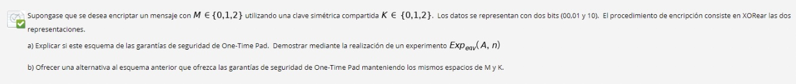

Este esquema no tiene las garantias de seguridad de One-Time Pad por que no tiene secreto perfecto.

Para verlo puedo emitir dos mensajes $m_0 = 00,m_1 = 01$ y veo que porcentaje de veces gana el atacante.

Para nuestro ataque, vamos a decir que si el mensaje cifrado empieza con $0$, vamos a emitir $b' = 0$

| m    | k    | b    | Cifrado | b’   | Acerto? |
| ---- | ---- | ---- | ------- | ---- | ------- |
| 00   | 00   | 0    | 00      | 0    | si      |
| 00   | 01   | 0    | 01      | 0    | Si      |
| 00   | 10   | 0    | 10      | 1    | no      |
| 10   | 00   | 1    | 10      | 1    | si      |
| 10   | 01   | 1    | 11      | 1    | si      |
| 10   | 10   | 1    | 00      | 0    | No      |

Vemos que acerto en su estimación 4 de las 6 veces, esto significa que la probabilidad de que:
$$
\Pr(\text{Eav}_{A,n} = 1) = \frac 4 6 > \frac 1 2 + \text{neg}(n)
$$
Y demuestro que no tiene secreto perfecto.

Para mejorar a este sistema se podrían mapear a los mensajes y a las claves a una matriz donde la distribución de estos valores sea uniforme.

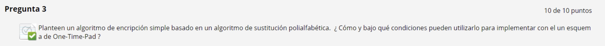

El cifrado de Vigenere es un algoritmo simple basado en la sustitución polialfabetica. Si la clave utilizada es mas larga que el mensaje, se considera equivalente al OTP.

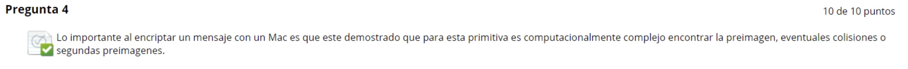

**Falso**. Una Mac no es utilizada para encriptar, sino que se usa para etiquetar a un mensaje de forma única y garantizar su integridad.

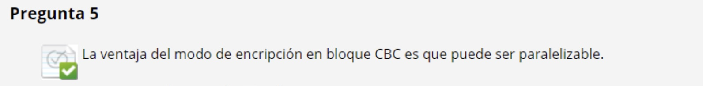

**Falso**. El modo CBC es serial.

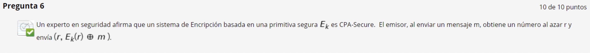

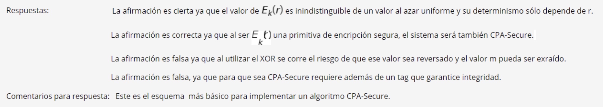

1. **Verdadero**
2. **Falso**
3. **Falso**
4. **Falso**