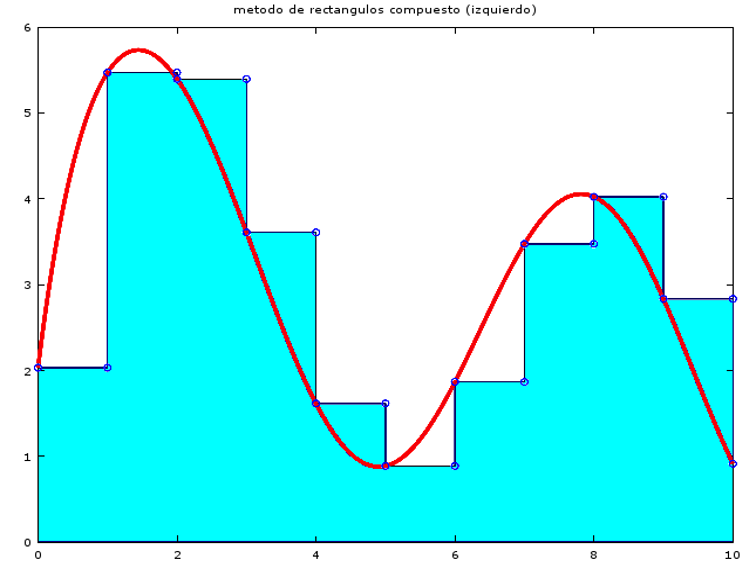
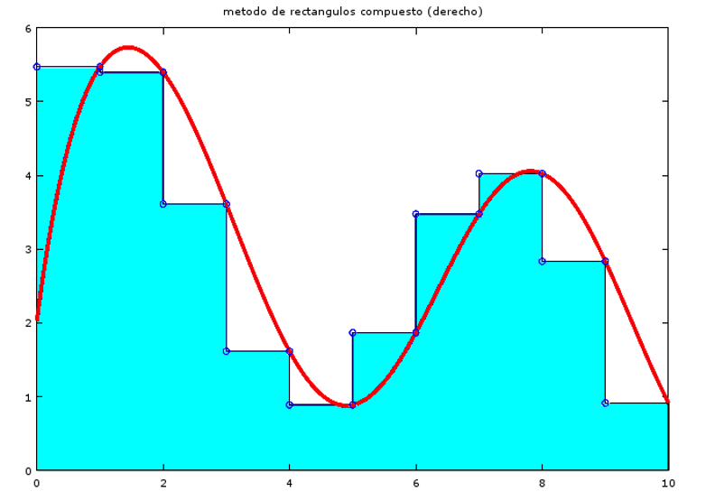
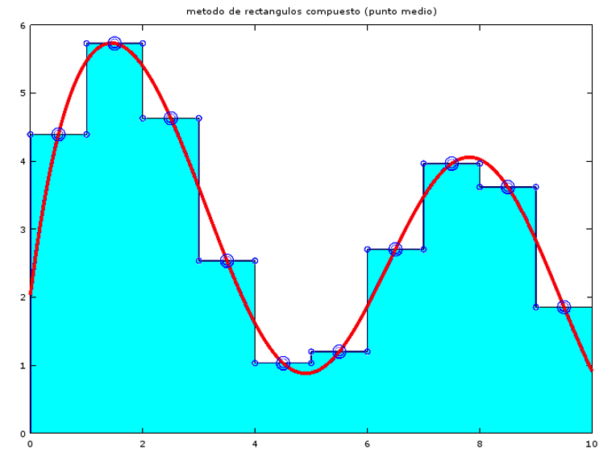
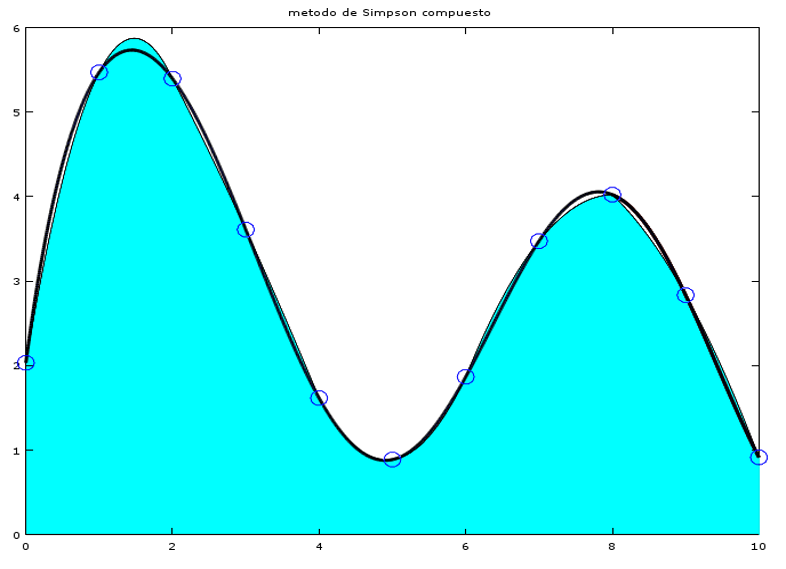

# Integración Numérica

## Métodos Compuestos

Sean $a=x_0<x_1<\dots<n_n=b$

### Regla del Rectángulo

- (Por Izquierda):

$$
I\sim \sum_{k=0}^{n-1}(x_{k+1}-x_k)\times f(x_k)
$$



- (Por Derecha):

$$
I\sim \sum_{k=0}^{n-1}(x_{k+1}-x_k)\times f(x_{k+1})
$$



- (Por Punto Medio):

$$
I\sim \sum_{k=0}^{n-1}(x_{k+1}-x_k)\times f(\frac{x_{k}+x_{k+1}}{2})
$$



------

### Regla del Trapecio

- (Clásica):

$$
I\sim \sum_{k=0}^{n-1}{(x_{k+1} -x_k)\times {\frac{f(x_{k+1})+f(x_k)}{2}}}\\
\\
Si\ x_{k+1}-x_k = h \ \ \forall k \Rightarrow h = \frac{b-a}{n} \\\\
I\sim T_h[f] =\frac{h}{2} \times \sum_{k=0}^{n-1}{f(x_{k+1}) +f(x_k)}\\
=\frac{h}{2}\times(E+2I_m) \ \ , \ \ E=f(a)+f(b) \ \ , \ \ I_m=\sum_{k=1}^{n-1}f(x_k) \\
\Rightarrow |I-T_h[f]|=\frac{(b-a)^2\times h}{12}\times|f''(\gamma)| \ \ ,\ \ \gamma \in [a,b]
$$


#### Error

$$
|E_h[f]|\sim\frac{b-a}{12}\times h^2C\ \ ,\ \ |E_{\frac{h}{2}}[f]|\sim\frac{b-a}{12}\times \frac{h^2}{4}\times C \\
\Rightarrow |E_h[f]|\sim \frac{|E_{\frac{h}{2}}[f]|}{4}
$$

Podemos aproximar el resultado de una mejor forma tomando $h$ y $\frac{h}{2}$ (Romberg):
$$
C \ \ y
\ \ I-T_{\frac{h}{2}}[f]\sim \frac{b-a}{12}\times \frac{h^2}{4} \times C  \\
Entonces\ observamos\ que:\\
0.25 \times(I-T_h[f]) \sim (I-T_{\frac{h}{2}}[f])\\
Reordenando\ obtenemos\ una\ aproximacion\ mucho\ mejor \\
I\sim\frac{4}{3}\times T_h[f]-\frac{1}{12}\times T_{\frac{h}{2}}[f]
$$

#### Ejemplo

Buscar la cantidad de intervalos para que el error sea menor a $10^{-m}$. Hacer una tabla
$$
I = \int_{0}^{1}{}\frac{dx}{1+x^2}=\frac{\pi}{2}\\
\Rightarrow f(x)=\frac{1}{1+x^2}\ \ ,\ \ f''(0)=-2\\
|I-T_h[f]|=\frac{1}{n^2 12}\times|f''(\gamma)| \leq \frac{1}{6n^2} \leq 10^{-m}
\Rightarrow n>\sqrt{\frac{10^m}{6}}
$$
Respuesta:

|  m   |  n   |
| :--: | :--: |
|  2   |  5   |
|  3   |  13  |
|  4   |  41  |
|  6   | 409  |

#### Código Matlab

```matlab
function q = trap(f,a,b,N)
	h = (b-a)/N;
	x = a:h:b;
	y = f(x);
	
	q = h/2 * sum(y(1:1:end-1) + y(2:1:end-1));
end
```

Se puede descargar de [aca](Resources/trapecio.m)

------

### Regla de Simpson

Para poder usarlo siempre se tiene que tener una cantidad impar de números

Si $x_{k+1}-x_k=h\ \  \forall k   \rightarrow h =\frac{b-a}{n}\ \ ,\ \ n\ par$
$$
E=f(a)+f(b)\\
P=f(x_2)+f(x_4)+\dots+f(x_{n-2})\\
I_m=f(x_1)+f(x_3)+\dots+f(x_{n-1})\\
\therefore I \sim S_h[f]=\frac{h}{3}\times(E+2\ P+4\ I_m)
$$


#### Código Matlab

```matlab
function q = simpson(f,a,b,N)
	if mod(N,2)
		N = 2*N;
	end
	
	h = (b-a)/N;
	x = a:h:b;
	y = f(x);
	E = y(1)+y(end);
	I = sum(y(2:end-1));
	P = sum(y(3:2:end-1));
	
	q = h/2 * (E+2*P+4*I);
end
```

Se puede descargar de [aca](Resources/simpson.m)


​    