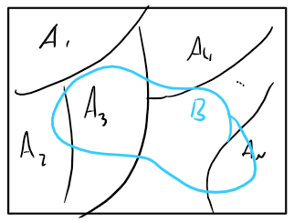

# Calculo de Probabilidad

## Regla de Laplace

### Hipótesis

Sean:

- $S=\{S_1,S_2,\dots,S_n\}\ \ \#S=n $   (Es un espacio finito)
- $P(S_i)=p$      (Todos los casos son igual de probables)
- $A=\bigcup_{j\ \in\  J} (S_j)\ \ \#A=\#J $  (Un suceso es la unión de algunos resultados)

### Teorema

$$
P(A)=\frac{\#A}{\#S} = \frac{Numero\ de\ casos\ deseados}{Numero\ Total\ de\ casos}
$$

### Axiomas del Calculo de Probabilidades

- $P(A)\geq0$
- $P(S)=1$
- $A\cap B=\phi \Rightarrow P(A\cup B)=P(A)+P(B)$
- $P(A)\leq 1$
- $P(\overline A) = 1- P(A)$
- $P(\phi)=0$
- $P(A\cup B) = P(A) + P(B) - P(A\cap B)$ 

#### Ejemplo

Se tienen 3 dados y se quiere saber la probabilidad de que al tirarlos salgan al menos 2 números iguales.

Tenemos los siguientes sucesos:

- $A$: Todos los números son distintos. $(A = 120)$
- $B$: Exactamente 2 números son iguales. $( B = 90)$
- $C$: Todos los los números son iguales. $( C = 6 )$
- $S = (A\cup B\cup C) = 216$

Tengo que buscar cuando caigan exactamente 2 números iguales $(B)$ o 3 números iguales $(C)$ $\Rightarrow $ quiero calcular $B\cup C$.
$$
P(B\cup C)=1-P(A) = 1-\frac{120}{216} = 0.4444
$$
Calculo $P(A)$ en vez de $P(B\cup C)$ por que es mas fácil de calcular.

## Probabilidad Condicional

Un suceso modifica las chances de ocurrencia de otro suceso.

### Probabilidad de A dado B

$$
P(A/B)=\frac{P(A\cap B)}{P(B)}\ \ ,\ \ P(B)>0
$$

### Propiedades

- $P(A/B)\geq 0$
- $P(S/B) = 1$
- $A\cup B=\phi \Rightarrow P(A\cup B/C)=\frac{P(A\cap C)}{P(C)} + \frac{P(B\cap C)}{P(C)}$
- Si $P(A/B)=P(A) \Rightarrow$ $B$ no condiciona a $A$ $\Rightarrow$ $P(A/B)\ .\ P(B) = P(A)\ .\ P(B/A)$
- $A$ y $B$ son **independientes** $\Leftrightarrow \ \ P(A\cap B) = P(A)\ .\ P(B)  $
- Si $A$ y $B$ sin independientes $\Rightarrow$ $\overline A$ y $B$ , $A$ y $\overline B$ , $\overline A$ y $\overline B$  son independientes. 
- Valen todos los [axiomas](#Axiomas del Calculo de Probabilidades) del las probabilidades no condicionales

### Ejemplo

Se tiran 2 dados, calcular la probabilidad de que <u>la suma de los dados sea menor a 8</u> $(A)$ dado que <u>la suma de los dados es impar</u> $(B)$.

Cálculos Auxiliares:
$$
P(A)=\frac{21}{36} \ \ -\ \ P(B)=\frac{18}{36}\ \ -\ \ P(A\cap B)=\frac{12}{36} \\
P(A/B) = \frac{P(A\cap B)}{P(A)}=\frac{\frac{12}{36}}{\frac{18}{36}} = \frac{12}{18} = 0.6667
$$

## Diagrama de Árbol

$$
P(B\cap A)=P(B/A)\ .\ P(A) = p_1\ .\ p 		\\
P(\overline B\cap A)=P(\overline B/A)\ .\ P(\overline A) = (1-p_1)\ .\ p 		\\
P(B\cap \overline A)=P(B/\overline A)\ .\ P(\overline A) = (1-p)\ .\ p_2 		\\
P(\overline B\cap \overline A)=P(\overline B/\overline A)\ .\ P(\overline A) = (1-p)\ .\ (1-p_2) 		\\
$$

## Particiones

Sea:

- $A_i$ una partición, $A_i \neq\phi$

- $A_i \cap A_j = \phi ,\ \ i\neq j$

- $S = \bigcup_{i=1}^{n}A_i$

- $B$ un conjunto superpuesto sobre S.

  

### Teorema de la Probabilidad Total

$$
P(B) = \sum_{i=1}^{n}P(B\cap A_i) = \sum_{i=1}^{n}P(B/A_i)\ .\ P(A_i)
$$

### Teorema de Bayes

$$
P(A_j/B)=\frac{P(a_j\cap B)}{P(B)} = \frac{P(B/A_j)\ .\ P(A_j) }{\sum_{i=1}^{n}P(B/A_i)\ .\ P(A_i)}
$$

