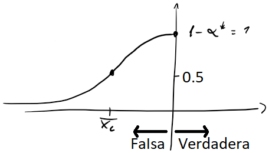

# Prueba de Hipótesis

Con las pruebas de Hipótesis queremos evaluar la veracidad de una afirmación. En este caso vamos a hablar de la media $(\mu)$.

Podemos plantear 3 hipótesis $\color{red}nulas$, cada una junto a su hipótesis $\color{green}alternativa$:
$$
\left\{
\begin{array}{}
	\color{red}H_0: \mu = \mu_0 \color{black}\mid \color{green}H_1 :\mu\neq\mu_0\\
	\color{red}H_0: \mu \leq \mu_0 \color{black}\mid \color{green}H_1 :\mu\neq\mu_0\\
	\color{red}H_0: \mu \geq \mu_0 \color{black}\mid \color{green}H_1 :\mu\neq\mu_0
\end{array}
\right.
$$
La hipótesis nula es la hipótesis que se asume inicialmente, siendo la hipótesis alternativa lo que se quiere probar. La hipótesis nula será rechazada en favor de la hipótesis alternativa solo si la evidencia muestral sugiere que la hipótesis nula es falsa. Las únicas 2 posibles conclusiones de la prueba de hipótesis son $H_0$ se rechaza y $H_0$ no se rechaza.

Tambien vamos a definir un criterio de Aceptación/Rechazo:

|                | $H_0$ verdadera   | $H_0$ falsa        |
| -------------- | ----------------- | ------------------ |
| Aceptar $H_0$  | Bien!             | Error de tipo $II$ |
| Rechazar $H_0$ | Error de tipo $I$ | Bien!              |

Siendo $\alpha$ la probabilidad de Error tipo $I$ y $\beta$ la probabilidad de error de tipo $II$.

### Calcular Error del tipo $I$ $(\alpha)$

Defino un máximo valor admisible para $\alpha$ llamado **Nivel del Confianza** $\alpha^*$. Y a partir de este valor determino el criterio de rechazo:

- Si $H_0:\mu \geq \mu_0$

$$
P(\overline{X_n} \lt \overline{X_c}) = \Phi\left( \frac {\overline{X_c} - \mu_0}{\sigma / \sqrt n} \right) \leq \alpha^*\\
\therefore~~~ \overline{X_c} = \frac \sigma {\sqrt n} \cdot \Phi^{-1}\left( \alpha^* \right) + \mu_0
$$

Entonces si $X_{obs} \lt \overline {X_c}$ entonces se rechaza la hipótesis nula, por el contario, se acepta la hipótesis 

Tambien se puede normalizar a esta función de la siguiente forma:
$$
P\left( \overline{X_n} \lt \overline{X_c} \right) = P\left(  \right)
$$
==BUSCAR EN EJEMPOS!==

### Calcular Error del tipo $II$ $(\beta)$

- Si $H_1 : \mu \lt \mu_0$:

$$
\beta(\mu) = P(\overline{X_n} \gt \overline{X_c}) = 1- \Phi\left( \frac{\overline{X_c} - \mu}{\sigma / \sqrt n} \right) = 1- \Phi\left(\Phi^{-1}(\alpha^*) + \frac {\mu_0 - \mu}{\sigma / \sqrt n} \right) \\
\beta(\mu)=1- \alpha - \Phi\left( \frac {\mu_0 - \mu}{\sigma / \sqrt n} \right)
$$

## Curvas de Operación Características

$$
\overline{X_c} = \mu_0 - Z_{\alpha^*} \cdot \frac {\sigma}{\sqrt n}
$$

- Caso 1:

Sea $H_0:\mu \leq\mu_0\mid H_1:\mu \gt \mu_0$

==COMPLETAR CON APUNTES DE FRAN==

## Prueba de Hipótesis con $\sigma$ Desconocido

Sea $T = \frac {\overline{X_n} - \mu_0} {s /\sqrt n}$, como $X_i \sim N(\mu_0,\sigma) \rightarrow T \sim t_{n-1}$

No puedo conocer $\overline {X_c}$ antes de hacer el experimento por que $s$ depende del experimento

