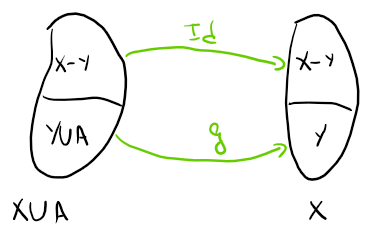

# Cardenalidad

## Coordinabilidad

### Definición

Sean $A,B$ conjuntos, $A\sim B$ si $\exist f :A \rightarrow B/f$ sea una función biyectiva.

### Notación

Si $A$ es coordinable con $B$, entonces se lo nota como:
$$
A \sim B
$$

### Observaciones

- La relación de coordinabilidad es de equivalencia

  - Demostración:

    - La relación es reflexiva, por que si planteo la función identidad $f(x)=x$ (biyectiva)
      $$
        f(A)=A \Rightarrow ARA
      $$

    - La relación es Simétrica, por que como $f$ es biyectiva, entonces existe $f^{-1}$
      $$
      ARB \Rightarrow f(A)=B \Rightarrow A = f^{-1}(B) \rightarrow BRA
      $$

    - La relación es Transitiva, por que la composición de funciones biyectivas resulta en una función biyectiva
      $$
      ARB\and BRC \Rightarrow f(A) = b \and g(B) = C \\\
      \text{Si defino } h:A \rightarrow C/ h(x) = g(f(x))\\
      \therefore h(A) = C \Rightarrow ARC
      $$

## Sección Inicial

### Definición

Son todos los conjuntos  de la forma:
$$
I_n=\{1,2,3,\dots, n\}
$$

### Observación

- $I_n \sim I_k \Leftrightarrow n = k$

  Demostración:

  - Ida:
    $$
    I_n\sim I_k \Rightarrow \exist f:I_n \rightarrow I_k \text{ biyectiva}
    $$
    Entonces la imagen de $f$ queda
    $$
    Im(f)=\{f(1),f(2),\dots,f(n)\}
    $$
    y tiene $n$ elementos.

    Tambien podemos ver que como $f$ va de $I_n$ a $I_k$
    $$
    Im(f) = I_k
    $$
    e $I_k$ tiene $k$ elementos.
    $$
    \therefore n=k
    $$

## Conjuntos Finitos e Infinitos

### Definición

$A$ es un conjunto <u>finito</u> si $A= \empty$ o $\exist n \in \N / A \sim I_n$

Si el conjunto $A$ no es finito, entonces se dice que es <u>infinito</u>

### Ejemplos

1. $A=\{\empty,\&,@\}$ es finito

   Definimos $f$ tal que:
   $$
   f:A \rightarrow I_3 / 
   \left\{
   	\array{
   		f(\empty)=1\\
   		f(\&) = 2 \\
   		f(@) = 3
   	}
   \right.
   $$
   Se puede ver que $f$ es biyectiva $\Rightarrow A \sim I_3 \Rightarrow A$ es finito.

2. $A=\N$ es infinito

   Supongo que es finito, entonces hay 2 opciones y solo hace falta que cumpla con una:

   - $\N = \empty ~~~~~(1)$

     <u>Falso</u>, por que 1 pertenece a $\N$

   - $\exist k / N \sim I_k~~~~~(2)$

     <u>Falso</u>, demuestro por absurdo

     Supongo que:
     $$
     \exist f:I_k \rightarrow \N \text{ biyectiva}
     $$
     Y su imagen es:
     $$
     Im(f) = \{f(1), f(2),\dots,f(k)\}
     $$
     Tomo el máximo valor de la imagen
     $$
     M = Max(Im(f)) 
     $$
     Pero podemos observar que:
     $$
     M+1 \in\N \and M+1 \notin Im(f)
     $$
     Entonces $f$ no es sobreyectiva y es <u>Absurdo</u>

## Cardenal

### Definición

- $Card(\empty) = 0$
- $Card(I_k) = k$
- $Card(\N) = \chi_o$

### Notación

Se lo nota de la siguiente forma:
$$
Card(A) = |A| = \#A
$$

### Relaciones entre Cardinales

Sean $a,b$ Cardinales. Sean $A,B$ conjuntos$/ \#A = a,~\#B=b$

1. $a\leq b$ si $\exist f:A\rightarrow B$ inyectiva
2. $a\geq b$ si $\exist f:A\rightarrow B$ sobreyectiva
3. $a = b $ si $\exist f:A\rightarrow B$ biyectiva
4. $a \lt b$ si $a\leq b$ y $a\neq b$
5. $a\gt b$ si $a \geq b$ y $a \neq b$

#### Ejemplo

1. Hallar $\# A / A =\{x \in \N/ x \text{ es par} \}$

   Defino $f:\N \rightarrow A / f(x)= 2 \cdot x$ y verifico que sea biyectiva

   Inyectividad: 
   $$
   f(x) = f(y) \Rightarrow2 \cdot x = 2 \cdot y \Rightarrow x = y
   $$
   Sobreyectividad:
   $$
   \text{Sea } a\in A \Rightarrow \exist k \in \N/ a = 2 \cdot k 
   $$
   Entonces podemos ver que $f$ es biyectiva.
   $$
   \therefore \#A=\#\N = \chi_o
   $$

2. $\#(\N \times \N) = ?= \chi_o$ por las diagonales de Cantor

   Vamos a usar el [Teorema de Bernstein](#Teorema de Beinstein), por lo que tenemos que buscar una función de $\N^2$ a $\N$ y otra de  $\N$ a $\N^2$, ambas inyectivas.

   - Busco $f:\N \rightarrow \N^2$

     Defino $f$ tal que:
     $$
     f:\N\rightarrow \N^2/f(x)=(x,x)
     $$
     Verifico que $f$ es inyectiva:
     $$
     f(x) = f(y)\\
     (x,x)=(y,y)\\
     x=y
     $$
     Y como es inyectiva, puedo decir que:
     $$
     \array{\#\N \leq \#\N^2 & (1)} 
     $$
     
- Busco $g:\N^2 \rightarrow \N$
  
  Defino $g$ tal que:
  $$
     g:\N^2 \rightarrow \N/ g(x,y)= 2^x\cdot 3^y
  $$
     Verifico que $g$ es inyectiva:
  $$
     g(a,b)=g(x,y)\\
     2^a \cdot3^b = 2 ^ x \cdot 3 ^y\\
     \text{Por el Teorema Fundamental de la Aritmetica }\\
     a = x \and b = y
  $$
     Y como es inyectiva, puedo decir que:
  $$
     \array{\#\N^2 \leq \#\N&(2)}
  $$
  

Entonces, por $(1)$ y $(2)$, mediante el teorema de Bernstein, puedo decir que:
$$
   \#\N^2 = \# \N = \chi_o
$$

### Teorema de Bernstein

Sean $a,b$ cardinales, si $a\leq b$ y $b \leq a \Rightarrow a = b$

Esto es sinónimo a decir:

Sea $A/\#A=a$, $B/\#B=b$, entonces:

Si existe $f:A\rightarrow B$ inyectiva y $g:B\rightarrow A$ inyectiva, entonces existe $h:A\rightarrow B$ biyectiva

#### Ejercicios

1. Demostrar que: Sea $A \sim \N,~B \sim \N \Rightarrow A\times B \sim \N$

   Como $A \sim \N \Rightarrow \exist f:A\rightarrow \N$ biyectiva

   Como $B \sim \N \Rightarrow \exist g:B\rightarrow\N$ biyectiva

   Entonces puedo definir una función $h$ de la siguiente forma:
   $$
   h:A\times B \rightarrow \N^2/h(x,y)=(f(x),g(y))
   $$
   Verifico que sea inyectiva:
   $$
   h(a,b)=h(x,y)\\
   (f(a),g(b))=(f(x),g(y))\\
   \array{f(a)=f(x) &~y~& g(b)=g(y)}\\
   $$
   ​		Como $f$ y $g$ son funciones inyectivas:
   $$
   \array{a=x&&b=y}
   $$
   Verifico que sea sobreyectiva:

   ​		Sean $(y_1,y_2) \in \N^2$:

   ​		Como $f$ es sobreyectiva, $\exist a / f(a) = y_1$

   ​		Como $g$ es sobreyectiva, $\exist b/g(b) = y_2$
   $$
   \therefore h(a,b)= (f(a),g(b))= (y_1,y_2)
   $$
   Como $h$ es inyectiva y sobreyectiva, podemos decir que es biyectiva, entonces tambien podemos decir que $A\times B \sim \N^2$.

   Ademas, ya sabiamos que $\N^2 \sim \N$

   Entonces, por trasitividad podemos decir:
   $$
   A\times B \sim \N
   $$

#### Observaciones

1. Cualquier subconjunto de una seccion inicial es finito

   - Sea $k\in \N, A \sub I_k$, entonces tengo que $I_k=\{1,2,3,\dots,k\}$

   - Ademas tengo un conjunto $A$ finito, por lo que $A=\{i_1,i_2,\dots i_m\}$ o $A=\empty$

     Elijo usar $i_m$ por que $A$ es un subconjunto de $I_k$, por lo que puede no contener a todos los elementos de $I_k$. Los elementos de $A$ son distintos.

   - Defino una funcion $h$:
     $$
     h:A\rightarrow I_m/h(i_j)=j
     $$
     Verifico que sea inyectiva:
     $$
     h(i_j)=h(i_t)\\
     j = t\\
     i_j = i_t
     $$
     ​	Por que todos los elementos son distinos, si comparten el mismo indice, son el mismo elemento.

     Verifico que sea Sobreyectiva:

     ​	Sea $r \in I_m$, entonces $1 \leq r \leq m$
     $$
     \exist i_r/ h(i_r) = r
     $$

   $\therefore$ Como $A$ es biyectiva, podemos decir que $A \sim I_m$ y esto indica que $A$ es un conjunto finito.

2. $A\sub B$ y $A$ es infinito $\Rightarrow B$ es infinito (<u>Demostracion por Absurdo</u>)

   - Supongo que $B$ es finito, entonces tengo 2 opciones:

     - $\array{(1)&B = \empty}$

       Como $B=\empty$ y $A\sub B \Rightarrow A = \empty$ Pero por dato $A$ es infinito, entonces es **falso**.  

     - $\array{(2)& \exist k \in \N/B \sim I_k}$

       Defino la funcion inclusion:
       $$
       inc:A\rightarrow B/ inc(x)=x\text{ inyectiva}
       $$
       Como $B\sim I_k$, podemos ver que:
       $$
       \exist f:B \rightarrow I_k\text{ biyectiva}
       $$
       Si componemos 2 funciones inyectivas, obtenemos una funcion inyectiva:
       $$
       f_oinc:A\rightarrow I_k \text{ inyectiva}
       $$
       Pero como necesitamos una funcion biyectiva, acotamos el codominio para que coincida con la imagen de la funcion compuesta ($C= Im(f_oinc)$)
       $$
       f_oinc:A \rightarrow C \text{ biyectiva}
       $$
       Entonces obtenemos lo siguente:
       $$
       A \sim C \sub I_k
       $$
       Y gracias a la observacion anterior ($\exist m/C \sim I_m$), obtenemos que:
       $$
       A \sim C \sim I_m
       $$
       Y esto indica que $A$ es un conjunto finito, pero por dato $A$ es infinito, entonces es **falso**.

3. $X$ es infinito, entonces $\exist f:\N \rightarrow X\text{ inyectiva}$

   - Esto dice que $\chi_o$ es el infinito mas chico.

   Como $X$ es infinito, entonces $X \neq \empty$, entonces:

   1. $\exist x_0 \in X \Rightarrow \text{ defino } f(0)=x_0$

   2. $\exist x_1 \in X-\{x_0\} \Rightarrow \text{ defino } f(1)=x_1$

      Inductivamente: $\exist x_n \in X-\{x_0,x_1,\dots,x_{n-1}\} \Rightarrow \text{ defino} f(n)=x_n$

   De esta forma queda definida $f:\N \rightarrow X$ inyectiva

4. $\geq$ es una relación de orden.

5. $\leq$ es una relación de orden.

6. $\exist f:A \rightarrow B$ inyectiva $\Leftrightarrow \exist g:B \rightarrow A$ sobreyectiva

   De forma similar $\#A \leq \#B \Leftrightarrow \#B \geq \#A$

#### Ejemplos

1. Demostrar que $\N \sim \Q$, es decir que $\#\N = \#\Q$

   Ayuda: Armar una tabla de diagonales de Cantor, pero con $\frac x y$. Como hay resultados repetidos, no se puede encontrar una función biyectiva, pero se puede buscar una inyectiva, por lo que tengo que usar el teorema de Bernstein.

## Conjunto Numerable

$A$ es numerable si $A$ es finito o $A \sim \N$.

### Teoremas

1. $\#[0,1] \gt \chi_o$

   **Demostracion**

   Primero voy a ver que  $\#[0,1] \ge \chi_o$

   - Propongo la funcion $F$:
     $$
     F:\N \rightarrow[0,1]/F(n)=\frac 1 {n+1}
     $$
     Como $F$ es inyectiva, podemos decir que $\#[0,1] \geq \# \N = \chi_o$ 

   Ahora quiero ver que $\#[0,1] \neq \chi_o$

   - Supongamos que $[0,1] \sim \N$
     $$
     \exist f:[0,1]\rightarrow \N \text{ biyectiva}\\
     \Rightarrow Im(f)=\{f(0),f(1),\dots\}= [0,1]
     $$
     ​	Con $f(i)=\mu_i=0,\mu_{i0}\mu_{i1}\mu_{i2} \dots$ , $\mu_{i,j}=\{0,1,2,3,4,5,6,7,8,9\}$ 
     
     Defino un numero $d$ para que me de el absurdo tal que $d = 0,d_0d_1d_2\dots d_i/ d_i \neq \mu_{ii}$. 
     
     Y digo que $d_i \in \{1,2,3,4,5,6,7,8\}$, donde saco el $0$ y el $9$ para asegurarme de que todos los numeros tengan escritura unica. Ahora puedo comparar a los numeros como secuencias de chars
     
     Entonces obtengo que $d\in [0,1]$
     
     Pero tambien sabemos que:
     $$
     d \neq \mu_i
     $$
     por que $d_i \neq \mu_{ii}$
     
     Por lo que 
     $$
     d \notin \{ \mu_0,\mu_1,\dots\} = \{f(0),f(1),\dots\}=[0,1]
     $$
     ABSURDO, por que vimos antes que $d \in [0,1]$

### Definicion

$$
C=\#[0,1]
$$

#### Propiedades

- Sea $X$ infinito no numerable ($\#X \gt \chi_o$) y $A$ numerable, entonces:
  $$
  X\cup A \sim X
  $$

  - **Demostracion**:
    $$
    \exist f:\N \rightarrow X \text{ inyectiva no biyectiva }\\
    Im(f)=\{ f(0), f(1), \dots \} = Y \sim \N \and Y \sub X
    $$
    

    Caso 1: $A \cap X = \empty$
    $$
    Y \cup A \sim Y \Rightarrow \exist g: Y\cup A \rightarrow Y/ g \text{  biyectiva}
    $$
    ​	Luego defino una funcion $f$ biyectiva:
    $$
    f: X\cup A \rightarrow X/ f(t)=
    \left\{
    	\begin{matrix}
    		t & t \in X-Y\\
    		g(t) & t \notin X-Y
    	\end{matrix}
    \right.
    $$
    
    $$
    \therefore X\cup A \sim X
    $$
    Caso 2: $A \cap X \neq \empty$

    ​	Podemos escribir a $A$ como:
    $$
    A=(A \cap X) \cup (A-X)=(A \cap X)\cup \overline{A}
    $$
    ​	Como $A$ es parte de $X$, podemos decir que $X\cup A = X \cup \overline A$.

    ​	De la misma forma, como $\overline A \sub A-X$ y $A-X$ es numerable, $\overline A$ es numerable.

    ​	Entonces caigo en el caso 1.

    

- Sea $X$ infinito no numerable, $A$ numerable, entonces:
  $$
  X-A \sim X
  $$

  - Demostracion

    Caso 1: $A \sub X$

    ​	Puedo definir a $X$ como:
    $$
    X = X-A \cup A
    $$
    ​	Y podemos ver que $X-A$ es infinito no numerable, por que $A$ es finito numerable.

    ​	Suponemos que $X-A$ es numerable:

    ​	Como $X = X-A \cup A$, $A$ es numerable y $X-A$ es numerable, podemos decir que $X$ es numerable. <u>ABSURDO</u>.
    $$
    \Rightarrow X-A \text{ es no numerable}\\
    \therefore X = X-A\cup A \sim X-A
    $$
    Caso 2: $A \not\sub X$

    ​	Puedo definir a $A$ como:	
    $$
    A = (A \cap X) \cup (A-X)=\overline A \cup (A-X)
    $$
    ​	Entonces veo que $X-A=X-\overline A$ y que $\overline A \sub X$ y caigo en el caso 1.

## Teorema de Cantor

$$
\#X \lt \rho(X)
$$

Hay infinitos cardinales infinitos:
$$
\#\N \lt \#\rho(\N) \lt \#\rho(\rho(\N)) \lt \dots 
$$

### Demostracion

- Defino $f$ tal que:

$$
f:X \rightarrow \rho(X)/f(a) = \{a\}
$$

Podemos ver que $f$ es inyectiva, entonces podemos decir que:
$$
\#X \leq \#\rho(X)
$$

- Supongo que $ \exist h:X \rightarrow \rho(X)$ sobreyectiva

  Defino $B=\{x\in X/x \notin h(x)\} \sub X$, entonces  $B \in \rho(X)$

  Como $h$ es sobreyectiva $\Rightarrow \exist b \in X/h(b)=B $

  Quiero ver si $b \in B$:
  $$
  b \in B \Leftrightarrow b \in h(b) \Leftrightarrow b \notin B
  $$
  ABSURDO, entonces:
  $$
  \not \exist h : X \rightarrow\rho(X) \text{ sobreyectiva}\\
  \Rightarrow \#X \not\geq\# \rho(X)
  $$

Y como $\#X \leq \#\rho(X)$ y $\#X \not\geq\# \rho(X)$, entonces:
$$
\#X \lt\# \rho(X)
$$

# Anexo

## Demostraciones

### 1

Todos los numeros termiandos en $,\dot 9 $ pueden ser escritos como el siguente entero con cola de $,\dot0$
$$
a = 0.\dot9\\
10 \cdot a - 9 = 9 \cdot a\\
9\cdot a = 9\\
a =1
$$

Caso 2: $A \sub X$

​	Puedo definir a $X$ como:
$$
X = X-A \cup A
$$
​	Y podemos ver que $X-A$ es infinito no numerable, por que $A$ es finito numerable.

​	Suponemos que $X-A$ es numerable:

​	Como $X = X-A \cup A$, $A$ es numerable y $X-A$ es numerable, podemos decir que $X$ es numerable. <u>ABSURDO</u>.
$$
\Rightarrow X-A \text{ es no numerable}\\
\therefore X = X-A\cup A \sim X-A
$$

