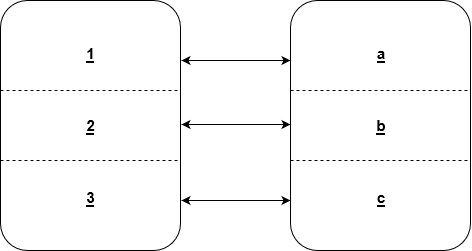
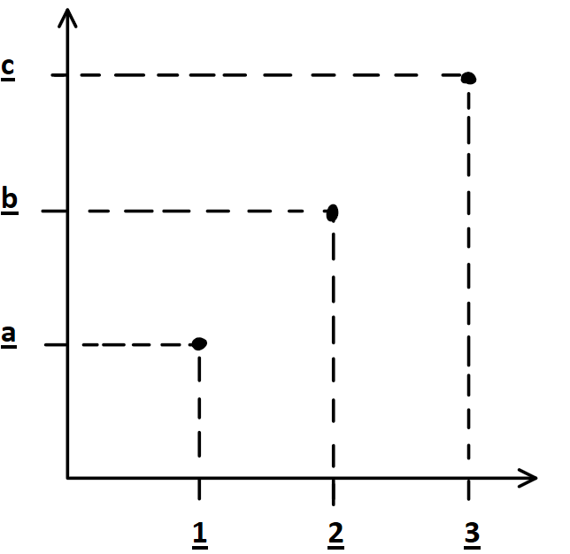
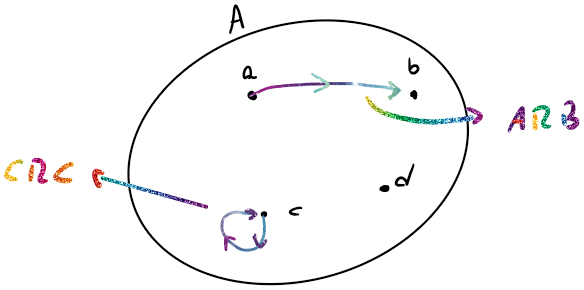

# Relaciones

$R$ es una relación entre los elementos de $A$ y $B$ si $R \sub A\times B$

## Formas de Representarlas

Sea $A=\{1,2,3\} B=\{a,b,c\}$ y $R\sub A\times B = \{\{1,a\},\{2,b\},\{3,c\}\}$

### Diagrama de Venn

### Ejes Cartesianos

### Representación Matricial

$$
M(R)=
\array{1\\2\\3}
\begin{pmatrix}
1&0&0\\
0&1&0\\
0&0&1
\end{pmatrix}\\
~~~~~~~~~~~~~~~~~~~\array{a&b&c}
$$

## Dominio e Imagen

Si $R\sub A \times B$:

- $Dom(R)=\{ a\in A/~\exist b \in B \and aRb \}$
- $Im(R)=\{b\in B / ~ a\in A \and aRb\}$

### Relación Inversa

Si $R\sub A \times B$, entonces la relación inversa es:
$$
R^{-1} \sub B\times A,~~R^{-1}=\{ (b,a)\in B\times A/~~(a,b) \in R \}
$$
En general $Dom(R) = Im(R^{-1})$ y $Dom(R^{-1}) = Im(R)$

## Particiones de Conjuntos

Dado que $A \neq \empty$, una partición de  $A$ es una familia $F$ de subconjuntos $A$ que satisface:

- Si $B \in F \Rightarrow B \neq \empty$
- Si $B,C\in F \Rightarrow B=C \or A\cap B=\empty$
- $\bigcup_{B\in F} B = A$

### Teorema

Sean $A\neq \empty$ y $R\sub A\times A$ una relación de equivalencia, entonces:

$F=\{ [a]/a\in A \}$ es una partición de $A$ y se la llama partición de $A$ inducida por $R$.

# Relaciones de un Conjunto a si mismo

## Representación

### Representación por Dígrafos

Sea $A=\{a,b,c,d\},R \sub A\times A=\{(a,b);(c,c)\}$ 

## Propiedades

- Re flexibilidad: $R$ es reflexiva $\Leftrightarrow aRa ~~\forall a\in A$
- Simetría: $R$ es simétrica $\Leftrightarrow$ $aRb \Rightarrow bRa ~~~ \forall a,b \in A$
- Anti-simetría: $R$ es anti-simétrica $\Leftrightarrow$ $aRb~\and~ a\neq b \Rightarrow b \cancel R a$
  - Definición equivalente: $R$ es anti simétrica $\Leftrightarrow  aRb \and bRa \Rightarrow x = y$
- Transitividad: $R$ es transitiva $\Leftrightarrow aRb \and bRc \Rightarrow aRc$

## Relación de Orden

$R\sub A\times A$ es una relación de orden si es **reflexiva**, **anti-simétrica** y **transitiva**.

- $R$ es de **orden global** si es una relación de orden y $\forall a,b \in A$, $aRb \and bRa$.
- $R$ es de **orden parcial** si es una relación de orden pero no es global.

## Relación de Equivalencia

$R \sub A \times A$ es de equivalencia si es **reflexiva**, ***simétrica* y **transitiva**.

### Clases de Equivalencia

Si $R\sub A \times A $ es una relación de equivalencia, se define a la clase de equivalencia como:
$$
[a] = \{ b\in A/~aRb \} = \{ b\in A/~bRa \}
$$

#### Teorema

Sea $A\neq \empty$ y $R\sub A \times A$ es una relación de equivalencia:

1. $[a] \neq \empty~~~\forall a \in A$
2. Si $a,b \in A \Rightarrow [a]=[b] \or [a]\cap[b]=\empty$
3. $\bigcup_{a\in A}[a] = A$

#### Demostración

1. Como $a\in A$, como $R$ es reflexiva, $aRa$  y $a\in [a] $ por lo tanto $[a] \neq \empty$

2. Sean $a$ y $b$ $\in A$, hay 2 posibilidades:

   - $[a]\cap[b] = \empty$

   En este caso, ya se puede ver que cumple con la tesis.

   - $[a] \cap [b] \neq\empty$

   En este caso hay que operar un poco:
   $$
   \exist c/ c\in [a] \and c\in[b]\\
   \Rightarrow cRa \and aRb
   $$
   Por Simetría:
   $$
   aRc \and  cRb
   $$
   Por transitividad:
   $$
   aRb
   $$
   Y por Simetría:
   $$
   bRa
   $$
   Entonces como $aRb$ y $bRa \Rightarrow [a] \sub [b]$

   De la misma forma puedo obtener que $[b]\sub [a]$

   Y por igualdad de conjuntos:
   $$
   [a] = [b]
   $$

# Anexo

### Producto Cartesiano

Sean $A_1$, $A_2$,$\dots$ $A_k$ conjuntos:
$$
A_1 \times A_2 \times \dots \times  A_k =\{\{a_1,a_2,\dots,a_k \}~~,~~a_i \in A_i\}
$$
