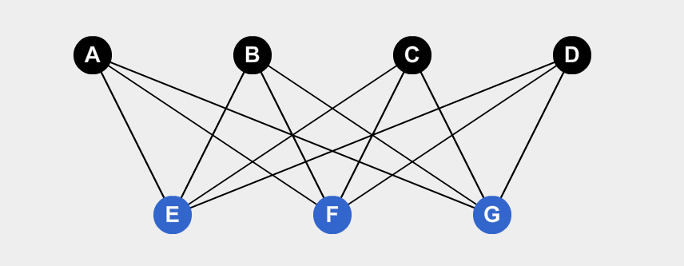

# Grafos

## Definiciones

### Grafo

Un grafo **G=(V,E)** es una estructura matemática que consta de dos conjuntos **V** y **E**. Los elementos de V son vértices o nodos y los elementos de E se llaman aristas. Cada arista tiene un conjunto de uno o mas vértices asociados que se llaman extremos ($V\neq \empty$).

##### Ejemplo Grafo Simple

### Grafo Trivial

Un grafo es trivial cuando $\#V=1$ y $\#E = 0$, es decir, cuando solo hay un punto.

### Grafo Lazo

Un grafo es lazo cuando tiene una arista cuyos puntos extremos son coincidentes.

##### Ejemplo

### Arista Propia

Es una arista que no es un lazo.

### Multígrafo

Un grado $G=(V,E)$ es un multígrafo si existen $a$ y $b \in V$ con dos o mas aristas incidentes en $a,b$. En caso contrario se lo llama grafo simple. Es decir, cuando hay dos aristas cuyos vértices son iguales.

##### Notación

A cada arista se la nombra por los vértices, por ejemplo, $e_1= \{a,b\}$

##### Ejemplo

### Grafo Dirigido o Dígrafo

Es un grafo donde todas sus aristas son dirigidas (Tienen flechas).

##### Notación

A cada arista se la nombra por los vértices de donde sale y a donde llega, en ese orden. Por ejemplo: $e_1 = \{a,b\}$ es una arista que sale del vértice $a$ y llega al vértice $b$.

##### Ejemplo 

### Multígrafo Dirigido

De forma similar a los multígrafos no dirigidos, un dígrafo es dirigido cuando hay dos aristas o mas que compartan el mismo vértice de inicio y el mismo vértice de fin.

##### Ejemplo

### Grafo Ponderado

$G$ es un grafo podenrado si cada arista tiene un peso asociado. Notacion $e\in E_G,p(e)$

#### Distancia ponderada

Sea $G$ un grafo ponderado con $a,b \in V_G $, la distancia ponderada es la distancia ponderada minima entre todos los caminos entre $a$ y $b$, Es decir, el camino con menor peso de todos los posibles. Notacion: $dp(a,b)$ 

Sea $c_j$ un camino valido entre $a,b$, compuesto por vertices $e_i \in E_G$:
$$
dp(a,b)= min\{c_1,\dots, c_j\}~~~c_j=\sum_i (e_i)
$$

### Matriz de Incidencia

La matriz de incidencia de un grafo $G$ es la matriz $I_G$  cuyas filas y columnas son indexadas por algún orden de $V_G$ y $E_G$ respectivamente tal que:
$$
I_G[v,e]=
\left\{
\array
{
0& \text{si $v$ no es un extremo de $e$}\\
1& \text{si $v$ es un extremo de $e$}\\
2 & \text{si $e$ es un lazo en $v$}
}
\right.
$$
Si se trata de un Dígrafo:
$$
I_D[v,e]=
\left\{
	\array{
		0&\text{si $v$ es un extremo de $e$}\\
		1&\text{si $v$ es la cabeza de $e$}\\
		-1&\text{si $v$ es la cola de $e$}\\
		2&\text{si $e$ es un lazo de $v$}
	}
\right.
$$
==PEDIR EJEMPLOS MATRIZ INCIDENCIA==

## Matriz de Adyacencia

La matriz de adyacencia de un grafo $G$ es la matriz $A
_G$ cuyas filas y columnas son indexadas por algún orden de $V_G$, tal que: 
$$
A_G[u,v]=
\left\{
	\array{
	\text{la cantidad de aristas entre ellos} && \text{si $u \neq v$}\\
	\text{la cantidad de lazos} && \text{si $u = v$ }
	}
\right.
$$
Si es un dígrafo:
$$
A_D[u,v]=
\left\{
	\array{
	\text{la cantidad de aristas de $u$ hasta $v$} && \text{si $u \neq v$}\\
	\text{la cantidad de lazos} && \text{si $u = v$ }
	}
\right.
$$
==PEDIR EJEMPLOS==

### Grado

El grado de un vértice en un grafo $G$ denotado $g(v)$ es el numero de aristas propias incidentes en $v$ mas el doble del numero de lazos en $v$. 

En un dígrafo se define **grado de salida** de un vértice $v$ $g_s(v)$ al numero de aristas cuya cola esta en $v$ mas el numero de lazos y el **grado de entrada** de un vértice $v$ $g_e(v)$ al numero de aristas cuya cabeza esta en $v$ mas el numero de lazos.

##### Proposición

- La suma de los grados de los vértices de un grafo $G$ es par y es igual al $2\cdot \#E_G$:
  $$
  \sum_{i=1}^{n=\#V_G} g(v_i)=2 \cdot \#E_G
  $$
[Demostración](Demostraciones\01 - Grafos\Proposicion 01.html) 
  
- En un grafo $G$ la cantidad de vértices de grado impar es par. 

  [Demostración](Demostraciones\01 - Grafos\Proposicion 02.html) 

### Grafo Regular

Todos los vértices tienen el mismo grado. Se llama $k$-regular si todos los vértices tienen grado $k$.

##### Regularidad en tipos de grafos

- $K_n$ es $n-1$ regular
- $K_{m,n}$ es $n$ regular si $m=n$
- $Q_n$ es $n$ regular
- $C_n$ es 2 regular

## Grafos Famosos

### Grafos Completos

Son grafos **simples sin lazos**. Todos los vértices son mutuamente adyacentes ($a$ es adyacente a $b$ si existe en el grafo $G$ la arista $e=\{a,b\}$)

##### Notación

Se los denomina $\mathbb K_m$, siendo $m$ la cantidad de vértices.

##### Ejemplos

### Grafos Caminos

Son grafos cuyos vértices tienen como máximo 2 conexiones.

##### Notación

Se los denomina $\mathbb P_n$ siendo $n$ la cantidad de vértices.

##### Ejemplos

## Grafos Ciclos

Son grafos en los que cada vértice se conectan con 2 aristas cada uno.

##### Notación 

Se los nota como $\mathbb C _n$ y $n$ son los vértices.

##### Ejemplos

## Grafos Dipolo

Son Grafos con 2 vértices y distinta cantidad de aristas entre si.

##### Notación

$\mathbb D_n$ y $n$ es la cantidad de aristas.

##### Ejemplos

## Grafos Cubo

Estos grafos tienen $2^n$ vértices. Si los notamos como números binarios, 2 vértices son adyacentes si difieren exactamente en 1 bit. La cantidad de aristas  se puede calcular de la siguiente forma:
$$
\#E_{Q_n} = 2^{n-1} \cdot n
$$

##### Notación

Se los nota $Q_n$ y $n$ es la cantidad de bits con los que pueden ser representados los vértices.

##### Ejemplos

### Grafo Bipartito ==Final==

Sea el grafo $G=(V,E)$ simple y sin lazos, es bipartito si $V$ = $V_1 \cup V_2$ u $V_1 \cap V_2 = \empty$. Debe existir una partición donde se cumple con la condición, pero no es necesario que todas las posibles particiones cumplan con la condición para ser bipartito.

Si $e=\{a,b\} \in E_G \rightarrow a \in V_1 \and b\in V_2$

La cantidad de aristas se las calcula como $\#\mathbb K_{m,n} = m + n-1$

##### Notación

Se los nota como $\mathbb K_{m,n}$

##### Ejemplo 

En este caso $V_1=\{A,C,E\}$ y $V_2 = \{B,D\}$, y $V_1 \cap V_2 = \empty$.

#### Caracterizacion de un Grafo Bipartito

$$
G \text{ es bipartito} \Leftrightarrow G \text{ no tiene ciclos de longitud impar}
$$

 [Demostración](Demostraciones\01 - Grafos\Proposicion 03.html) 

#### Grafo Bipartito Completo

Este es un grafo $\mathbb K_{4,3}$.

### Grafo Rueda

Es un grafo ciclo con $n-1$ vértices mas 1 vértice.

##### Notación

$W_n = C_{n-1}+ \{v\}$, con $n\geq 4$

##### Ejemplo

Se puede ver el grafo $W_4$

## Subgrafos

Un subgrafo de un grafo $G$ (dirigido o no) es un grafo $H$, que cumple que $V_H ⊆ V_G$ y $E_H \subset E_G$

### Subgrafo Recubridor

$H$ es un subgrafo recubridor de $G$ si $V_G = V_H$

### Subgrafo Inducido

Sea $G=(V,E)$ un grafo (dirigido o no). Si $\empty \neq U \sub V$, el subgrafo de $G$ indicado por $U$ es el subgrafo cuyo conjunto de vértices es $U$ y que contiene todas las aristas de $G$ de la forma:

1. $(x,y)$ para $x,y \in U$ si es dirigido
2. $\{x,y\}$ para $x,y \in U$ si no es dirigido

#### Ejemplo

Sea el grafo $G$:

Se nota al subgrafo como $<U_1>$ $U_1=\{A,B,C\}$ es:

### Operaciones

#### Borrado de un vértice

Si v es un vértice de un grafo (dirigido o no) $G$, entonces $G−v$ es el subgrafo inducido por el conjunto de vértices $V_G −{v}$. En general, el resultado de borrar iterativamente todos los vértices de $U ⊆V_G$ se denota $G−U$.

##### Ejemplo.

Si tengo el siguiente grafo $G$:

Y le quiero eliminar el vértice $C$, entonces obtengo el grafo $G-\{C\}$:

#### Borrado de una Arista

Si e es una arista del grafo (dirigido o no) $G$, entonces $G−e$ es el subgrafo cuyo conjunto de aristas es $E_G −{e}$ y el conjunto de vértices es $V_G$.

#### Agregado de un Vértice

Agregar un vértice $v$ a un grafo $G$, donde $v$ no pertenece a $V_G$ significa crear un supergrafo denotado $G \cup\{v\}$ donde el conjunto de es $V_G\cup{v}$ y el conjunto de aristas es $E_G$.

#### Agregado de una Arista

Agregar una arista e entre dos vértices $v$ y $u$ del grafo $G$ significa crear un supergrafo denotado $G\cup{e}$ donde el conjunto de vértices es $V_G$ y el conjunto de aristas es $E_G\cup{e}$.

#### Suma de Grafos

 Sean $G$ y $H$ dos grafos. Sumando $G$ y $H$ se obtiene $V_{G+H} = V_G\cup V_H$ y EG+H = $E_G\cup E_H \cup \{e =\{u,v\}: u∈V_G,v ∈V_H\}$.

#### Complemento

El complemento de $G$ (**grafo simple sin lazos no dirigido**), que se denota $\overline G$ o $G^c$ es el subgrafo de $K_n$ formado por los $n$ vértices de $G$ y todas las aristas que no están en $G$.

Por lo general, $\#E_G + \#E_\overline G = \#E_{k_n}$

#### Isomorfismo de Grafos ==FINAL==

Sean $G_1(V_1,E_1)$ y $G_2(V_2,E_2)$ dos grafos no dirigidos, una función $f: V_1 \rightarrow V_2$ es un isomorfismo de grafos si:

1. $f$ es biyectiva.
2. $\forall a,b \in V_1, ~~{a,b}\in E_1 \Leftrightarrow \{ f(a),f(b) \} \in E_2$

Cuando existe dicha función $G_1$ y $G_2$ son grafos isomorfos. A cada clase de equivalencia se llama tipo de isomorfismo.

Condiciones necesarias para que haya un isomorfismo:

- $\#V_{G_1} = \#V_{G_2}$
- $\#E_{G_1} = \#E_{G_2}$
- La secuencia de Grados de $G_1$ es igual a la secuencia de Grados de $G_2$.

##### Notación

Si $G_1$ y $G_2$ son isomorfos, se lo nota como:  $G_1 \simeq G_2 $

