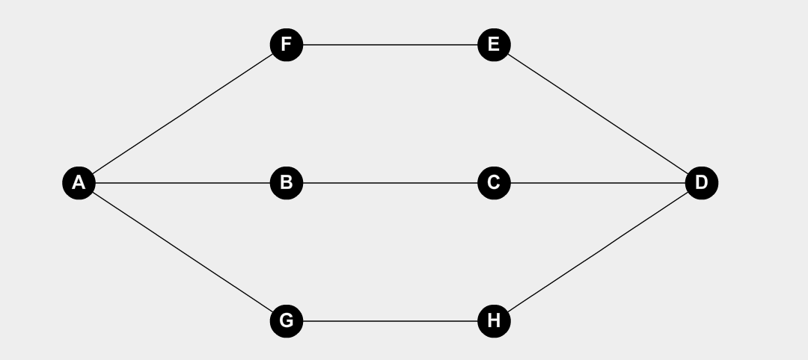

# Conexidad

Un grafo es conexo si $∀ \text{ par de vertices } u \text{ y } v \text{ hay un camino } u−v$.

## Digrafo Conexo

Un digrafo puede ser al mismo tiempo fuerte y debilmente conexo. Por ejempo, todo grafo fuertemente conexo va a ser debilmente conexo

### Debilmente Conexo

Un digrafo es debilmente conexo si al considerarlo no dirigido es conexo.

### Fuertemente Conexo

Un digrafo es fuertemente conexo si todo par de vertices en el digrafo es mutuamente alcanzable. Dos vertices $u$ y $v$ son mutuamente alcanzables si existen en el digrafo un camino directo $u−v$ y un camino directo $v−u$.

## Componentes

Se llama componente de un grafo a un subgrafo conexo maximal del grafo $G$. Es decir, un subgrafo es maximal si no es un subgrafo propio de otro subgrafo de $G$.

Por ejemplo, tanto el subgrafo formado por los vertices $C_1=\{A,B,C\}$, o por $C_2=\{D,E\}$, o por $C_3=\{F\}$ son todos componentes.

En el grafo $G$, la componente 1 ($C_1$) tambien se puede llamar como $C(A)=C(B)=C(C)$.

Si definimos la relacion $v_iRv_j$ ==__PEDIR__==

$R$ es de equivalencia. Cada clase de equivalencia contiene a todos los vertices de una componente de $G$.

### Observaciones

Si $G$ es conexo, tiene solo una componente.

## Vertice de Corte

Tambien llamado punto de articulacion, es un vertice que al removerlo, se generan mas componentes. Si $v$ es es vertice de corte y $G$ es un grafo, entonces la cantidad de componentes conexas de $G$ es menor a $G-\{v\}$.

Se denomina $\scr{K}$$(G)$ a la cantidad de componentes de $G$.

En este caso, se puede ver que el vertice $F$ y $E$ son vertices de corte ya que si los remuevo genero nuevos subgrafos

### Proposiciones

$$
v\in V_G \text{ es vertice de corte de }G \\ \Leftrightarrow \\\exist \mu,v,w \in V_G/ \mu \neq v, v \neq w, \mu \neq w \text{ tal que todo camino de } \mu-w \text{ pasa por } w
$$

==FINAL==

#### Demostracion

- Ida:

  Si $v$ es vertice de corte de $G \Rightarrow$ 

  $G-\{v\}$ tiene al menos dos componentes si tomamos a $v,w$ como dos componentes distintas de $G-\{v\} \Rightarrow$

  $\not \exist$ camino $\mu-w$ en $G-\{v\} \Rightarrow$

  Como $G$ es conexo, en $G$ todo camino $\mu-w$ pasa por $v$

- Vuelta:

  Si todo camino $\mu-w$ en $G-\{v\}$ pasa por $v$ $\Rightarrow$

  En $G-\{v\}$ no hay camino $\mu-w$ $\Rightarrow$

  $G-\{v\}$ no es conexo,  como $G$ es conexo $\Rightarrow$

  $v$ es vertice de corte.

## Aristas de corte o Puente

$e$ es una arista de corte si: $\scr{K}$$(G-\{e\}) \gt$ $\scr{K}$$(G)$

La arista marcada con un $1$ es una arista de corte, ya que al eliminarla obtengo 2 componentes.

### Observaciones

Si $v$ es de corte  $\scr{K}$$(G-\{v\}) \gt$ $\scr{K}$$(G)$ no sabemos por cuanto difieren.

Si $e$ es de corte  $\scr{K}$$(G-\{e\}) =$$\scr{K}$$(G)+1$

Si la arista $e=\{a,b\}$ es de corte y el $gr(a)\gt 1 \Rightarrow a$ es de corte.

### Proposiciones

Sea $G$ conexo:
$$
e\in E_G \text{ es arista de corte } \Leftrightarrow e \text{ no pertenece a un ciclo en }G
$$

#### Demostracion

- Ida (Por contrareciproco):

  Si $e$ pertenece a un ciclo de $G$

  $\Rightarrow$ para todo camino $u-v$ que contenga a la arista $e$ habra otro camino en $G$ que no la contenga.

  $\Rightarrow$ $e$ no es de corte.

  Basta ver lo siguente:

  Sea $e=\{a,b\}$, $L$ el camino, $e-v=<u,\dots,a,e,b,\dots,v>$

  Como hay un ciclo, entonces existe un camino alterantivo $L'=<a,\dots,b>$ que no contiene a $e$.

  Entonces al quitar $e$ sigue habiendo un camino $u-v=L_{u-a}L'L_{b-v}$

- Vuelta (Contrareciproco):

  Si $e$ no es de corte

  $\Rightarrow$ $G-\{e\}$ es conexo

  $\Rightarrow$ Para todo camino $L=u-v$ que contiene a $e$ existe un camino alternativo $L'$ que no contiene a $e$ y $LL'$ es un ciclo que contiene a $e$.

 ## Conexidad por Vertices

Es la minima cantidad de vertices que hay que remover del grafo para que deje de ser conexo <u>o se transforme en el grafo trivial</u>.

Notacion $K_v(G)$

### Ejemplos

$K_v(G)=2$, siendo los vertices de corte $C,D,E,F$. Eliminando 2 de esos vertices se obtienen 2 componentes.

Para Grafos $K_n$: $K_v(K_n)=n-1$

### Observaciones

Si $G$ tiene vertice de corte $\Rightarrow K_v(G)=1$

Si $G$ no es conexo, decimos que $K_v(G)=0$

## Grafo $k-conexo$ 

Si $k \leq K_v(G) \Rightarrow$ decimos que $G$ es $k-conexo$.

### Ejemplos

Si tomo al grafo $K_4$ , veo que $K_v(K_4)=3$, entonces puedo decir que es $conexo$, $2-conexo$ y $3-conexo$ 

### Proposicion

Sea $G~k-conexo$ con $k\ge 3 \Rightarrow G-\{e\}$ es $(k-1)-conexo~~~~ \forall e \in E_G $

<u>Analisis de la Hipotesis:</u>

Sea $G~k-conexo $ 

- Si saco $q \lt k$ vertices, el grafo no se desconecta.
- $K_v(G)\ge k$
- $\#V_G \ge k+1$

<u>Tesis:</u>

Sea $G-\{e\} ~(k-1)-conexo$ 

- Si saco $q' < k-1$ vertices, el grafo se desconecta.
- $K_v(G) \ge k-1$
- $\#V_{G-\{e\}} = \#V_G$

#### Demostracion

Quiero ver que $G-\{e\}$ es $(k-1)-conexo$, entonces si saco $k-2$ vertices del grafo, este seguira siendo conexo.

Tomamos $W \sub V_G$ de vertices $/\#W=k-2$. Si pruebo que $G-\{e\}\cup W$ es conexo, habre probado que $G-\{e\}$ es $(k-1)-conexo$  

- Caso $I$ : $a \in W$ o $b\in W$, entonces $G-W=G-\{e\}\cup W$ 

  Al sacar uno de los extremos desaparece la arista.

  $\Rightarrow$ Como $G$ es $k-conexo$, $G-W$ es conexo.

- Caso $II$:  $a,b \notin W$

  1. Busco la existencia del camino $u-v$ en caso de que alguno de los dos no es extremo de $e$.

     Supongo que $u \neq a$ y que $u\neq b$.

     Supongo que $v \neq b$

     Veamos que $G-W\cup \{b\}$ es conexo. Entonce en este grafo hay un camino $u-v$ que no contiene  a $e$ (Desaparecio al sacar a $b$).

     $\Rightarrow$ hay un camino $u-v$ en $G-W\cup\{e\}$

  2. Veamos que hay camino $a-b$, entonces, $(1) ~G-W\cup\{a\}$ y $(2)~G-W\cup\{b\}$ con conexos.

     En $(1)$ esta el vertice $b$ y otro vertice $z$ distinto de $b$ $\Rightarrow$ Por ser conexo $\exist$ un camino $b-z=L_1$ 

     En $(2)$ esta el vertice $a$ y otro vertice $z$ distinto de $a$ $\Rightarrow$ Por ser conexo $\exist$ un camino $z-a=L_2$

     $\Rightarrow$ $L_1L_2$ es un camino $a-b$ que no contiene a $e$.

#### Corolario

Sea que $G~k-conexo$ y sea $M$ un conjunto de aristas $M\sub E_G/ \#M = m \le k-1$ 

$\Rightarrow G-M$ es conexo.

TAREA: usando el Teorema y el corolario encontrar la relacion entre $K_e(G)$ y $K_v(G)$.

## Conexidad por aristas 

Es la minima cantidad de aristas que hay que remover del grafo para que deje de ser conexo.

Notacion $K_e(G)$

### Observaciones

Sea $\delta_{min}=min\{v_i\}$, entonces  $K_e(G)\leq \delta_{min}$. Basta tomar las aristas incidentes en el tiene de grado minimo para que el grafo deje de ser conexo.

## Grafo $k-arista~conexo$

Si $k \leq K_e(G)$ podemos decir que $G$ es $k-arista~conexo$.

## Vertice Interno

Dado un camino $u-v$ en $G$, un vertice interno del camino es un vertice $w/w\neq u \and w \neq v$.

## Coleccion de Caminos Internamente Disjuntos (CCID)

Una CCID $u-v$ es una coleccion de caminos $u-v$ tales que ningun camino contiene vertices internos de otros caminos en la coleccion.

### Ejemplo

  

La CCID $A-D$ contiene 3 caminos disjuntos.

En este caso los 3 caminos no son internamente disjuntos pero sin <u>disjuntos por aristas</u>. 

## Particion por Corte de Aristas

Sean $V_1 \sub V_G \and V_2 \sub V_G/V_1\cap V_2 = \empty \and V_1 \cup V_2 = V_G$
$$
<V_1,V_2>=\{

	e\in E_G / e=\{v_1,v_2\} \text{ con } v_1 \in V_1 \and v_2 \in V2

\}
$$
Es decir, el conjunto $<V_2,V_2>$ es el conjunto de aristas que empiezan en algun vertice de $V_1$ y terminan en algun vertice de $V_2$ o viceversa.

### Observacion

Para cualquier particion de $V_G$, se cumple que $\#<V_1,V_2> \geq K_e(G)$

