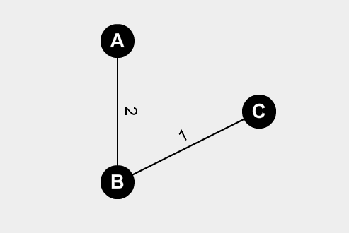

# Floyd

## Matriz de Floyd

Cada elemento de la matriz ($[D^o]_{ij}$) muestra la distancia ponderada entre todo par de vertices si solo se permiten caminos con una unica arista.  
$$
[D^o]_{ij}=
\left\{
	\array{
	p(i,j)	&	\exist e \in (i,j) \or \exist e\in\{i,j\}\text{ y } i\neq j\\
	0		&	\text{si i=j}\\
	\infty	&	\text{else}
	}
\right.
$$
Tambien hay otra matriz de Floyd, que se hace a partir de los elementos de la primer matriz.
$$
[D^k]_{ij}= min\{D_{ij}^{k-1},D^{k-1}_{ik} + D^{k-1}_{kj}\}
\\
1 \le k \le n=\#V_G
$$

### Teorema

Los elementos de la segunda matriz son la distancia ponderada entre los nodos que corresponden a la fila y a la columna.
$$
[D^n]_{ij}=dp(i,j)
$$

### Ejemplo


$$
D^o=
\begin{pmatrix}
	0&2&\infty\\
	2&0&1\\
	\infty&1&0
\end{pmatrix}
$$
Agrego $A$ como vertice interno: 
$$
[D^1_{ac}]=min\{D_{ac}^0 = \infty, D^0_{aa}+D^0_{ac}=0+\infty\} = \infty\\
[D^1_{bc}]=min\{D_{bc}^0 = 1, D^0_{ba}+D^0_{bac}=2+\infty\} = 1
$$

$$
D^1=
\begin{pmatrix}
	0		&		2&		\infty\\
	2		&		0&		1\\
	\infty	&		1&		0
\end{pmatrix}
$$

Agrego a $B$ como vertice interno:
$$
[D^2_{ac}]=min\{D_{ac}^1 = \infty, D^1_{ab}+D^1_{bc}=0+\infty\} = \infty\\
D^2=
\begin{pmatrix}
	0		&		2&		3\\
	2		&		0&		1\\
	3		&		1&		0
\end{pmatrix}
$$

## Algoritmo de Floyd

Sea $G$ un grafo tal que $\#V_G=n$

Entrada: $D^0$ 		Salida: $D^n$

```pseudocode
# D es un arreglo de matrices de floyd, donde D[0] es el valor de entrada
for i=1 to n
	for j=1 to n
		for k=1 to n
			D[I][j][k]=min(D[i-1][j][k],D[i-1][j][i]+D[i-1][i][k])
		end
	end
end
```


# Anexo

$\{i,j\}$ camino en digrafo de $i$ a $j$

$(i,j)$ camino en grafo de $i$ a $j$