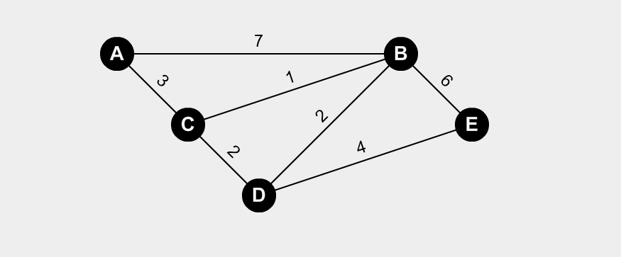

# Algoritmo de Dijkstra

```pseudocode
# Sea G un grafo, s el vertice de origen, VG los vertices del grafo G
# Devuelve un areglo con la distancia de el vertice de origen hacia todos los demas      # vertices y al padre de 

dist = Array(VG)


for each v in VG
	dist[v]=inf;
	parent[v]= null;
end
dist[s]=0;

Q = VG;

while !Q.isEmpty() 
	u = Q.getMin();								# Tomo el nodo de Q con minima distancia
	Q.remove(u);								# Elimino al minimo valor de Q
	for each e in edgesFrom(u,v)				# Agarro todas las aristas
		if dist[v] > dist[u] + weight[e] then
			dist[v] = dist[u] + weight[e];
			parent[v]=u;
		end
	end
end

return dist,parent

```

### Ejemplo

Calcular la distancia minima desde el vertice $A$ a todos los vertices.




| vértice | distancia | parent |
| :-----: | :-------: | :----: |
|    A    |     0     |   A    |
|    B    |     4     |   C    |
|    C    |     3     |   A    |
|    D    |     5     |   C    |
|    E    |     9     |   D    |

Pasos:

0. Inicializo los arreglos, pongo todas las distancias en $\infty$ menos la de A, que es $0$.

1. Extraigo $A$ , vemos que tiene 2 vecinos $B$ y $C$.

   1. Calculo la distancia  con $B$: 
      $$
      dist(a,b)=dist[a]+w(a,b)= 0+7 = 7
      $$

   2. Veo si tengo que reemplazar al valor en distancia
      $$
      dist[b]=\infty > 7=dist(a,b) ~?
      $$
      Entonces $dist[c]=7$

      Indico que el padre de $B$ es $A$.

   3. Calculo la distancia  con $B$: 
      $$
      dist(a,c)=dist[a]+w(a,c)= 0+3 = 3
      $$

   4. Veo si tengo que reemplazar al valor en distancia
      $$
      dist[c]=\infty > 3 = dist(a,c) ~?
      $$
      Entonces $dist[c]=3$

      Indico que el padre de $C$ es $A$.

2. Extraigo $C$. Vemos que tiene 2 vecinos $B$ y $D$:

   - Opero con $B$:

     1. Calculo la distancia  con $B$: 
        $$
        dist(c,b)=dist[c]+w(c,b)= 3+1 = 4
        $$

     2. Veo si tengo que reemplazar al valor en distancia
        $$
        dist[b]=7 > 4=dist(c,b) ~?
        $$
        Entonces $dist[b]=4$

        Indico que el padre de $B$ es $C$

   - Opero con $D$:

     1. Calculo la distancia  con $D$: 
        $$
        dist(c,d)=dist[c]+w(c,d)= 3+2 = 5
        $$

     2. Veo si tengo que reemplazar al valor en distancia
        $$
        dist[d]=\infty > 5=dist(c,d) ~?
        $$
        Entonces $dist[d]=5$

        Indico que el padre de $D$ es $C$

3. Extraigo $B$. Vemos que tiene 2 vecinos $D$ y $E$:

   - Opero con $D$:

     1. Calculo la distancia  con $D$: 
        $$
        dist(b,d)=dist[b]+w(b,d)= 4+2 = 6
        $$

     2. Veo si tengo que reemplazar al valor en distancia
        $$
        dist[d]=5 > 6=dist(c,b) ~?
        $$
        Entonces no cambio nada.

   - Opero con $E$:

     1. Calculo la distancia  con $E$: 
        $$
        dist(b,e)=dist[b]+w(b,e)= 4+6 = 10
        $$

     2. Veo si tengo que reemplazar al valor en distancia
        $$
        dist[e]=\infty > 10=dist(b,e) ~?
        $$
        Entonces $dist[e]=10$

        Indico que el padre de $E$ es $B$

4. Extraigo $D$. Vemos que tiene 1 vecino $E$ 

   - Opero con $E$:

     1. Calculo la distancia  con $E$: 
        $$
        dist(d,e)=dist[d]+w(d,e)= 5+4 = 9
        $$

     2. Veo si tengo que reemplazar al valor en distancia
        $$
        dist[e]=10 > 9=dist(d,e) ~?
        $$
        Entonces $dist[e]=9$

        Indico que el padre de $E$ es $D$

5. Extraigo $E$. Vemos que no tiene vecinos no visitados, entonces no opero y finaliza el algoritmo.


