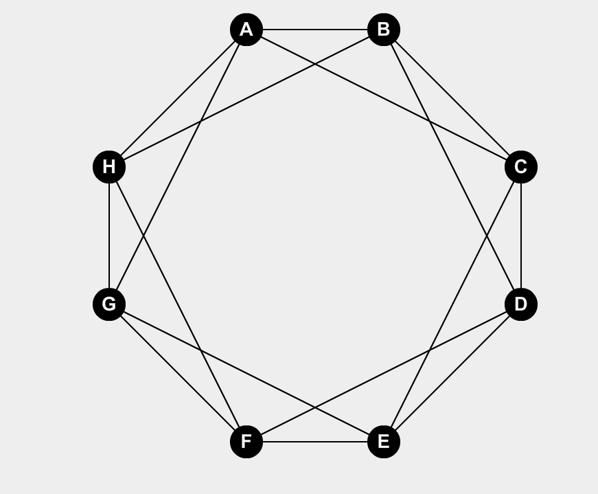
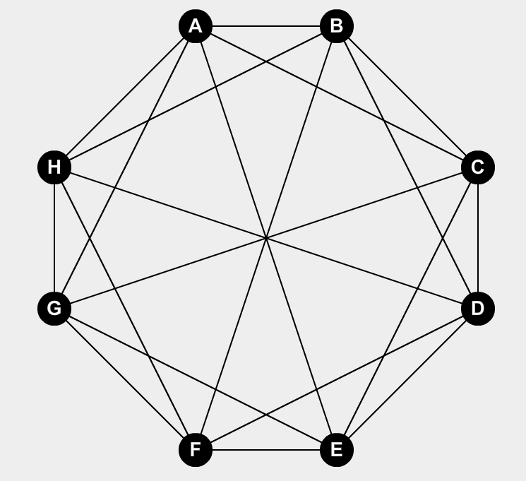

# Grafo de Harary

Se lo nota como $H_{k,m}$

## Como armarlo

1. Armo un grafo $C_m$ y agrego aristas entre todo par de vértices que estén a una [distancia circular](#Distancia circular) menor o igual a $\lfloor {\frac k 2} \rfloor$
2. Distintas opciones:
   - Si $k$ es par, termino.
   - Si $k$ es impar y $m$ es par, entonces agrego los diámetros $\{i,i+\frac m 2\}$
   - Si $k$ es impar y $m$ es impar, entonces agrego los diámetros $\{ 0,\frac{m-1} 2 \} \{0,\frac {m+1} 2\}$ y los cuasi diámetros $\{i,i+\frac{m+1} 2\}$

La idea en este tipo de grafos es conectar a cada vértice con aquel que este a menos de $k$ vértices de distancia circular.

## Ejemplos

### $H_{4,8}$

### $H_{5,8}$

### $H_{5,9}$

## Propiedades

- Tiene $m$ vértices 
- Son $k$ conexos
- Tiene la menor cantidad de aristas posibles

## Observaciones

- Si $G$ tiene  $m$ vértices y es $k-conexo $, entonces $\#E_G \ge \frac {k \cdot m} 2$

  Sea $k \le K_v \le K_e \le \delta$, $\sum_{i\in \N}^m g(v_i)=2 \cdot e$
  $$
  g(v_i)\ge \delta~~\forall i\\
  2 \cdot \#E_G \ge\sum_{i=1}^m \delta = m \cdot \delta \ge m \cdot k\\
  \therefore \#E_G \ge \frac{m \cdot k} 2
  $$

- $H_{k,m}$ es $k-conexo$

  - Caso 1: $k$ par $(k=2\cdot r)$.

    Quiero ver que saco $k-1$ vértices y el grafo sigue siendo conexo.

    El peor caso es sacar los vértices de 2 "Tiras" de vértices  (secuencias)

    En el peor caso tomo vértices de 2 conjuntos $R_1, R_2$, donde $\#R_1=r$ y $\#R_2 = r-1$, entonces en total tienen $2\cdot r-1$ vértices .

    Entonces existe $x,y/x\in R_1$ y $y\in R_2$, donde la distancia circular entre ellos es $r$. 

    Entonces $\exist\{x,y\}$ y el grafo sigue siendo conexo.

    Tomo $v$ un vertice generico. $v$ tiene $r$ vecinos a si inzquieda y $r$ vecinos a su derecha. Nos falta verificar que no se solapan.

    Como $H_{k,m}$ tiene $m$ vertices y $m>k=2 \cdot r$

    Entonces $H_{k,m}$ es $2\cdot r-regular$

    Entonces $2 \cdot \#E - \sum ^m_{i=1} g(v_i) = k \cdot m$

    Entonces $\#E=\frac{k \cdot m} 2$

    

  - Caso 2: $k$ impar, $n$ par.

    Tarea Libro

  - Caso 3: $k$ impar, $n$ par.

    Tarea Libro

# Anexo

## Distancia circular

Distancia circular entre el nodo $i$ y $j$ en un grafo $C_m$
$$
|i-j|_m =min\{ |i-j|, m-|i-j| \}
$$
