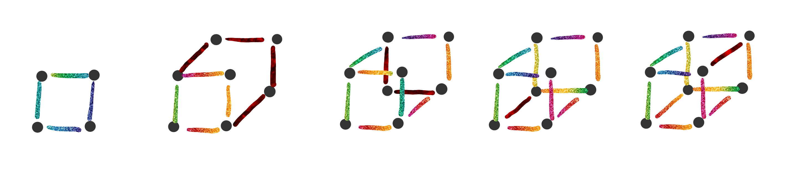

# Caracterizacion de Grafos $2-conexos$ 

## Teorema de Whitney

(Para grafos $2-conexos$)

Sea $G$ un grado con 3 o mas vertices, entonces:
$$
G \text{ es }2-conexo \\\Leftrightarrow\\ \forall \text{ par de vertices }x,y~ \exist\text{ 2 caminos internamende disjuntos}\\\text{ (Hay un ciclo en $G$ que contiene a ambos vertices)}
$$

 [Demostración](Demostraciones\07 - Caracterizacion\Teorema - 01.html) 

### Sintesis de Whitney

De un grafo $G$ a partir de un grafo $H$.

Es una sucesion de grafos $\{G_0,G_1,\dots,G_q\}/ G_0=H,\dots,G_q=G,\dots$ y $G_j$ se obtiene de adicionar un camino simple al $G_{j-1}$

#### Ejemplo

Pasar de $G_0=Q_2$ a $Q_3$

### Lemas

1. Sea $H$ un grafo $2-conexo$. La adicion a $H$ de un camino simple lo convierte en un grafo $H'$ $2-conexo$.
2. Sea $H \sub G~2-conexo$ y sea $e \in E_{G-H}$, Entonces se puede adicionar un camino simple a $H$ que contenga la arista $e$.

### Teorema

Utilizando ambos lemas:
$$
G \text{ es conexo}\\\Leftrightarrow\\G \text{ es un ciclo o una sintesis de Whitney a partir de un ciclo}
$$

 [Demostración](Demostraciones\07 - Caracterizacion\Teorema - 02.html) 

# Caracterización de Grafos $3-conexos$ 

### Teorema de Tutte

$$
G \text{ es } 3-conexo \\\Leftrightarrow \\G \text{ es un grafo rueda o una sitensis de Tutte a partir de un grafo rueda}
$$

### Sintesis de Tutte

Una sintesis de Tutte de un grafo parte de un $W_n$ al cual se le aplica una sucesion de operaciones 1 y/o 2.

#### Operaciones

- Operación $I$: Agrego una arista entre los vertices no adyacentes

  

- Operacion $II$: “Explotar” un vertice de grado mayor o igual a 4

  

  Por explotar se refiere a serarar el vertice $v$ por $v_1$ y $v_2$. Los adyacentes al vertice $v$ seran adyacentes a $v_1$ o $v_2$ pero no con ambos, de modo que $g(v_i) \ge 3$  $1\le i \le2$  

