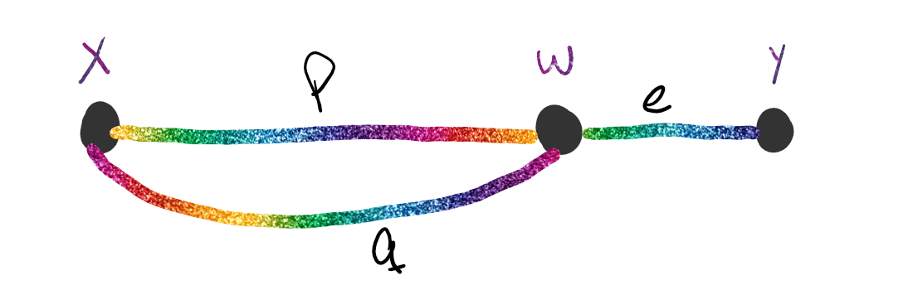

# Caracterizacion de Grafos $2-conexos$ 

## Teorema de Whitney

(Para grafos $2-conexos$)

Sea $G$ un grado con 3 o mas vertices, entonces:
$$
G \text{ es }2-conexo \\\Leftrightarrow\\ \forall \text{ par de vertices }x,y~ \exist\text{ 2 caminos internamende disjuntos}\\\text{ (Hay un ciclo en $G$ que contiene a ambos vertices)}
$$

### Demostracion

#### Vuelta 

Demuestro por contra reciproco

Si $G$ no es $2-conexo $

$\Rightarrow$ Como es conexo tiene un vertice de corte ($v$)

$\Rightarrow$ $G-\{v\}$ tiene al menos 2 componentes. Si tomo $x \in V_G$ en una componente y tomo $y \in V_G$ un corte distinto, no hay camino $x-y$ en $G-\{v\}$ 

$\Rightarrow$ Todo camino $x-y$ contiene a $v$

$\Rightarrow \not \exist$ en $G$ caminos $x-y$ internamente disjuntos

#### Ida

Demuestro por induccion en la distancia entre $x,y$ ($d(x,y)$)

- Caso Base:

  Si $d(x,y)=1$, es decir, $e=\{x,y\} \in E_G$

  Como $G$ es $2-conexo$:
  $$
  K_v(G)\ge 2 \Rightarrow K_e(G)\ge2
  $$
  $\Rightarrow G-\{e\}$ es conexo

  $\Rightarrow$ hay en $G-\{e\}$ un camino $x-y$ . Dicho camino es internamente disjunto en $G$ con el camino $e$ anteriormente definido.

  $\Rightarrow$ Se cumple para $d(x,y)=1$ 

- Hipotesis Indictiva:

  Supongamos que es verdadero para $d(x,y)<n$

- Tesis Inductiva:

  Supongamos que es verdadero para $d(x,y) = n$

Si $d(x,y)=n \Rightarrow \exist$ en $G$ un camino de longitud $n$ de $x$ a $y$.

Sea $w$ un vertice adyacente a $y$ en dicho camino $\Rightarrow d(x,y)< n$, por lo que puedo usa la Hipotesis Inductiva.

$\Rightarrow \exist$ dos caminos internamente disjuntos $P$ y $Q$ entre $x$ y $w$   

Aqui tengo 2 casos:

- Caso 1:

  

  Como $G$ es $2-conexo$, $G-\{w\}$ es conexo, $\Rightarrow \exist R_{x,y}$ en $G-\{w\}$

  Sin perder generalidad suponemos que el ultimo vertice en comun con $P$ o $Q$ lo tiene con $P$ y se llama $z$.

  $\Rightarrow$ $P_{x,z}$ o $R_{z,y}$ es internamente disjunto con $Q \cdot <w,e,y>$

  

- Caso 2: 

  

  Se cumple la Tesis por que $<w,e,y>$ es $L_{x,y}$, $Q_{x,y}$ es otro $L_{x,y}'$ internamente disjunto con $L_{x,y}$

### Sintesis de Whitney

De un grafo $G$ a partir de un grafo $H$.

Es una sucesion de grafos $\{G_0,G_1,\dots,G_q\}/ G_0=H,\dots,G_q=G,\dots$ y $G_j$ se obtiene de adicionar un camino simple al $G_{j-1}$

#### Ejemplo

Pasar de $G_0=Q_2$ a $Q_3$

### Lemas

1. Sea $H$ un grafo $2-conexo$. La adicion a $H$ de un camino simple lo convierte en un grafo $H'$ $2-conexo$.
2. Sea $H \sub G~2-conexo$ y sea $e \in E_{G-H}$, Entonces se puede adicionar un camino simple a $H$ que contenga la arista $e$.

### Teorema

Utilizando ambos lemas:
$$
G \text{ es conexo}\\\Leftrightarrow\\G \text{ es un ciclo o una sintesis de Whitney a partir de un ciclo}
$$

# Caracterización de Grafos $3-conexos$ 

### Teorema de Tutte

$$
G \text{ es } 3-conexo \\\Leftrightarrow \\G \text{ es un grafo rueda o una sitensis de Tutte a partir de un grafo rueda}
$$

### Sintesis de Tutte

Una sintesis de Tutte de un grafo parte de un $W_n$ al cual se le aplica una sucesion de operaciones 1 y/o 2.

#### Operaciones

- Operación $I$: Agrego una arista entre los vertices no adyacentes

  

- Operacion $II$: “Explotar” un vertice de grado mayor o igual a 4

  

  Por explotar se refiere a serarar el vertice $v$ por $v_1$ y $v_2$. Los adyacentes al vertice $v$ seran adyacentes a $v_1$ o $v_2$ pero no con ambos, de modo que $g(v_i) \ge 3$  $1\le i \le2$  

