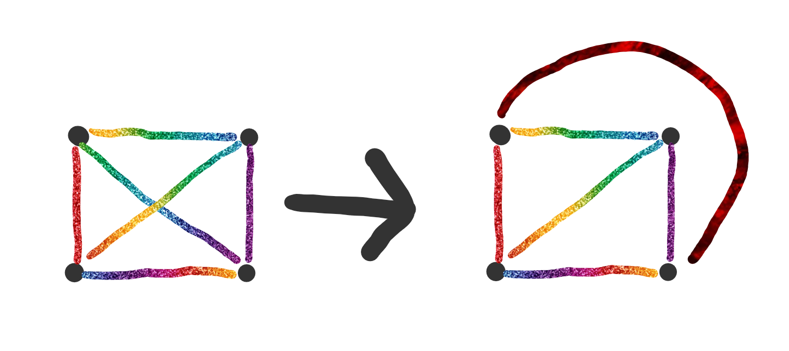
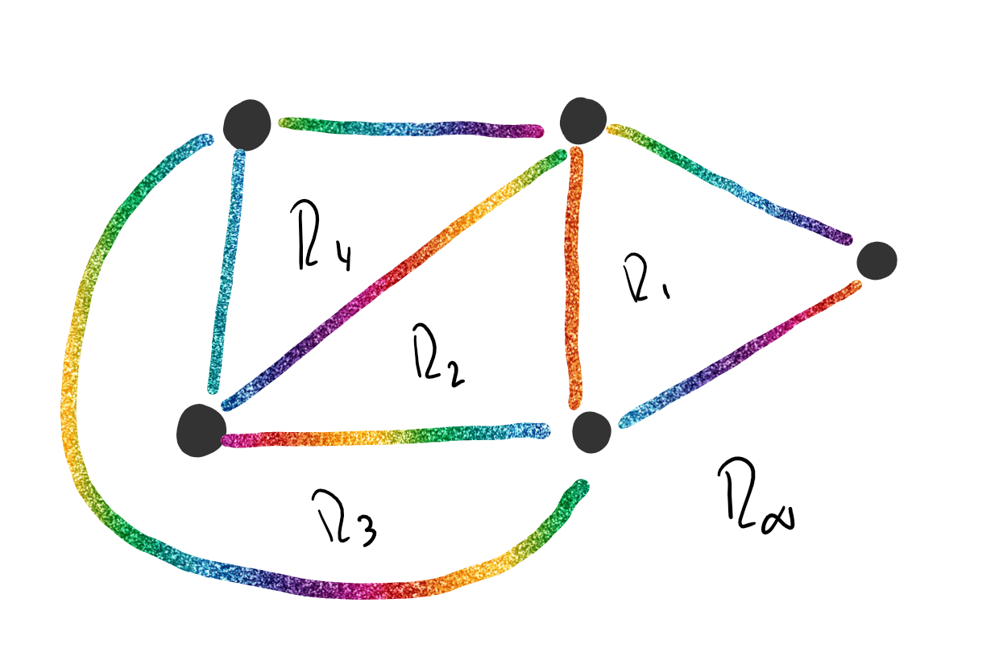

# Planaridad

Un grafo $G$ es plano si existe una [inmersión plana](#Inmersion-Plana) ($\tau$) de $G$.

Por ejemplo:

## Inmersión Plana

Una inmersión plana es aquella que dibuja al grafo en el plano donde las aristas de $G$ solo se intersecan en los vértices de $G$.

Se define como una función $\tau:G \rightarrow S$

### Región

En una inmersión plana de un grafo $G$ quedan determinadas regiones. La región externa se llama infinita: $R_\infty$

Por ejemplo:

#### Frontera

Es el camino mas corto que encierra a la región.

#### Grado de una región

Es la cantidad de aristas de su frontera. Se lo nota como $g(R_n)$

## Proposiciones

- Dada una inmersión plana de un grafo $G$ plano $\Rightarrow$ $\sum_{\forall R_i} g(R_i) = 2 \times \#E_G$

  Porque cada arista se cuenta dos veces ya sea que están en la frontera de regiones diferentes o dentro de la misma región.

- Sea $H\sub G$, si $H$ no es plano $\Rightarrow$ $G$ no es plano.

   [Demostración](Demostraciones\08 - Planaridad\Proposicion - 01.html) 

## Teoremas

### Teorema de Euler

Sea $G$ plano y conexo, tal que $\#V_G=v,\#E_G=e,\#Regiones=r$, entonces:
$$
v-e+r=2
$$

 [Demostración](Demostraciones\08 - Planaridad\Teorema - 01.html) 

#### Corolarios

Sirven para probar que un grafo no es plano.

- Sea $G$ simple, conexo y sin lazos ($e>2$), entonces
  $$
  e\le 3 \times v - 6
  $$
  Si $G$ no cumple con esto, entonces no es plano.

   [Demostración](Demostraciones\08 - Planaridad\Corolario - 01.html) 

- Sea $G$ un grafo plano, conexo y bipartito, entonces:
  $$
  e \le 2 \times v - 4
  $$
   [Demostración](Demostraciones\08 - Planaridad\Corolario - 02.html) 

## Observaciones

- $K_n$ no es plano $\forall n\ge5$.
- Para obtener un grafo que no sea plano pero cumpla con el primer corolario del teorema de Euler, tengo que plantear un $K_5$ y agregarle un hilo de vértices y aristas en una de sus puntas.
- $K_{3,3}$ no es plano.
- Para obtener un grafo que no sea plano pero cumpla con el segundo corolario del teorema de Euler, tengo que plantear un $K_{3,3}$ y agregarle varios elementos a cada subgrafo, y conectarlos todos con una sola arista entre vértices. 
- Los lazos, vértices colgantes y las multiaristas no afectan a la planaridad, por lo que si quiero analizar la planaridad de un grafo puedo remover todos los lazos, vértices colgantes y multiaristas.

## Resumen

Tenemos las siguentes herramientas paran justificar si un grafo es plano o no:

- **Corolario de Euler**:
  $$
  \text{$G$ plano, simple sin lazos y conexo} \Leftrightarrow e \le 3 \times v - 6
  $$

- **Corolario de Euler para Grafos Bipartitos:**
  $$
  \text{$G$ plano, simple sin lazos, bipartito y conexo} \Leftrightarrow e \le 2 \times v - 4
  $$

- **Teorema de Kuratowsky**:
  $$
  \text{Un grafo $G$ no es plano } \Leftrightarrow G \text{ contiene un subgrafo homeomorfo a $K_5$ o $K_{3,3}$}
  $$

- **Algoritmo de Planaridad**

- **Teorema**:
  $$
  H \text{ subgrafo de $G$, $H$ no es plano} \Rightarrow G \text{ no es plano}
  $$
  