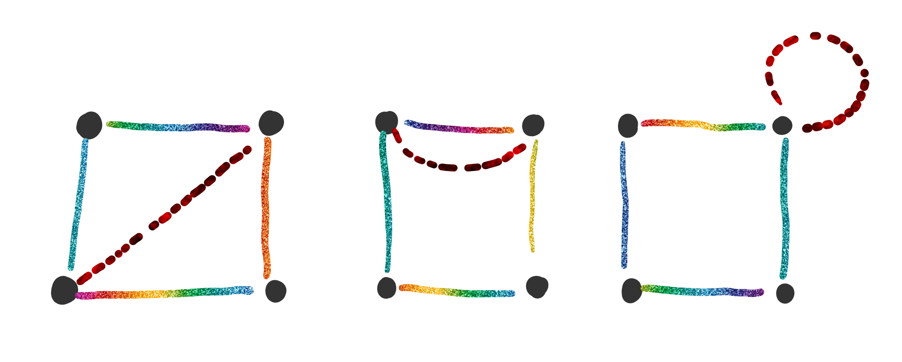
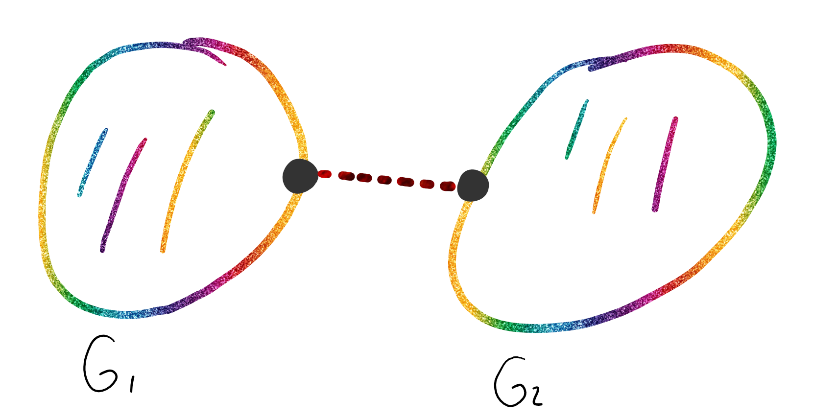

# Planaridad

Un grafo $G$ es plano si existe una [inmersión plana](#Inmersion-Plana) ($\tau$) de $G$.

Por ejemplo:

## Inmersión Plana

Una inmersión plana es aquella que dibuja al grafo en el plano donde las aristas de $G$ solo se intersecan en los vértices de $G$.

Se define como una función $\tau:G \rightarrow S$

### Región

En una inmersión plana de un grafo $G$ quedan determinadas regiones. La región externa se llama infinita: $R_\infty$

Por ejemplo:

#### Frontera

Es el camino mas corto que encierra a la región.

#### Grado de una región

Es la cantidad de aristas de su frontera. Se lo nota como $g(R_n)$

## Proposiciones

- Dada una inmersión plana de un grafo $G$ plano $\Rightarrow$ $\sum_{\forall R_i} g(R_i) = 2 \times \#E_G$

  Porque cada arista se cuenta dos veces ya sea que están en la frontera de regiones diferentes o dentro de la misma región.

- Sea $H\sub G$, si $H$ no es plano $\Rightarrow$ $G$ no es plano.

  - Demostración:

    Si $G$ no es plano, entonces $\exist \tau:G\rightarrow S$ una inmersión plana de todo subgrafo de $G$, en particular de H. Entonces $H$ será plano. <u>ABS!</u>.

    $\therefore$ $G$ no es plano.

## Teoremas

### Teorema de Euler

Sea $G$ plano y conexo, tal que $\#V_G=v,\#E_G=e,\#Regiones=r$, entonces:
$$
v-e+r=2
$$

#### Demostración

(Por inducción en la cantidad de aristas)

- Caso Base:

  Sea $e=1$, tengo 2 casos de grafos conexo:

  - Caso $I$: Tengo el grafo $K_2$, entones $2 - 1 + 1=2$. Lo valida.
  - Caso $II$: Tengo un lazo, entonces $1-1+2=2$. Lo valida.

- Hipótesis Inductiva:

  La proposición es verdadera si $e\le n$.

- Tesis Inductiva:

  La proposición es verdadera si $e = n+1$.

Supongamos que un grafo $G$ conexo con $n+1$ aristas. Si quitamos una arista, tenemos 2 casos:

- Caso $I$: Al quitar la arista el grafo sigue siendo conexo, es decir, no quito una arista de corte

  

  En todos estos casos, al tomar la arista tengo una arista menos y tengo una region menos. Entonces por Hipotesis inductiva:
  $$
  v-n+r=2\\r-(n+1)+(r+1) = 2 \\v-n+r =2
  $$

- Caso $II$:

  

  $v_1 + v_2 = v$, $e_1 + e_2 = e-1$  y $r_1 + r_2 = r+1$. Entonces, por HI
  $$
  v-n+r=\\
  v_1-e_1+r_1 +v_2 - e_2 +r_2 = \\
  v-e+1 + r+1
  $$
  ==PEDIR==

#### Corolarios

Sirven para probar que un grafo no es plano.

- Sea $G$ simple, conexo y sin lazos ($e>2$), entonces
  $$
  e\le 3 \times v - 6
  $$
  Si $G$ no cumple con esto, entonces no es plano.

  - Demostración:

    Si $G$ es simple, no hay multiaristas y no hay regiones de grado 2. Como no tiene lazos, no hay regiones de grado 1. Entonces:
    $$
    g(R_i)\ge 3~~~\forall R_i
    $$
    Tambien sabemos que 
    $$
    \sum_{\forall R_i} g(R_i)=2 \times e \ge e \times r\\
    2 \times e \ge e \times r
    $$
    Como $G$ es plano:
    $$
    2 \times e \ge e \times (v-e+2)\\
    3\times v - 6 \ge e
    $$

- Sea $G$ un grafo plano, conexo y bipartito, entonces:
  $$
  e \le 2 \times v - 4
  $$
  Sabemos que en un grafo bipartito:
  $$
  g(R_i) \ge 4
  $$
  Entonces si planteamos la sumatoria de grados de regiones
  $$
  \sum_{\forall R_i} g(R_i) = 2 \times e \ge 4 \times r
  $$
  Como $r = 2 - v + e$:
  $$
  2 \times e \ge 4 \times (2 - v + e)\\
  2 \times v - 4 \ge e
  $$
  

## Observaciones

- $K_n$ no es plano $\forall n\ge5$.
- Para obtener un grafo que no sea plano pero cumpla con el primer corolario del teorema de Euler, tengo que plantear un $K_5$ y agregarle un hilo de vértices y aristas en una de sus puntas.
- $K_{3,3}$ no es plano.
- Para obtener un grafo que no sea plano pero cumpla con el segundo corolario del teorema de Euler, tengo que plantear un $K_{3,3}$ y agregarle varios elementos a cada subgrafo, y conectarlos todos con una sola arista entre vértices. 
- Los lazos, vértices colgantes y las multiaristas no afectan a la planaridad, por lo que si quiero analizar la planaridad de un grafo puedo remover todos los lazos, vértices colgantes y multiaristas.
