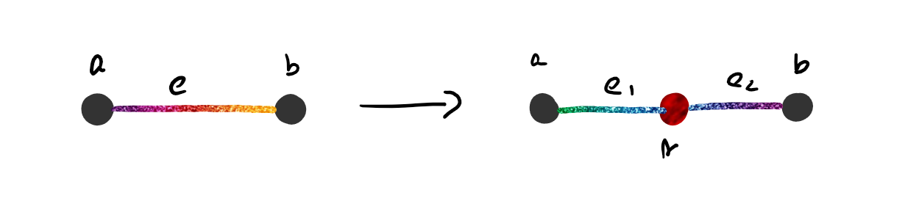
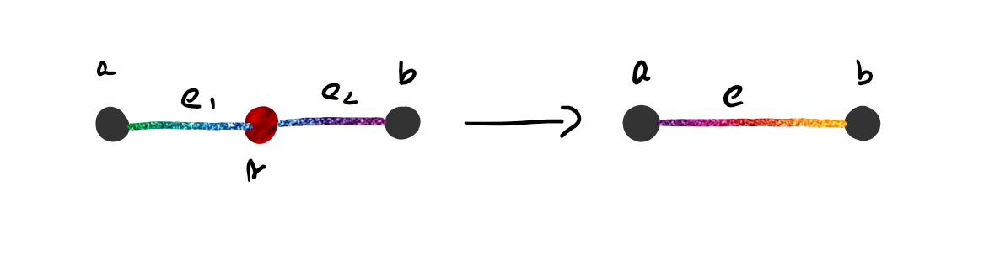
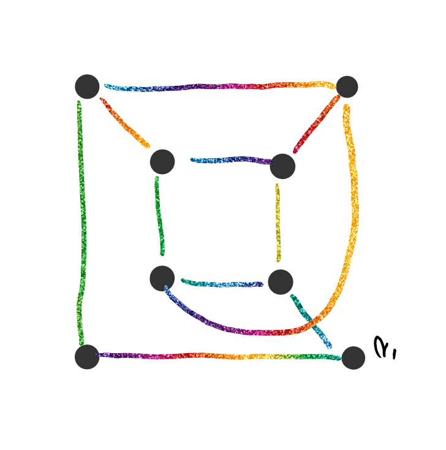
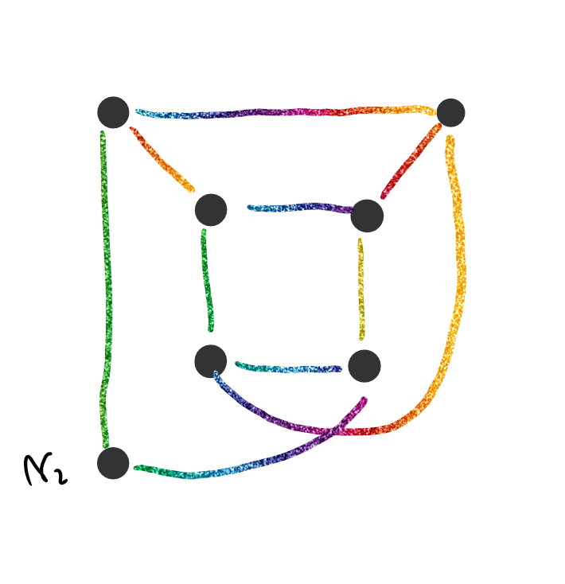
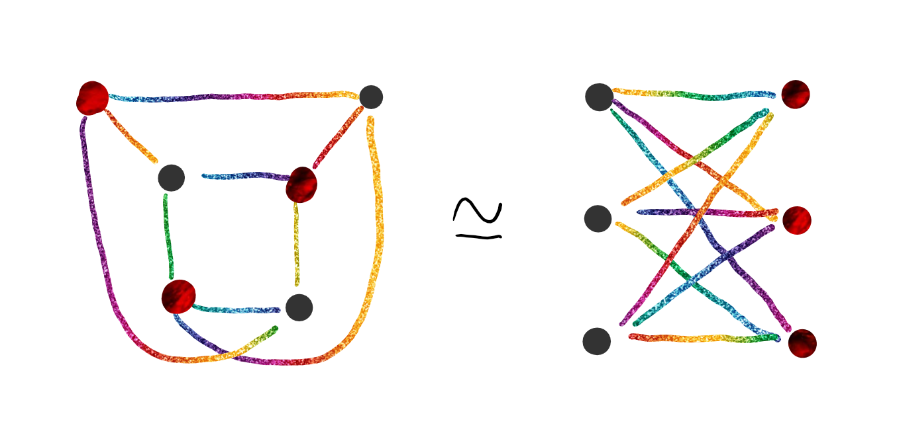

# Homeomorfismo

Dos grafos $G_1,G_2$ son homeomorfos si cumplen con alguno de los siguientes ítems:

- Son isomorfos.
- Ambos se pueden obtener a partir del mismo grafo mediante una sucesión de subdivisión de aristas o remoción de vértices

Se lo nota de la siguiente forma: 
$$
G_1\simeq_H G_2
$$
Por ejemplo, el grafo $C_5$ es homeomorfo con $G_7$, ya que puedo remover 2 vértices del grafo $C_7$ y obtener el grafo $C_5$.

## Operaciones

1. **Subdivisión elemental de una arista**:

   

   Se reemplaza el camino $<a,e,b>$ con el camino $<a,e_1,v,e_2,b>$

2. **Remoción débil de un vértice**:

   

   Si el $gr(v)=2$, entonces puedo reemplazar el camino $<a,e_1,v,e_2,b>$ por el camino $<a,e,b>$.

## Proposiciones

1. Las operaciones $1.$ y $2.$ no afectan a la planaridad. Si un grafo es plano y realizamos las operaciones sobre el mismo, entonces sigue siendo plano. Si no es plano y las realizamos, el resultado es un grafo no plano.

2. Siendo una consecuencia a la proposicion anterior, si $G_1 \simeq_H G_2$, entonces:
   $$
   G_1 \text{ no plano} \Leftrightarrow G_2 \text{ no plano}\\
   G_1 \text{ plano} \Leftrightarrow G_2 \text{ plano}
   $$

## Teoremas

### Teorema de Kuratowski

$$
\text{Un grafo $G$ no es plano } \Leftrightarrow G \text{ contiene un subgrafo homeomorfo a $K_5$ o $K_{3,3}$}
$$

No se demuestra la implicación a la derecha. La implicación a la izquierda se demuestra por la proposición.

- **Observación**: Si el grafo tiene menos de $5$ vertices de grado $4$ es imposible encontrar un subgrafo homeomorfo a $K_5$.
  
- **Observación**: Si el grafo tiene menos de 6 vertices de grado 3 es imposible encontrar un subgrafo homeomorfo a $K_{3,3}$.
  
- **Ejemplo**: Analizar si el grafo $G = Q_2$ es plano

  Tomo el subgrafo de $G$

  

  Remuevo el vertice $v_1$

  

  Veo que es isomorfo a $K_{3,3}$

  

