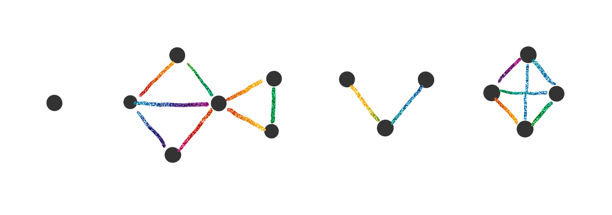
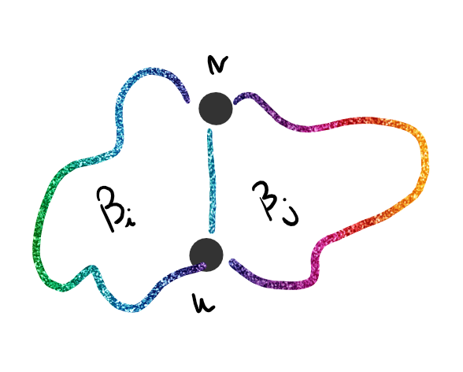
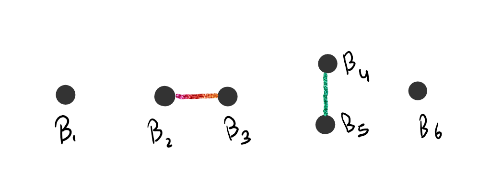
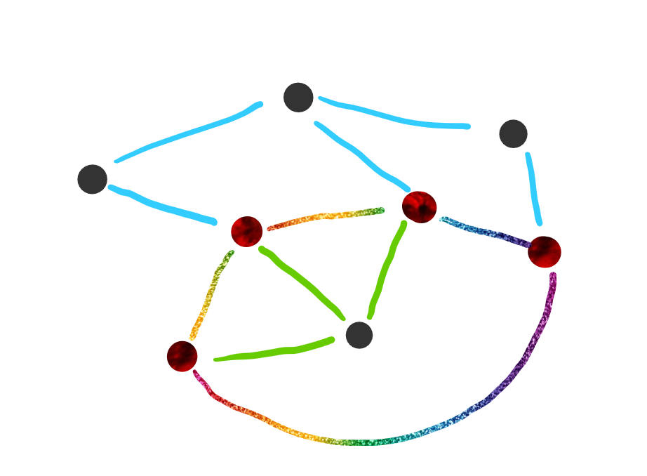
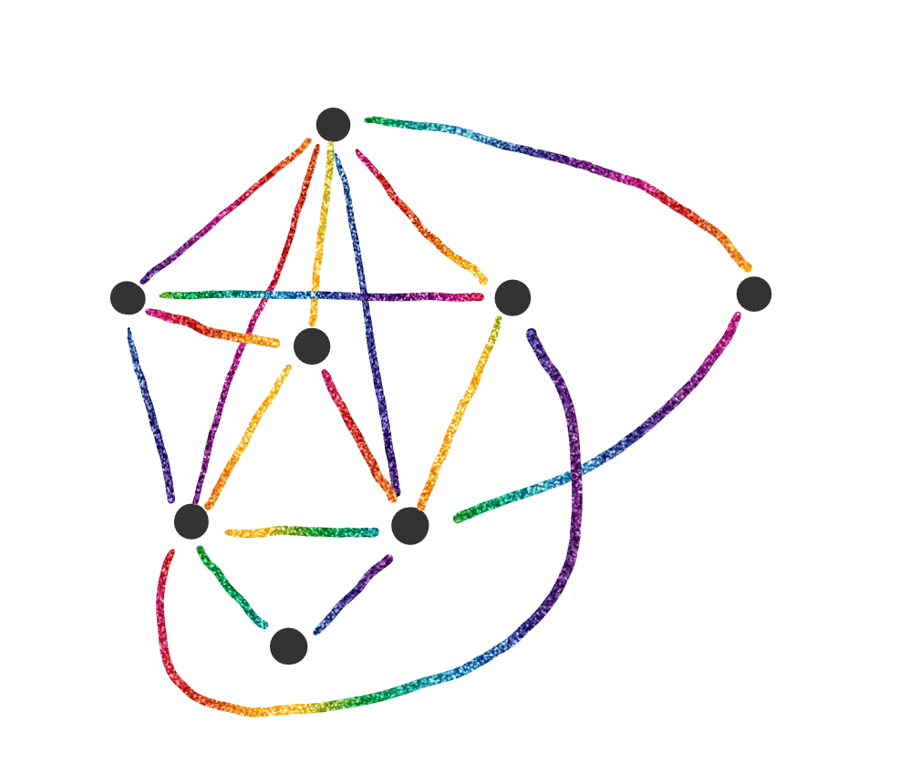
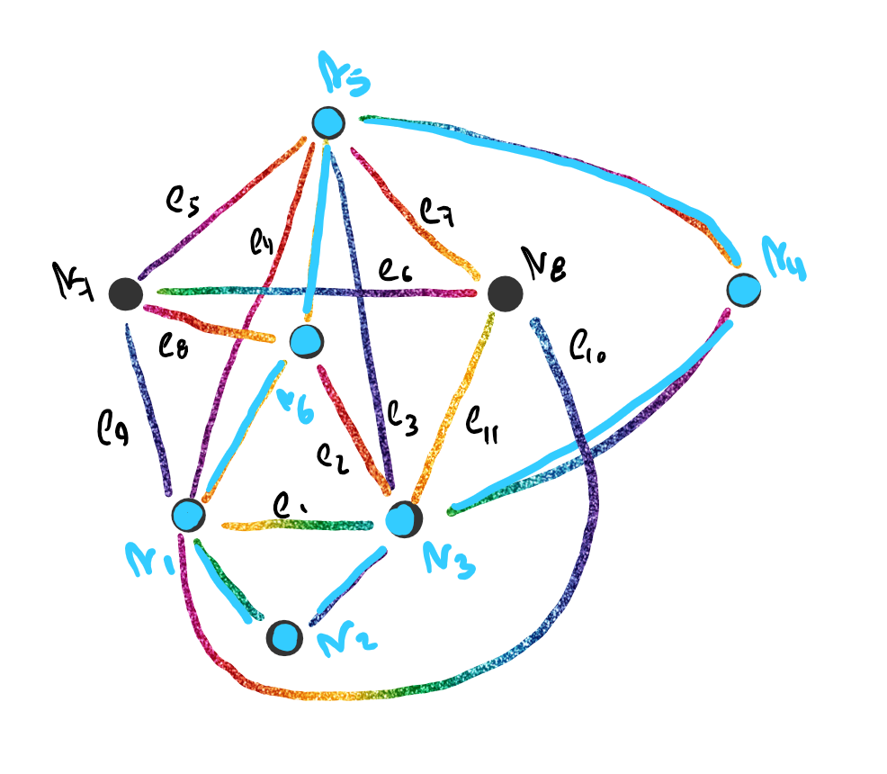
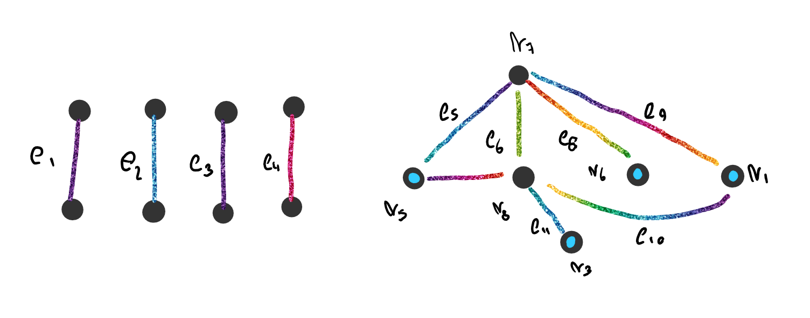
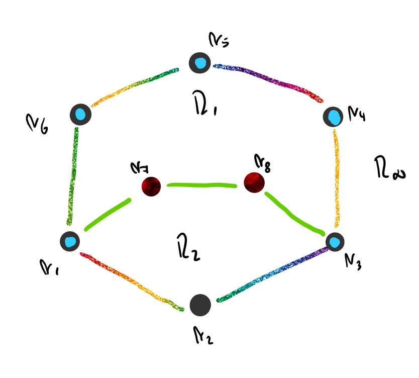

# Bloque de un Grafo $G$

Un bloque de un grafo $G$ es un subgrafo de $G$ conexo máxima sin vértices de corte en el subgrafo.

Por ejemplo, si $G$ es 

Los bloques de $G$ son

### Observaciones

1. Los bloques de un grafo $G$ son vértices aislados, dipolos o grafos $2-conexos$.

2. Si $v\in B_i \and v\in B_j ~~(i\neq j) \Rightarrow v$ es vértice de corte de $G$.

3. Si $v \in B_i \and u \in B_j ~~(i\neq j)$ y ni $v$ ni $u$ son vértices de corte $\Rightarrow v$ no es adyacente a $u$ en $G$.

4. Dos vértices distintos $u,v$ no pueden pertenecer ambos a dos bloques distintos, sino $B_i \cup B_j$ seria un bloque solo.

   

5. Para analizar la planaridad de un grafo $G$, analizamos a cada uno de sus bloques $2-conexos$. Si todos sus bloques $2-conexos$ son planos, entonces $G$ es plano.

## Grafo Bloque de $G$

El grafo bloque de $G$ tiene un vértice para cada bloque de $G$ y las aristas entre bloques indican que dichos bloques tienen un vértice en común. Indican como se conectan los bloques de un mismo grafo.

Siguiendo con el ejemplo anterior:

## Bloque Hoja

Se llama bloque hoja en un grafo bloque al bloque que es un vértice colgante, o solo tienen en común con otro bloque un vértice de corte.

Por ejemplo, en este caso los bloques $B_1$ y $B_3$ son hoja:

# Aristas Inseparables

Sea un grafo $G$ y $H\sub G$ un subgrafo de $G$.

Definimos la siguiente relación entre las aristas de $G$ y las que no están en $H$:

Sean $e_i \in E_{G-H} / e_i~R~e_j$, siendo que $e_i$ se relaciona con $e_j$ si  $\exist$ un camino al cual ambas pertenecen, cuyos vértices internos no son vértices de $H$.

Decimos en ese caso que $e_i$ es inseparable de $e_j$.

Podemos probar que $R$ es una relación de equivalencia y llamar a cada clase *<u>apéndice</u>*.

Si tomamos como ejemplo al siguiente grafo:

Los vértices pintados en color rojo y las aristas de color negro forman al subgrafo $H$. Podemos ver que tenemos distintos apéndices, marcados cada uno con un color distinto, exceptuando a las aristas con color negro. 

## Punto de Contacto

Un vértice $v$ es un punto de contacto de un apéndice si $v \in$ al apéndice y $in V_H$.

## Superposición

Dos puntos de contacto están superpuestos si tienen 3 vértices de contacto en común o dos vértices de contacto de uno de los apéndices alterna con dos puntos de contacto del otro.

Superposición por $3$ vértices de contacto:

Superposición por 2 vértices alternados:

### Observación

1. Sea $G$ un grafo y $H \sub G$, $H$ ciclo, entonces $2$ apéndices superpuestos no pueden dibujarse ambos en la misma región (interior a $H$ o región infinita).

### Proposiciones

- Si $G$ tiene todos sus bloques planos, entonces es plano.

- Sean $B_1,B_2$ dos bloques distintos de $G$, entonces tienen a lo sumo un vertice en común. 

   [Demostración](Demostraciones\10 - Bloques\Proposicion - 01.html) 

## Algoritmo de Planaridad

Se intenta de transformar a cualquier grafo a uno $2-conexo$.

Para analizar la planaridad de un grafo $G$ buscamos sus bloque y hacemos "correr" al algoritmo con los bloques $2-conexos$.

### Algoritmo

1. Dibujamos un ciclo $H\sub G_i$, con $G_i$ siendo los bloques de $G$ que cumplen con  ser $2-conexos$.

2. Dibujamos los apéndices.

3. Anotamos todos los apéndices forzados y si hay algún apéndice bloqueado

4. Hay dos casos:

   - Si en el paso 3 hay un apéndice hay un apéndice bloqueado, el grafo no es plano, **<u>FIN</u>**
   - Si no lo hay, elegimos un apéndice forzado y dentro de el un camino simple que adicionamos a $H_i$, obteniendo $H_{i+1} \sub G_i$ mediante una síntesis de Whitney.

5. Hay dos casos:

   - Si no dibuje todo el grafo, vuelvo al paso 3

   - Si no quedan apéndices para elegir, es decir, si dibuje todo el grafo, **<u>FIN</u>**.

### Ejemplo

Sea $G_1$

Elijo $H_1$ y lo pinto de azul:

Veo que tengo los siguientes apéndices:

Agrego el camino $<v_1,e_9,v_7,e_6,v_8,e_{11},v_3>$ a $H_1$

