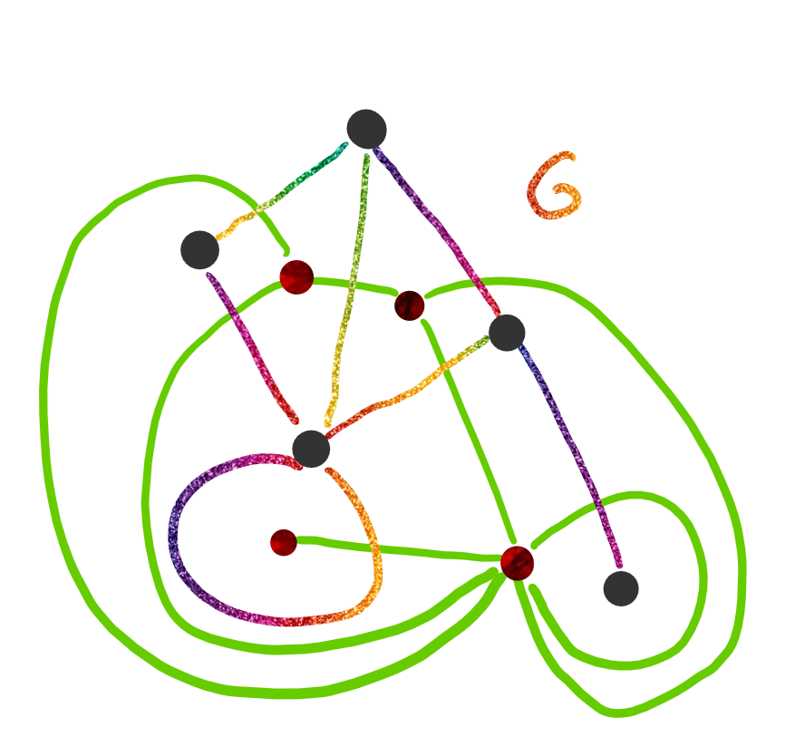
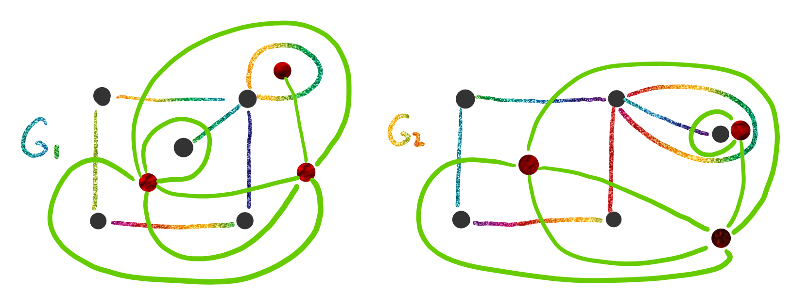

# Grafo Dual

Dada una inmersión plana de $G$, colocamos un vértice en cada región y una arista entre vértices que comparten fronteras. Cada arista del grafo $G$ es "*cruzada*" por una arista del grafo dual.

Por ejemplo, a partir del grafo $G$ puedo crear el siguiente grafo dual:

Si el grafo tiene un vértice colgante en el dual se genera un lazo.

Se puede ver que la cantidad de vértices del grafo dual es la misma que la cantidad de regiones que tiene la inmersión plana           
$$
\#V_{G^d}=\#R_G
$$
Tambien se puede ver que la cantidad de aristas del grafo dual es igual a la cantidad de aristas de la inmersión plana.
$$
\#E_{G^d} = \#E_G
$$

## Aplicaciones

### Coloreo de Mapas

Armo el dual del grafo continente (sin conectarse a la región infinita) y coloreamos el dual. Así paises limítrofes tendrán distinto color.

## Observaciones

- La dualidad de un grafo no es una función, esta definida según la inmersión plana del grafo. Por esto podemos decir que si $G \simeq F$, no puedo asegurar que $G^d \simeq F^d$. Ejemplo:

  

  Podemos ver en este caso que los grafos $G_1$ y $G_2$ son  isomorfos, pero $G_1^d$ no es isomorfo a $G_2^d$.

