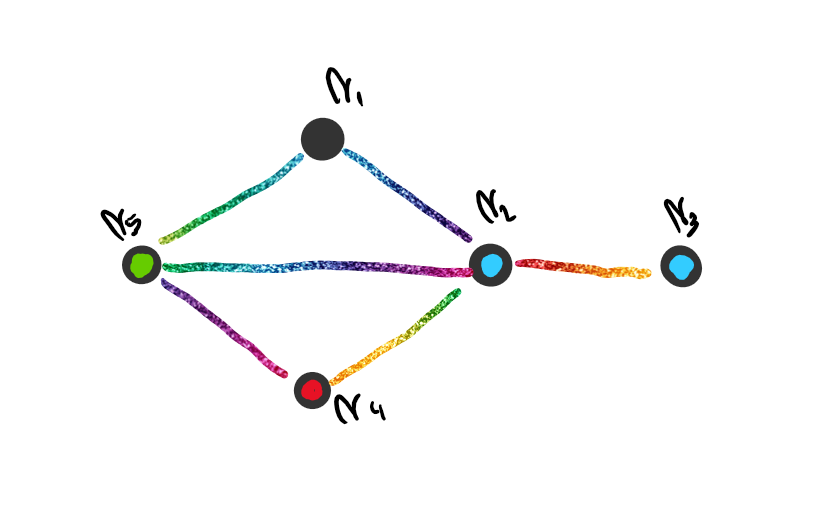
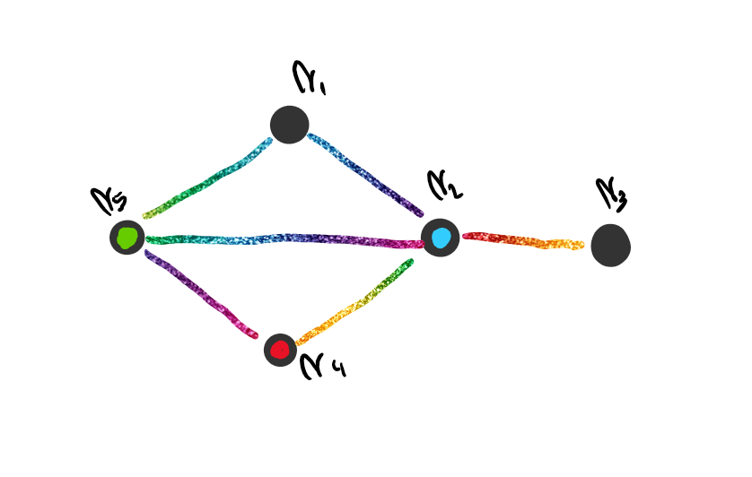

# Coloreo

Un coloreo de vértices es una función $f$ tal que:
$$
f:V_G\rightarrow A
$$
Siendo $A$ un conjunto de colores.

Por ejemplo, para el siguiente grafo defino la función $g$:

$$
g:V_G\rightarrow \{Rojo,Verde,Azul,Negro\}/ g(v_i)=
\left\{
\array{
	Rojo	&	i=4\\
	Verde	&	i=5\\
	Negro	&	i=1\\
	Azul	&	i=2 \lor i=3
}
\right.
$$
Podemos ver que este colores es un [$4-coloreo$](#$k-Coloreo$).

**Tomemos** el siguiente grafo:

Podemos decir que es un [$3-coloreo$](#$k-Coloreo$) y que además es un [coloreo propio](#$k-Coloreo$ propio).

El objetivo de este tema es pintar un grafo con un coloreo propio, utilizando la mínima cantidad de colores.

**Tomemos** el siguiente grafo $K_3$:

Decimos que $K_3$ es [3 critico](#Grafo $k-critico$) por que $\chi(K_3)=3$ y $K_3-\{e\}$ es [2 coloreable](#Grafo $k-coloreable$). Tambien podemos decir que es una [obstrucción $2$ cromática](#Obstrucción $k$ cromática).

**Tomemos** el grafo $C_{2n+1}$. Este grafo es [3 critico](#Grafo $k-critico$) para todo $n\ge1$ ya que $\chi(C_{2n+1})=3$ y como $C_{2n+1}-\{e\} = P_{2n+1}$, y sabemos que $P_{2n+1}$ es bipartito, $\chi(P_2{n+1})=2$ y el grafo es $2$ coloreable.

Tambien podemos decir que $C_{2n+1}$ es [CCO $2$ cromático](#Conjunto Completo de Obstrucciones $k$ cromáticas), ya que $C_{2n+1}$ es $3$ critico. Además si $\chi(G)\ge 3$, $\Rightarrow$  $G$ no es bipartito, $\Rightarrow$  $G$ tiene al menos un ciclo de longitud impar, $\Rightarrow$  $C_{2n+1} \subset G$ para algún $n \in \N$. 

**Tomemos** el grafo $K_2$. Es una obstrucción $1$ cromática por que es $2$ critico ya que $\chi(K_2)=2$ y $\chi(K_2-\{e\})=1$.

Además, como $K_2 \subset G~~\forall G \text{ con al menos una arista}$, entonces $\{K_2\}$ es un [CCO $1$ cromático](#Conjunto Completo de Obstrucciones $k$ cromáticas). 

**Tomemos** el siguiente grafo $G$:

Podemos ver que tiene los siguientes conjuntos de vértices independientes: 
$$
A_1=\{v_1,v_5\}, A_2=\{v_2,v_6\},A_3=\{v_2,v_4\},A_4=\{v_2,v_5\}, A_5=\{v_3,v_4\}
$$
Podemos calcular la [independencia](#Independencia de un Grafo) tal que $ind(G)=2$

## Definiciones

### $k-Coloreo$

Un $k-coloreo$ es un coloreo que usa exactamente $k$ colores.

### $k-Coloreo$ propio

Es un coloreo donde los vértices adyacentes no tienen el mismo color.

### Clases de Color

Dado un $k-coloreo$, se llama clases de color al conjunto de vértices que tienen el mismo color.

### Grafo $k-coloreable$

Decimos que un grafo es $k-coloreable$ si tiene un coloreo propio que usa exactamente $k$ colores.

### Numero Cromático

Se define al numero cromático de $G$ como la mínima cantidad de colores necesaria para tener un coloreo propio. 

Se lo nota como $\chi(G)$.

#### Pasos para hallar $\chi(G)$

1. Escribimos un coloreo propio para $G$ que utilice $k$ colores, por lo que $\chi(G) \le k$.
2. Buscamos alguna propiedad que ofrece al $\chi(G)$ a ser $\ge k $, por lo que concluimos que $\chi(G)=k$
3.  Si logramos el paso 2. buscamos pintar el grafo con menos colores.
4. Si logramos hacer el paso 3., repetimos el paso 1. y 2. de vuelta.

#### Propiedades

- Si $\#E_G > 0$, entonces $\chi(G)\ge2$

- $G$ no es bipartito, si solo si, $G$ no tiene ciclos de longitud impar, entonces $\chi(G)\ge 3$

- Si $H \subset G$, entonces $\chi(G)\ge \chi(H)$

- $\chi(K_n)=n$

- $\chi(G+H) = \chi(G) + \chi(H)$

  Todos los vértices de $G$ están conectados a los de $H$ y viceversa, entonces los colores que usa $H$ no pueden usarse para los vértices de $G$.

- Utilizando a la [independencia](#Independencia de un Grafo), podemos calcular que $\chi(G) \ge \lceil {\frac{\#V_G}{ind(G)}}\rceil $

   [Demostración](Demostraciones\12 - Coloreo\Proposicion - 03.html) 

### Grafo $k-critico$

Sea $G$ un grafo tal que $\chi(G)=k$ y $G-\{e\}$ es $k-1$ coloreable $\forall e \in E_G$  

### Obstrucción $k$ cromática

Una obstrucción $k$ cromática es un subgrafo $H$ de $G$ ($H\subset G$) que obliga a que $\chi(G)>k$.

### Conjunto Completo de Obstrucciones $k$ cromáticas

Sea un conjunto de grafos $\{G_j/G_j \text{ es $k+1$ critico}\}$. El conjunto es un conjunto completo de obstrucciones $k$ cromáticas si todo grafo $k+1$ coloreable contiene al menos un representante de los $G_j$ como subgrafo.

### Conjunto de Vértices Independientes

Un conjunto de vértices de $G=\{v_i\}_{1\le i\le q}$ es independiente si $v_i$ no es adyacente a $v_j$ $\forall 1\le i\le j\le q,~i\neq j$.

### Independencia de un Grafo

Se llama independencia de $G$ a la cantidad de vértices del mayor conjunto de vértices independientes de $G$.
$$
ind(G)=max_{\forall A_j}\{\#A_j\}
$$
Siendo $A_j$ un conjunto de vértices independientes de $G$.

## Observaciones

- No se puede colorear a un grafo con lazos.
- Las multiaristas no modifican al coloreo.
- Si $G$ tiene [$\chi(G)$](#Numero Cromático), entonces $G$ es $k$ coloreable siendo $\#V_G\ge k \ge \chi(G)$
- $K_n$ es una [obstrucción $n-1$ cromática](#Obstrucción $k$ cromática)
- $C_{2n+1}$ es una [obstrucción $2$ cromática](#Obstrucción $k$ cromática)
- $W_{2n}$ es una [obstrucción $3$ cromática](#Obstrucción $k$ cromática)

## Proposiciones

- Sea $G$ un grafo conexo [$k$ critico](#Grafo $k-critico$), entonces $G-\{v\}$ es [$k-1$ coloreable](#Grafo $k-coloreable$) $\forall v\in V_G$ 

   [Demostración](Demostraciones\12 - Coloreo\Proposicion - 02.html) 

- Sea $G$ conexo y [$k$ critico](#Grafo $k-critico$), entonces $gr(v_i) \ge k-1~~\forall v_i\in G$.

   [Demostración](Demostraciones\12 - Coloreo\Proposicion - 01.html) 

- $\chi(G)\le \delta_{max}+1$, con $\delta_{max}=max_{\forall v_i \in V_G} \{gr(v_i)\}$ 

  

