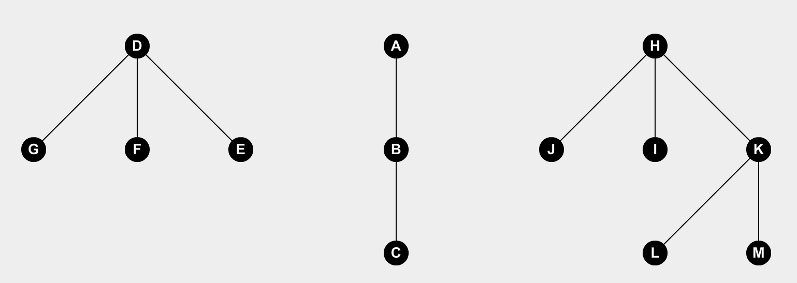

# Arboles

Hay muchas definiciones de arboles, la primera que vamos a tomar es que un **arbol** es un grafo conexo que no tiene ciclos. Por ejemplo, aca tenemos 3 arboles distintos:

Un **bosque** es un conjunto de arboles. Es un grafo no conexo donde los componentes son arboles.

## Definiciones

- **Arbol**: Grafo conexo que no tiene ciclos.
- **Arista Ciclo**: Sea $e$ una arista de un grafo $G$, esta se llama arista ciclo si existe en $G$ un ciclo que la contiene.
- **Bosque**: Es un grafo no conexo donde los componentes son arboles.

## Teoremas

- Equivalencias entre la definicion de arbol. ==FINAL==

  Sea $T$ un grafo con $n$ vertices sin lazos, entonces las siguentes afirmaciones son equivalentes:

  1. $T$ es un arbol.
  2. $T$ no contiene ciclos y tiene $(n-1)$ aristas.
  3. $T$ es conexo y tiene $(n-1)$ aristas.
  4. $T$ es conexo y toda arista es una arista de corte.
  5. Todo par de vertices de $T$ estan conectados por exactamente un camino simple.
  6. $T$ no contiene ciclos y $T+\{e\}$ tiene exactamente un ciclo.

  [Demostración](Demostraciones\14 - Arboles\Teorema - 01.html) 

- Sea $T$ un arbol con $n$ vertices y sea $G$ un grafo simple tal que el $\delta_{min}(G) \ge (n-1) \Rightarrow T$ es un subgrafo de $G$.

  [Demostración](Demostraciones\14 - Arboles\Teorema - 02.html) 

## Proposiciones

- Sea $e$ una arista en un grafo conexo $G$:

  ​										es conexo $\Leftrightarrow e$ es una arista ciclo de $G$.

  [Demostración](#Proposicion 1)

  Esta proposicion tiene 2 corolarios

  1. Una arista de un grafo es una arista de corte $\Leftrightarrow$ no es una arista ciclo.

  2. Sea $e$ cualquier arista de  $G$, entonces $\scr K$ $(G-\{e\}) = \left\{\array{\scr K\text{($G$)} &e \text{ es una arista ciclo}\\\scr K\text{($G$)}+1 & \text{else}}\right.$

- Todo arbol con al menos una arista tiene por lo menos 2 vertices de grado 1.

  [Demostración](Demostraciones\14 - Arboles\Proposicion - 02.html) 

  Esta proposicion tiene un corolario:

  1. Si $g(v_i) \ge 2~\forall v_i\in V_G \Rightarrow$ el grafo debe contener al menos un ciclo.

- Todo arbol con $n$ vertices tiene $n-1$ aristas.

  [Demostración](Demostraciones\14 - Arboles\Proposicion - 03.html) 

- Todo arbol con $n$ vertices tiene exactamente $n-1$ aristas.

  Esta proposicion tiene 2 corolarios:

  1. Todo bosque con $n$ vertices tiene $n-\scr K$ $(F)$ aristas
  2. Un grafo $G$ con $n$ vertices tiene por lo menos  $n-\scr K$ $(G)$ aristas

- Sea $G$ un grafo simple con $n$ vertices y $k$ componentes $\Rightarrow$ la cantidad de aristas es :
  $$
  \#E_G \le \frac{(n-k)(n-k+1)}{2}
  $$
  Esta proposicion tiene 1 corolario:

  1. Un grafo simple con $n$ vertices y mas de $\frac{(n-1)(n-2)}{2}$ aristas, debe ser conexo.
