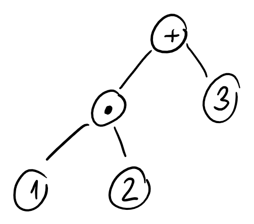

# Ordenamiento de Arboles

## Definiciones

- **Arbol de Expresion**: Es un vertice con un numero o con una operacion matematica tal que sus hijos derecho o izquierdo son arboles de expresion. Por ejemplo, se puede escribir a la formula $1\cdot 2 + 3$ con el siguente arbol de expresion.

  

## Algoritmos

### Orden por Nivel

Este algoritmo ordena a los nodos de un arbol de arriba hacia abajo y de izquierda a derecha.  

```javascript
In: Arbol binario
Out: Lista de vertices ordenados por nivel
SortByLevel = function(binaryTree){
	var cola = [];
	var output = [];
	cola.push(binaryTree.root)
	while(cola.size != 0){
		var node = cola.pop();
		output.push(node);
		foreach(var child in node.getChildrenLeftToRight());
			cola.push(child);
	}
    return output;
}

```

### Preorden Izquierdo Iterativo

```javascript
sortPreordenIzquierdo = function(BinaryTree){
    var output = [];
    var pila = [];
    pila.push(BinaryTree.root);
    
    while(!pila.isEmpty()){
        var node = pila.pop();
        output.push(node);
        foreach(var child in node.getChildrenRightToLeft())
        	pila.push(child);
    }
    return output;
}
```

### Preorden Izquierdo Recursivo

```javascript
sortPreordenIzquierdo = function(node,output){
    
    if(node == null){
        return;
    }else{
        output.push(node);
    }
    
    sortPreordenIzquierdo(node.getChildLeft(),output);
    sortPreordenIzquierdo(node.getChildRight(),output);
    
}
```

### PostOrden Iterativo

```javascript
sortPostorden = function(BinaryTree){
    var pila = [];
    var output = [];
    pila.push(BinaryTree.root);
    
    while(!pila.isEmpty()){
        if(!pila.top().isVisited) {
            var node = pila.top();
            node.isVisited = true;
            foreach(var child in node.getChildrenRightToLeft())
            	pila.push(child);
        }
        else{
            output.push(pila.pop());
        }
    
    }
}
```

### PostOrden Recursivo

```javascript
sortPostorden = function(node, output){
    if(node == null)
        return;
    sortPostorden(node.getLeftChild(),output);
    sortPostorden(node.getRightChild(),output);
    output.push(node);
}
```

### InOrder Iterativo

```javascript
sortInorder = function(BinaryTree){
    var pila = [];
    var output = [];
    pila.push(BinaryTree.root);
    
    while(!pila.isEmpty()){
        var node = pila.top();
        while(node.getLeftChild() != null){
            pila.push(node.getLeftChild());
            node = node.getLeftChild();
        }
        node = pila.pop();
        output.push(node);
        if(node.getRightChild() != null){
		   pila.push(node.getRightChild());
            node = node.getRightChild();
        }
        else{
            while(!pila.isEmpty() && node.getRightChild() == null ){
                node = pila.pop();
                output.puhs(node);
                if(node.getRightChild() != null)
                    pila.push(node.getRightChild());
            }
        }
    }
}
```

### Inorder Recursivo

```javascript
sortInorder = function(node, output){
    if(node == null)
        return;
    
    sortInorder(node.getLeftChild(),output);
    output.push(node);
    sortInorder(node.getRightChild(),output);
}
```


