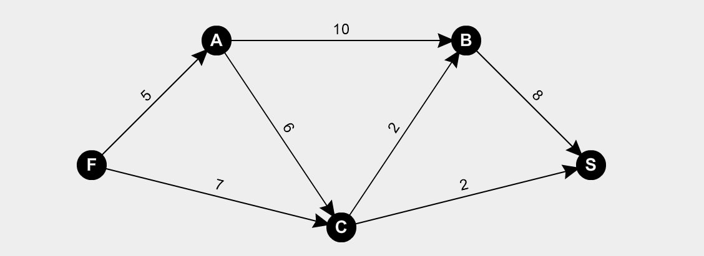
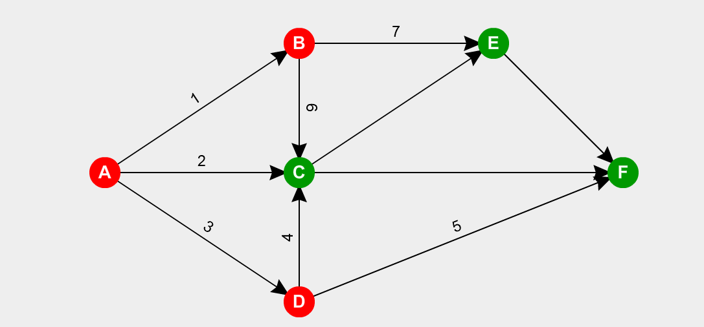
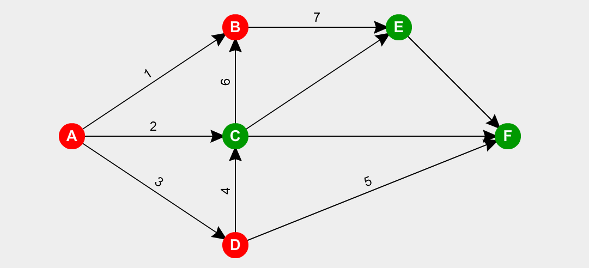

# Redes de Flujo

Las redes de flujos son dígrafos con dos vértices especiales llamados fuente $(f)$ y sumidero $(s)$ tal que el grado de salida de la fuente es mayor a cero y el grado de entrada del sumidero es mayor a cero. Las aristas poseen una capacidad positiva $cap(e)>0$ 

El dígrafo debe ser conexo, ya que para que tenga sentido debe existir al menos un camino $f-s$.

El problema a resolver es: *Cual es el máximo de elementos que puedo transportar desde la fuente hasta el sumidero?*

Esto se resuelve mediante una función llamada $flujo:E_N \rightarrow\N$, siendo $N$ el grafo al cual quiero analizar, y tiene las siguientes características:

- $flujo(e) \le cap(e)$
- $\forall v \neq f \land v\neq s, \sum_{e\in Ent(v)} flujo(e) = \sum_{e\in Sal(v)} flujo(e)$

Siendo $Ent(v)$ las aristas que entran a $v$ y $Sal(v)$ las aristas que salen de $v$.

Tengo la siguente red de fujo, donde con verde estan marcadas las capacidades de cada arista.

Para aumentar el flujo de la red debo seguir los siguentes pasos:

1. $f(e)=0 ~~\forall e \in E_N$

2. Buscamos $Q$ haciendo un BFS segun el orden lexicografico (marcado en celeste). De esta forma obtenemos Q:

   

   $\Delta Q=1$

3. Para cada arista de  $Q$, asignamos un nuevo flujo igual a la suma del anterior y $\Delta Q$ 

   

4. Repetir el paso 2 hasta que no haya mas $Q$ de aumento.

Finalmente nos queda el siguente grafo:

Donde en $V_f$ ponemos todos los vértices etiquetados y en $V_s$ quedan los que no.

Tambien se obtiene que $K^* = <V_f,V_s>$ es el corte mínimo.

$val(f^*) = \sum_{\forall i}Q_i = 11= cap(K^*)$

## Definiciones

- **Redes de Flujo**: Es un dígrafo con dos vértices distinguidos ($f:$ fuente, $s:$ sumidero) tal que $g_s(f)>0$ y $g_e(s)>0$.

- **Valores de Flujo**: Dado un flujo en la red, definimos $val(f)=\sum_{e \in Sal(f)} - \sum_{e \in Ent(f)}$. 

  Por lo general la segunda sumatoria va a valer $0$.

- **Flujo Máximo**: un flujo es máximo si para todo flujo asociado a la red se verifica $val(f) \leq val(f^*)$.

  Se lo nota como $f^*$

  **Capacidad de Corte**: $cap<V_f,V_s> = \sum_{e \in <V_f,V_s>} cap(e)$

- **Corte Mínimo**: $K^*$ es un corte tal que $\forall k=<V_f,V_s>$

- **Cuasicamino de Aumento**: Un cuasi camino de aumento es un camino $f-s$ en el grafo subyacente de la red (no importa el sentido de las aristas), tal que si la arista es directa $f(e)<cap(e)$ siendo $\Delta e = cap(e)-f(e)$. 

  Si la arista es inversa $f(e)>0$ y $\Delta e = f(e)$.

  
  $$
  \Delta Q = min_{e \in Q} \{ \Delta e \} = 7
  $$
  

## Proposiciones

- Dado un corte $<V_f,V_s>$, todo camino directo $f-s$ contiene una arista en el conjunto $<V_f,V_s>$

  

  $\Rightarrow \exist v_i, v_{i+1}$ en el camino $/v_i \in V_f \and v_{i+1}\in V_s, (v_i,v_{i+1}) \in <V_f,V_s>$

- $Val(f) = \sum_{e \in <V_f,V_s> }f(e) = \sum_{e \in <V_s,V_f>} f(e)$ para todo corte $<V_f,V_s>$ y $<V_s,V_f>$ en la red.

- Si en la red el $val(f)=cap(k)$ para algun corte  $\Rightarrow f = f^* \and k = k^*$

  [Demostración](Demostraciones\20 - Redes de Flujo\Proposicion - 03.html) 

## Observaciones

- Sea un corte $<V_f,V_s>$ en la red:
  $$
  \bigcup_{v \in V_f} Sal(v) = <V_f,V_f> \cup <V_f,V_s> 
  $$
  

  Donde se puede ver que $<V_f,V_f>=\{e_1,e_3\}$ y que $<V_f,V_s>=\{e_1,e_4,e_5,e_6,e_7\}$
  $$
  \bigcup_{v \in V_f} Ent(v)= <V_f,V_f> \cup <V_s,V_f>
  $$
  

  Donde $<V_f,V_f> = \{e_1,e_3\}$ y $<V_s,V_f>=\{e_6\}$