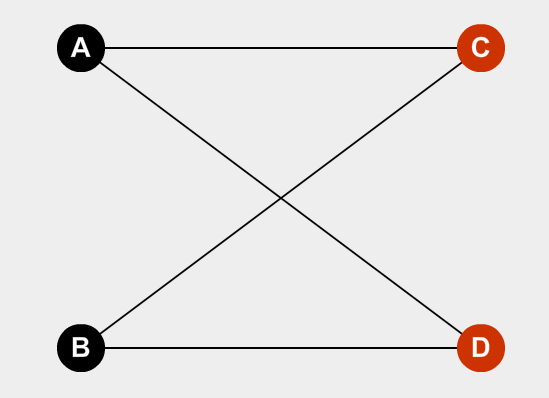

# Demostración

$$
G \text{ es un grafo bipartito} \Leftrightarrow G \text{ no tiene ciclos de longitud impar}
$$

#### Demo

$\Rightarrow)$

Sea $G$ un grafo bipartito, Existe una particion de $V_G$ en $V_1$ y $V_2$ tal que:
$$
\text{Si }e=\{a,b\} \in E_G \Rightarrow (a\in V_1 \land b \in V_2) \lor (a \in V_2 \land b \in V_1)
$$
Luego, todo camino cerrado (si hubiera) comenzara en un vertice de $V_1$ o de  $V_2$, y debera volver a dicho vertice. La unica manera de hacer esto seria recoriendo un numero par de aristas. Por ejemplo:

Entonces, no hay ciclos de longitud impar.

$\Leftarrow)$

Sin perder generalidad, supongo que el grafo es conexo. 

Sea $u \in V_G$:

- $V_1 = \{v\in V_G/d(u,v) = 2\times k, k\in \Z\}$
- $V_2 = \{v \in V_G/d(u,v)=2\times k +1, k\in \Z\}$

Con estos datos podemos verificar que el grafo es bipartito:

1. $V_1 \neq \empty$, pues $u\in V_G$ y $d(u,u)=0$ es par,  entonces $u\in V_1$. Luego de ver esto necesitamos que $\#V_2\ge 2$, para cumplir con el caso de que haya ciclos impares.
2. $V_2 \neq \empty$, pues $\exist v \neq u/d(v,u)=1$, pues $G$ es conexo.
3. $V_1 \cap V_2 = \empty$, ya que no puede haber caminos de longitud par e impar al mismo tiempo.
4. $V_1 \cup V_2 = V_G$, ya que $G$ es conexo.

- <u>Ahora voy a probar que no exite un ciclo de longitud impar, si tomamos vertices del conjunto $V_1$:</u>

  Supongamos que $\exist e\in E_G/e=\{v,w\}, ~~~v,w\in V_1$ 

  Como $v,w \in V_1$, entonces $d(u,v) = 2\times k$ y $d(u,w) = 2 \times q$

  Entonces $long(v-u)+long(u-w) =2\times(k+q)$

  Entonces concluimos que  $<v,e,w>$ es un ciclo de longitud impar 

  **ABS!** Por dato sabemos que no existen ciclos de longitud impar.

  $\therefore \not \exist e\in E_G/e=\{v,w\},~~~v,w \in V_1$

  

- <u>Ahora voy a probar que no exite un ciclo de longitud impar, si tomamos vertices del conjunto $V_2$:</u>

  Supongamos que $\exist e\in E_G/e=\{v,w\}, ~~~v,w\in V_2$ 

  Como $v,w \in V_2$, entonces $d(u,v) = 2\times k +1$ y $d(u,w) = 2 \times q+1$

  Entonces $long(v-u)+long(u-w) =2\times(k+q)+2$ 

  Entonces concluimos que  $<v,e,w>$ es un ciclo de longitud impar 

  **ABS!** Por dato sabemos que no existen ciclos de longitud impar.

  $\therefore \not \exist e\in E_G/e=\{v,w\},~~~v,w \in V_2$

$\therefore$ Se cumple que $e=\{v,w\}\in E_G \Rightarrow (v\in V_1 \land w \in V_2) \lor (v\in V_2\land w\in V_1)$ si no hay ciclos de longitud impar y $G$ es bipartito.

